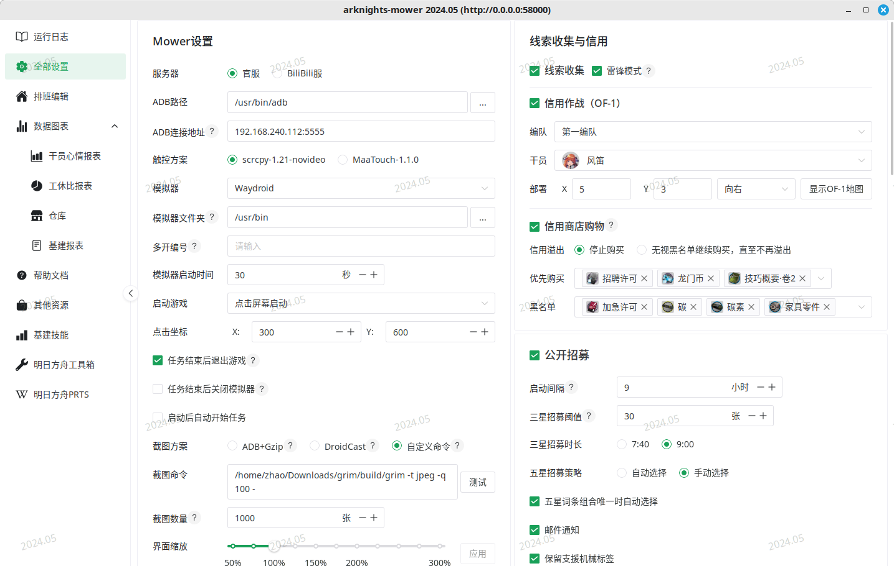

# arknights-mower

[-green)](https://qm.qq.com/q/uALU6yjUuk)

Mower 是为长期运行设计的、开源的明日方舟脚本。

初次使用，建议阅读《[Mower 简明教程](https://blog.zhaozuohong.vip/2024/05/10/mower-guide/tutorial/)》；提出建议、反馈 Bug 或交流基建知识，欢迎加入 QQ 频道 [ArkMower（频道号：2r118jwue4）](https://pd.qq.com/s/5t91c3gx9)。

## [安装](./start/download)

Mower 支持 Windows、macOS 与 Linux 平台。Windows 用户推荐使用下载器下载运行；macOS 与 Linux 用户请参考群文件《mower入门一条龙》内容运行。

## 功能介绍

- [基建](./start/riic)：跑单、按心情动态换班、自动合成材料；
- 森空岛：签到、仓库读取；
- 日常：公招、邮件、线索、清理智；
- 大型任务：生息演算、隐秘战线；
- 签到：五周年月卡、限定池每日一抽、矿区、孤星领箱子、端午签到……
- 调用 maa：肉鸽、保全。

## 界面截图

