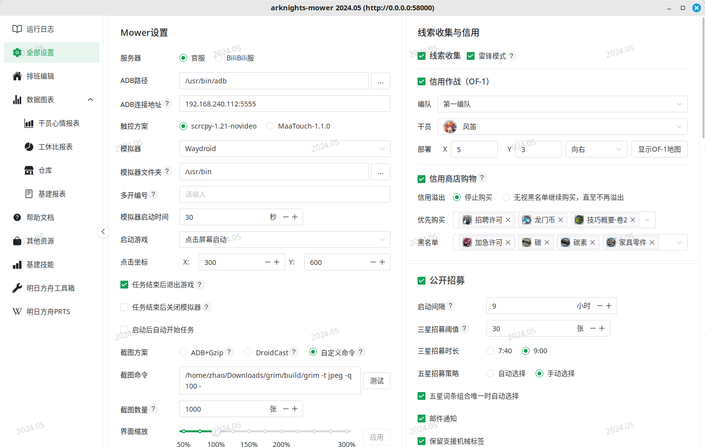
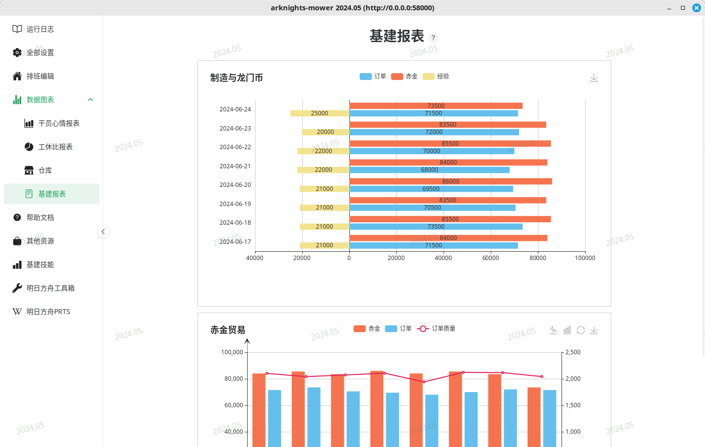

# arknights-mower

Mower 是为长期运行设计的开源明日方舟脚本。

## 功能介绍

- 基建：跑单、按心情动态换班；
- 森空岛：签到、仓库读取；
- 日常：公招、邮件、线索、清理智；
- 大型任务：生息演算、隐秘战线；
- 签到：五周年月卡、限定池每日一抽、矿区、孤星领箱子、端午签到……
- 调用 MAA：肉鸽、保全。

## 界面截图






## 下载与安装

### 运行环境准备

git、Python 3.12、Node.js 16

### 克隆仓库

```bash
git clone -c lfs.concurrenttransfers=200 https://github.com/ArkMowers/arknights-mower.git
cd arknights-mower
```

### 构建前端

```bash
cd ui
npm install
npm run build
```

### 构建后端（Windows）

```bash
cd ..
python -m venv venv
.\venv\Scripts\activate.bat
pip install -r requirements.txt
pip install Flask flask-cors flask-sock pywebview
```

### 构建后端（Linux）

```bash
cd ..
python3 -m venv venv
. ./venv/bin/activate
pip install -r requirements.in
pip install Flask flask-cors flask-sock pywebview
```

### 打包（Windows）

```bash
pip install pyinstaller
pyinstaller webui_zip.spec
python scripts/fix_runtime_dlls.py
```

生成的 `mower.exe` 在 `dist` 文件夹中，到此打包完成，已可使用。

### 打包（Linux）

```bash
pip install pyinstaller
pyinstaller webui_zip_for_linux.spec
```

生成的 `mower` 在 `dist` 文件夹中，到此打包完成，已可使用。

注：Linux 下运行时，shell 会显示如 `Running on http://127.0.0.1:53703` 的输出，本地浏览器访问 `http://127.0.0.1:53703` 即进入 Mower 页面。

> Linux 独立包仍依赖宿主机的部分系统动态库，并非完全便携。产物在 Ubuntu 24.04
> 上构建，运行时要求 glibc >= 2.39，且需安装：`libzbar0`（二维码识别）、
> `libgl1` 与 `libglib2.0-0`（OpenCV）、`libgtk-3-0` 与 `libwebkit2gtk-4.1-0`
> （WebView 界面，Ubuntu 24.04 对应包名）。

### 打包（macOS）

```bash
pip install pyinstaller
brew install zbar
pyinstaller webui_zip_for_macos.spec
```

生成的 `mower.app` 在 `dist` 文件夹中，包含主程序与多开管理器。macOS 产物为
**unsigned experimental build**（PyInstaller 仅做 ad-hoc 签名，非 Developer ID
签名、未经 notarization），首次运行若被 Gatekeeper 拦截，需在「隐私与安全性」
中手动允许；二维码识别依赖宿主机 `zbar`（`brew install zbar`）。

### 正式版与 alpha 的产物和签名说明

正式版与 alpha 共用跨平台发布流水线，为五个平台生成统一命名的独立包，并附带
统一的 SHA-256 清单（SHA256SUMS）：

```text
arknights-mower_<version>_windows_x64.zip
arknights-mower_<version>_linux_x64.tar.gz
arknights-mower_<version>_linux_arm64.tar.gz
arknights-mower_<version>_macos_x64.zip
arknights-mower_<version>_macos_arm64.zip
```

发布入口、版本格式、构建检查和系统依赖见
[跨平台发布流水线](doc/release-platforms.md)。

Windows 与 macOS 产物均未签名：Windows 首次运行可能出现 SmartScreen 提示，请
选择「更多信息 -> 仍要运行」；macOS 为 unsigned experimental build，可能需要在
「隐私与安全性」中手动允许。建议下载后先核对 SHA256SUMS 再使用。

## Docker 部署

Docker 部署说明见 [Arknights-Mower 文档 - Docker 部署](https://arkmowers.github.io/arknights-mower/manual/docker-deploy/)。

## Linux系统下的Docker一键部署

### 运行环境准备

Docker version 28.1.128.1.1、Linux

### 克隆仓库

```bash
git clone -c lfs.concurrenttransfers=200 https://github.com/ArkMowers/arknights-mower.git
cd arknights-mower
```

### 镜像构建

```bash
docker build -t mower .
```

### 启动容器

```bash
docker run -d \
    --name mower\
    --network host \
    -e TZ="Asia/Shanghai" \
    --restart always \
    --memory 2g \
    mower
```

### 进入 Mower

容器在后台启动以后，可以本地浏览器访问 `http://127.0.0.1:58000?token=mower` 或 `http://局域网IP:58000?token=mower`。

此时，该容器已预先配置好 MAA 以及 ADB 设置，仅需要手动配置 ADB 连接地址。

## 建议与反馈

**提出建议、反馈 Bug，欢迎加入 QQ 群 (521857729) 或 QQ 频道 (ArkMower)（频道号：2r118jwue4）**

## 关于 Mower-NG

Mower-NG 项目由前 Mower 项目开发者之一 [EE0000 (@ZhaoZuohong)](https://github.com/ZhaoZuohong) 基于 Mower 项目二次开发，现已独立运作为其个人开发的项目，与 Mower 项目不再有关联。

由于 [EE0000 (@ZhaoZuohong)](https://github.com/ZhaoZuohong) 已经退出 Mower 开发组，其在网络平台上发表的言论仅代表其个人观点，不代表 Mower 项目或 Mower 开发组的立场。我们敬请广大用户理性分析，并谨慎甄别相关信息。
