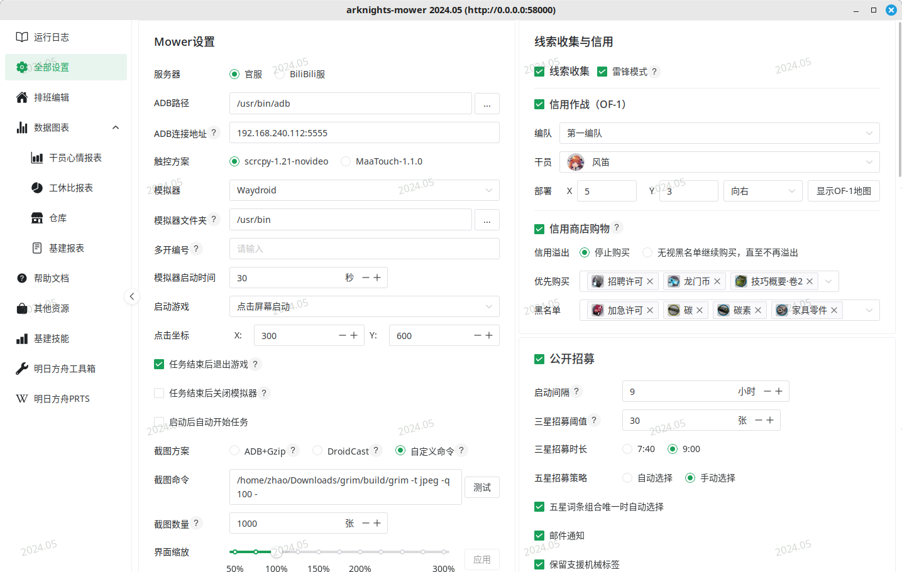
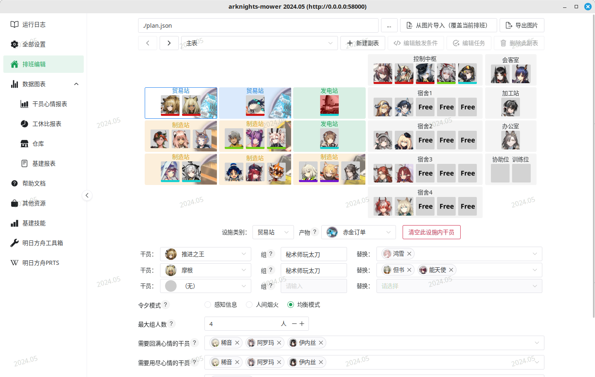
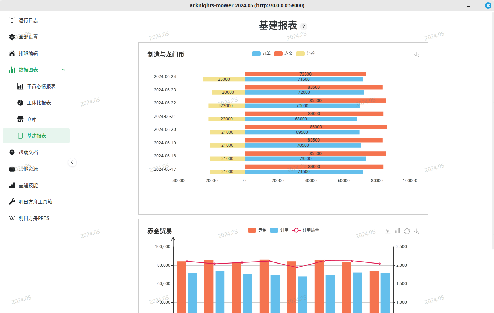

# arknights-mower

Mower 是为长期运行设计的开源明日方舟脚本。

## 功能介绍

- 基建：跑单、按心情动态换班；
- 森空岛：签到、仓库读取；
- 日常：公招、邮件、线索、清理智；
- 大型任务：生息演算、隐秘战线；
- 活动：支持的签到和每日领取；
- 调用 MAA：肉鸽、保全。

## 界面截图






## 源码部署

macOS 和 Linux 虽提供独立包，仍建议优先使用源码部署。

需要 Git、Python 3.12，以及 Node.js 20.19+ 或 22.12+。Linux 需要图形桌面环境；Windows 需要 WebView2 运行时。

### 获取源码并构建前端

以下步骤适用于 Windows、Linux 和 macOS，在终端依次执行：

```bash
git clone --branch alpha https://github.com/ArkMowers/arknights-mower.git
cd arknights-mower
cd ui
npm ci
npm run build
cd ..
```

完成后，在仓库根目录按对应系统安装 Python 依赖并启动。

### Windows

在 PowerShell 中执行：

```powershell
py -3.12 -m venv .venv
.\.venv\Scripts\python.exe -m pip install -r requirements.txt
.\.venv\Scripts\python.exe webview_ui.py
```

### Linux

以下以 Ubuntu 24.04 桌面环境为例。安装窗口后端、二维码识别等系统依赖，再创建可访问系统 PyGObject 的 Python 3.12 环境：

```bash
sudo apt install python3.12-venv python3-tk python3-gi \
    gir1.2-gtk-3.0 gir1.2-webkit2-4.1 gir1.2-soup-3.0 \
    libzbar0 libgl1 libglib2.0-0 adb
python3.12 -m venv --system-site-packages .venv
./.venv/bin/python -m pip install -r requirements.in
./.venv/bin/python webview_ui.py
```

其他发行版需使用对应的系统依赖包，并确保系统 PyGObject 与虚拟环境的 Python 版本一致。GTK/WebKit2 依赖说明见 [平台依赖](doc/release-platforms.md#linux-独立包的窗口后端与宿主依赖)。

### macOS

使用 Homebrew 安装 Python、Tk 和二维码识别依赖，再安装当前平台的 Python 依赖：

```bash
brew install python@3.12 python-tk@3.12 zbar
python3.12 -m venv .venv
./.venv/bin/python -m pip install -r requirements.in
./.venv/bin/python webview_ui.py
```

### 启动与配置

后续启动只需在仓库根目录执行对应系统的最后一条命令。将 `webview_ui.py` 换成 `manager.py` 可启动多开管理器。

首次进入后，在 Mower 设置中选择设备并测试连接，再配置排班及所需任务。入门说明见程序内“一条龙”；源码更新见 [软件更新说明](doc/software-update.md#源码部署)。

打包与其他部署方式：[本地打包说明](docs/cookbook/packaging.md) · [Docker 部署](docs/cookbook/docker-deploy.md)。

## 建议与反馈

[Mower 反馈表](https://docs.qq.com/sheet/DUEJ6UWN5VFVRU0dG?tab=BB08J2)：查看已有问题；表格填写需相应编辑权限。提交反馈时请附软件版本、系统与设备、实际现象、期望行为及相关日志，并去除账号密码、访问令牌和密钥。

**提出建议、反馈 Bug，欢迎加入 QQ 群 (521857729) 或 QQ 频道 (ArkMower)（频道号：2r118jwue4）**

## 关于 Mower-NG

Mower-NG 项目由前 Mower 项目开发者之一 [EE0000 (@ZhaoZuohong)](https://github.com/ZhaoZuohong) 基于 Mower 项目二次开发，现已独立运作为其个人开发的项目，与 Mower 项目不再有关联。

由于 [EE0000 (@ZhaoZuohong)](https://github.com/ZhaoZuohong) 已经退出 Mower 开发组，其在网络平台上发表的言论仅代表其个人观点，不代表 Mower 项目或 Mower 开发组的立场。我们敬请广大用户理性分析，并谨慎甄别相关信息。
