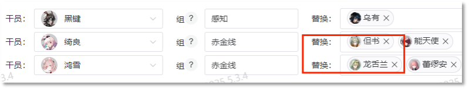
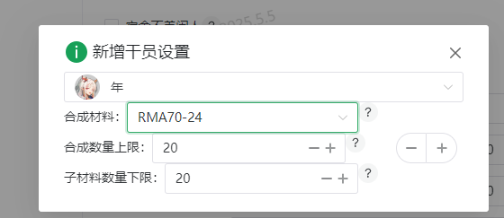
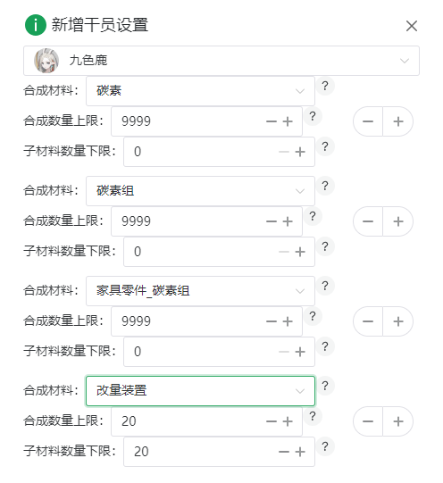

# 高级设置

### 运行模式
> 换班模式： 换班+跑单

### 线索收集
开启后mower接管线索收集与开趴

### 宿舍不养闲人
开启后自动移出已回满的干员，替换为未回满且未被心情工作或黑名单限制的干员，若无待回复的干员则置入宿管干员

### 葛朗台跑单
>**跑单**：但书、龙舌兰、佩佩、u酱的技能效果仅作用于订单生成的一瞬间。在贸易站内安排高效率的干员，于当前订单快结束时换上但书、龙舌兰，下一笔订单生成后换回高效率的干员，这种操作称为跑单。目前Mower仅适配但书、龙舌兰、佩佩跑单。将跑单干员添加至贸易站干员替换组首位，则Mower运行时会自动读取该站订单时间，执行跑单任务。
  
| 勾选 | 优点 | 执行操作 |
|--------|----------|----------|
| 是 |不消耗无人机| 选中干员后会等待至新单生成前若干秒（葛朗台缓冲时间）后再放入贸易站。 |
| 否 |网络不好时选用能避免漏单| 选中干员后会立即放入贸易站再无人机加速 |

### 跑单前置延时（分钟）
提前x分钟开始跑单，推荐值为5-10分钟

### 无人机使用房间
默认为跑单使用无人机，填写格式为room_X_X(X为数字)
> ***⚠ 若跑单且想加速贸易站，请勿填写此项，以免干扰跑单***

### 无人机使用阈值
加速制造站时，使用超过阈值部分的无人机。加速贸易站时，超过阈值使用无人机加速一单。故请加速贸易站的时候至少保证该阈值超过一单的数量（92）
如加速贸易，推荐大于 贸易站数 x 10 + 92                          
如加速制造，推荐大于 贸易站数 x 10

### 搓玉补货房间
搓玉玩家使用Mower时请再次填上搓玉的制造站，以保证自动补货

### 心情阈值
整组心情低于该值时会安排下班任务
>实际心情值为心情下限+心情阈值×心情上下限差。如阈值设65%，对应感知模式下夕实际心情为12+0.65*12=19.8。大部分干员心情下限为0，心情范围在[0,24]

### 急救阈值
整组心情低于心情阈值×急救阈值后，且宿舍有**任意空位**，则Mower强制安排该组进入宿舍休息
  - 急救阈值为0时不触发急救

### 宿舍优先级排序
可以按照用户需求对宿舍回复优先级进行排序，不填按默认顺序

### 替换组心情监视
填入干员后将记录该干员心情

### 无缝合成材料设置指南
✅ **必须满足**：
- 开启"宿舍不养闲人回满"功能
- 已绑定森空岛账号并开启仓库读取
- 在**基建设置**中完成材料配置
- 首次合成需设置**加工任务**或手动合成触发不养闲人 
  
- 合成多个材料，则优先合成列表中更靠前的材料，材料列表如图
  
**九色鹿专属设置**
#### 心情消耗规则
- **垫刀材料**：所有≤3心情消耗以及基建材料  
  示例：家具零件_碳（1）、全新装置（2）
- **暴击材料**：必须=4心情消耗  
  示例：固源岩组（4）、糖组（4）
- **建议路径**：碳素 → 碳素组 → 家具零件_碳素组 → 材料
  
`九色鹿暂不支持8心情拓展`

### 启动mower时自动开启任务
勾选后，启动mower便会自动执行任务
