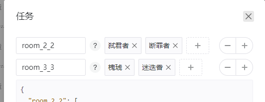

# 副表（beta）
  可以通过用户自定义基建条件来触发的特殊排班表  
  - 主表的**干员休息优先级**优先级最高，和副表冲突时生效主表设置
  - 副表空白位置则继承主表
  - 主表其余设置与生效副表设置取并集
  - 副表优先级从上到下递增，副班同时生效时高优先级副表覆盖差异位置
  - 生效副表可见于当前运行日志

### 副表管理
- 点击铅笔图标可命名副表
- 可使用【＜ ＞】调整优先级顺序
  

### 触发时机
触发时机是判定副表开始和结束的时间点。目前支持的时机包括：
  - 任务开始
  - 下班结束
  - 上班结束
  - 任务结束
上方时机涵盖下方时机

### 运算符
| 运算符 | 意义 | 内容 |
|--------|----------|----------|
| and | 和 | 多个条件同时为真 |
| or | 或 | 其中一个条件为真 |
| == | 等于 | 比较两个值是否相等 |
| != | 不等于 | 比较两个值是否不相等 |
| > | 大于| 数值计算 |
| >= | 大于等于| 数值计算 |
| < | 小于| 数值计算 |
| <= | 小于等于| 数值计算 |
| + | 加 | 数值计算 |
| - | 减 | 数值计算 |

### 副表任务
副表触发时，执行的一次换班任务
  - 副表任务有序，写入顺序即放入位置顺序
      
  - 若任务与当前班表相同则跳过
  - 若执行完毕与当前班表不同则纠错

 **常用副表见群文件入门一条龙教程**

  如果有其他特殊需求可以建立Issue
