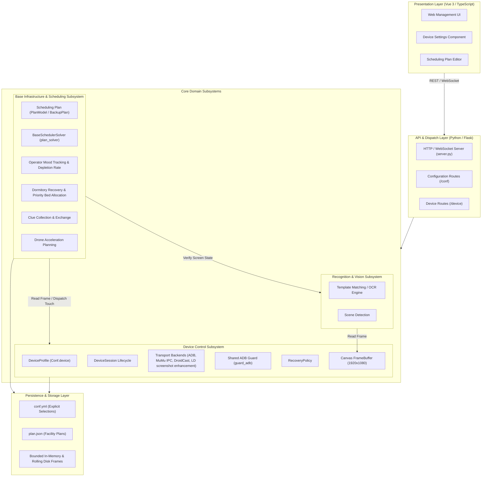

# System Panorama Architecture

Authoritative architectural specification of Arknights Mower, documenting subsystem boundaries, data flows, and invariant enforcement.

---

## 1. System Decomposition

Arknights Mower consists of four decoupled layers:

### 1.1 Presentation Layer (`ui/`)
- Built with Vue 3, Vite, Naive UI, and Pinia.
- Translates user intent into declarative API payloads.
- Maintains ephemeral discovery lists without persisting unconfirmed candidate instances.
- Directly exposes configurable recovery policies (`recovery_timeout`, `recovery_attempts`, `recovery_local_wait`).

### 1.2 API & Dispatch Layer (`server.py`)
- Provides RESTful JSON endpoints and real-time WebSocket feeds.
- Implements `GET /conf` on-the-fly migration, `PATCH /conf` partial updates, and `POST /conf` backward compatibility.
- Dispatches scheduling runs and orchestrates graceful shutdown across threads and child processes.

### 1.3 Core Subsystems (`arknights_mower/`)
- **[Device Control Subsystem](subsystems/device-control.md)**: Manages emulator discovery, socket-level transport, standard canvas frame acquisition, readiness verdicts, and bounded crash recovery.
- **[Base Infrastructure & Scheduling Subsystem](subsystems/base-scheduler.md)**: Drives automated base operations: operator mood evaluation, empirical depletion rate calculation, dormitory recovery ordering, dynamic shift transitions, clue party management, and drone acceleration.
- **[MAA Integration Subsystem](subsystems/maa-integration.md)**: Consumes MAA core callbacks across a MAA run boundary, translating task-chain transitions and whitelisted milestones into runtime-log lines while recurring telemetry stays at DEBUG.
- **Recognition Subsystem**: Performs template matching and neural OCR over immutable 1920×1080 canvas frames.

### 1.4 Persistence & Storage Layer
- Stores explicit user configuration in `conf.yml` via [`DeviceProfile`](../arknights_mower/utils/config/device_profile.py).
- Stores base layouts and shifts in `plan.json` via [`PlanModel`](../arknights_mower/utils/config/plan.py).
- Maintains bounded diagnostic frame buffers with deterministic ring-buffer eviction and rolling disk cleanup.

---

## 2. Invariant Traceability Matrix

The system enforces six core architectural invariants defined in [CODING_STANDARDS.md](../CODING_STANDARDS.md):

| Invariant | Name | Scope | Enforcement Mechanism | Verification Suite |
| :--- | :--- | :--- | :--- | :--- |
| `[INV-01]` | Transient vs Persisted Isolation | Config / Device | `DeviceProfile` serializes explicit fields only; discovery candidates stay in-memory | `device_config_tests.py` |
| `[INV-02]` | Target Rebinding Clears Endpoints | Session / Device | Switching presets or instances invalidates `last_serial` immediately | `device_session_tests.py` |
| `[INV-03]` | Failure Preserves Target Identity | Session / Driver | Failed readiness or discovery halts without drifting to host devices | `device_session_tests.py` |
| `[INV-04]` | IPC Pair Cohesion | Capture / Touch | MuMu IPC capture and touch backends require simultaneous selection | `device_config_tests.py` |
| `[INV-05]` | Shared ADB Guard | Transport / ADB | Socket-level handshake checks server liveness; forbids implicit `kill-server` | `device_session_io_tests.py` |
| `[INV-06]` | Domain Glossary Synchronization | Docs / Governance | All code, tests, and documentation adhere to authoritative terms in `CONTEXT.md` | `verify_governance_tests.py` |

---

## 3. Cross-Cutting Architectural Patterns

### 3.1 Monotonic Deadline Budgets
All socket connections, ADB commands, emulator CLI interactions, and instance recoveries execute within explicit time limits. The system uses monotonic deadlines (`deadline = time.monotonic() + budget`) rather than unbounded polling loops.

### 3.2 Guaranteed Compensation
Every acquired runtime resource (temporary screen geometry overrides, child processes, open socket handles, file locks) registers cleanup and compensation with [`PreparationSession`](../arknights_mower/utils/device/preparation.py), [`close_process`](../arknights_mower/utils/device/owned.py), or dedicated process termination handlers. Compensation executes unconditionally upon normal exit, exceptions, or cancellation signals.

### 3.3 Structured Verdicts
External device interactions produce structured status verdicts ([`ReadinessResult`](../arknights_mower/utils/device/session.py)) containing concrete classifications (`absent`, `offline`, `booting`, `ready`) and remediation guidance rather than unhandled tracebacks.
