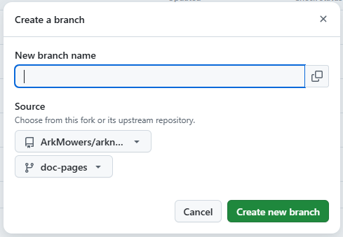

# 项目文档

本项目文档使用 `Markdown` 格式编写，由 [MkDocs](https://www.mkdocs.org/) 构建，并使用 [Material for MkDocs](https://squidfunk.github.io/mkdocs-material/) 主题。

源码在 [doc-pages 分支](https://github.com/ArkMowers/arknights-mower/tree/doc-pages)，使用 [Publishing from a branch](https://docs.github.com/en/pages/getting-started-with-github-pages/configuring-a-publishing-source-for-your-github-pages-site#publishing-from-a-branch) 的方式自动部署到 GitHub Pages。

在本地预览与构建文档，需要安装 Python 3 环境。

---

## 准备工作

### 获取源码

首先前往 Mower 在 GitHub 上的主仓库进行 Fork：

[`https://github.com/ArkMowers/arknights-mower/fork`](https://github.com/ArkMowers/arknights-mower/fork){ target="_blank" }

??? info "建议勾选 Copy the main branch only"
    在 Fork 页面建议勾选 **`Copy the main branch only`** 以保持你的仓库简洁。如果你后续需要维护其他分支，可以通过下文的 `fetch` 命令按需获取。

Fork 完成后，在自己的仓库新建一个分支，基于主仓库的 `doc-pages` 分支：

<figure markdown="span">
  { width="500" }
</figure>

接下来就可以克隆源码了

```bash title="bash" linenums="1"
git clone --single-branch --branch doc-pages https://github.com/{你的用户名}/arknights-mower.git
cd arknights-mower
```

### 创建虚拟环境

源码克隆完成后，为隔离环境，需要在虚拟环境里安装依赖：

=== "Windows"
    ```bash title="bash" linenums="1"
    python -m venv venv
    .\venv\Scripts\activate
    ```
=== "MacOS"
    ```bash title="bash" linenums="1"
    python3 -m venv venv
    source venv/bin/activate
    ```
=== "Linux"
    ```bash title="bash" linenums="1"
    python3 -m venv venv
    source venv/bin/activate
    ```

### 安装依赖

```bash title="bash" linenums="1"
pip install -r requirements.txt

```

至此，准备工作已全部完成，可以愉快地编写文档了~

---

## 编辑、预览与构建

建议使用 `Visual Studio Code` 进行编辑。

### 文档文件结构

为了方便大家更快了解并上手编辑文档，这里给出文档文件结构：

```text title="文件结构" linenums="1" hl_lines="22"
material-doc/
├── .github/
│   └── workflows/
│       └── ci.yml                       # GitHub Actions CI 配置
├── docs/
│   ├── assets/
│   │   ├── img/                         # 文档引用图片（肥鸭.png、log.png 等）
│   │   ├── logo/                        # 站点 logo（logo.ico / logo.png）
│   │   └── snippets/                    # 示例代码片段（图像处理与特征匹配）
│   │       ├── coordinate.md
│   │       ├── cropimg.md
│   │       ├── feature-matching.md
│   │       ├── feature-matching-3d.md
│   │       ├── feature-point.md
│   │       ├── loadimg.md
│   │       ├── matcher.md
│   │       ├── multi-matching.md
│   │       ├── ra-map.md
│   │       └── thres2.md
│   ├── dev/                             # 开发文档
│   │   ├── branch.md                    # 版本与分支说明
│   │   ├── doc.md                       # 项目文档贡献指南（当前文件）
│   │   ├── environment.md               # 开发环境配置
│   │   ├── feature-matching.md          # 特征匹配说明
│   │   ├── image.md                     # 图像处理基础函数
│   │   └── README.md
│   ├── former-manual/                   # 旧版用户手册
│   │   ├── manualV1/                    # 第一版手册
│   │   │   ├── conf/                    # 配置指南
│   │   │   ├── noun/                    # 名词解释与小技巧
│   │   │   ├── qa/                      # 常见问题
│   │   │   └── start/                   # 入门（下载、基建）
│   │   ├── manualV2/                    # 第二版手册（入门指北）
│   │   └── README.md
│   ├── manual/                          # 当前用户手册
│   │   ├── chart.md                     # 数据图表
│   │   ├── install.md                   # 下载及更新
│   │   ├── intro.md                     # 前言
│   │   ├── MasteryRecommendation.md     # 专精推荐
│   │   ├── mower-settings.md            # Mower 设置
│   │   ├── qa.md                        # 常见问题
│   │   ├── README.md                    
│   │   └── schedule.md                  # 排班教学
│   └── README.md                        # 站点首页
├── .gitignore
├── mkdocs.yml                           # MkDocs 配置（主题、导航、插件）
├── README.md                            
└── requirements.txt                     # Python 依赖（MkDocs、插件等）
```

#### 目录说明

| 目录 | 用途 |
| ---- | ---- | 
| `docs/manual/` | **当前**用户手册，面向最终用户 |
| `docs/former-manual/manualV2/` | 第二版手册（入门指北），已归档 |
| `docs/former-manual/manualV1/` | 第一版手册（更早），已归档 |
| `docs/dev/` | 开发文档，面向贡献者 |
| `docs/assets/img/` | 文档中使用的截图、示意图等图片资源 |
| `docs/assets/logo/` | 站点 Favicon / Logo 图标文件 |
| `docs/assets/snippets/` | mkdocs 可引用的 Markdown 片段文件 |

#### 关键文件

| 文件 | 用途 |
| ---- | ---- |
| `mkdocs.yml` | MkDocs 主配置：定义站点名称、主题、导航栏结构、Markdown 扩展、插件等 |
| `requirements.txt` | Python 依赖项：`pip install -r requirements.txt` 安装 |
| `.github/workflows/ci.yml` | CI 流水线配置 |

> 导航结构由 `mkdocs.yml` 中的 `nav` 配置控制。添加新页面时需同时更新 `nav`。


* **实时预览**： 用于编写文档时预览修改效果。
```bash title="bash" linenums="1"
mkdocs serve --livereload
# 你也可以使用 -a <IP:PORT> 参数来显式指定监听的 IP 与端口：
# mkdocs serve --livereload -a 127.0.0.1:8000
```
等待一会，mkdocs 会启动一个本地开发服务器，默认监听 [localhost:8000](localhost:8000)


* **本地构建**：用于检查生成的静态文件是否正常。
```bash title="bash" linenums="1"
mkdocs build
```

---

## 提交更改

完成编辑后，将更改推送到**你自己的** Fork 仓库：

```bash title="bash" linenums="1"
git add .
git commit -m "docs: [对提交的更改进行描述]"
git push origin {分支名}
```

??? note "规范化提交"
    `commit` 的描述内容建议参考 [约定式提交](https://www.conventionalcommits.org/zh-hans/v1.0.0-beta.4/#%e7%ba%a6%e5%ae%9a%e5%bc%8f%e6%8f%90%e4%ba%a4%e8%a7%84%e8%8c%83){ target="_blank" } 规范。

---

## 同步 Fork {:#SyncFork}

当主仓库（upstream）有了新更新，而你需要将其合并进你的开发分支时，请根据需求选择以下方式：

### 使用 Rebase 同步（推荐）

!!! success "保持历史整洁"
变基（Rebase）会将你的修改“接”在主仓库最新的提交之后，避免产生无用的 `Merge branch` 提交记录。

```bash title="bash" linenums="1"
# 获取主仓库更新
git fetch upstream

# 将当前分支变基到主仓库的 doc-pages 之上
git rebase upstream/doc-pages

```

**处理冲突：**

1. 若提示 `CONFLICT`，请在 VS Code 中处理冲突文件。
2. 处理完后执行 `git add .`（不要 commit）。
3. 执行 `git rebase --continue` 直到变基完成。

### 常规合并（Merge）

如果你更习惯传统的合并方式：

```bash title="bash" linenums="1"
git fetch upstream
git merge upstream/doc-pages
# 处理冲突并提交
git push origin doc-pages

```

### 强制同步（放弃本地修改）

!!! warning "危险操作"
该操作将会**彻底覆盖**你本地的所有更改，使其与主仓库完全一致。

```bash title="bash" linenums="1"
git fetch upstream
git reset --hard upstream/doc-pages
git push -f origin doc-pages

```

## 创建 Pull Request

在你的 GitHub Fork 仓库页面点击 **"Compare & pull request"**。
**注意：** 请确保 `base repository` 指向主仓库，且 `base` 分支选择为 `doc-pages`。
