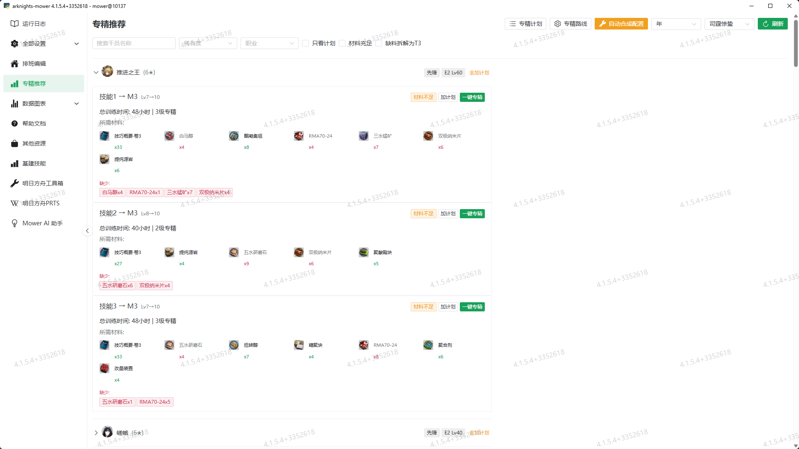
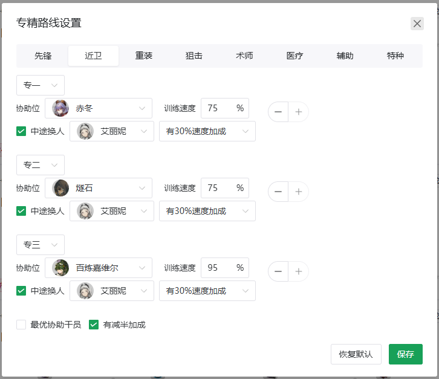
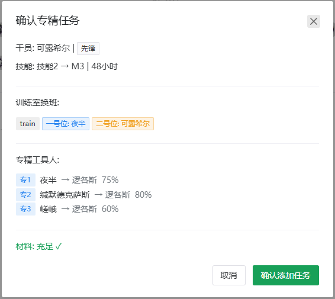

# 专精推荐功能使用教程

## 功能概述

专精推荐功能基于森空岛数据，自动分析你的干员和仓库材料，计算哪些技能可以进行专精（技能等级 7→10，即专一至专三），并支持一键创建自动化专精任务。

---

## 训练室基础机制

在了解本功能之前，先回顾训练室的核心游戏规则：

| 机制 | 说明 |
|------|------|
| **训练室等级** | 训练室需要升级到 3 级才能进行专三训练 |
| **基础速度加成** | 协助位进驻非「注意力涣散」的干员时，训练速度 **+5%**（所有协助生效的基础值） |
| **同时单计划** | 训练室同时只能执行一个专精计划 |
| **不可中止** | 训练开始后无法取消，训练中的干员在此期间无法换岗 |
| **实际消耗** | 本模块仅分析仓库材料是否充足，专精时游戏内会**真实消耗材料**，不会自动代刷 |

### 训练时间的计算

实际训练用时 = 基础训练时间 / (1 + 5% + 协助干员加成%)

不同稀有度的基础训练时间不同（以 6★ 为例约为 8h / 16h / 24h，5★/4★ 更短），Mower 会根据 `skill_data.json` 中的精确数据计算每个技能的实际用时，无需手动估算。

---

## 前置条件

1. **Mower 正在运行**：专精任务会被添加到 Mower 的任务队列中自动执行
2. **森空岛数据**：首次使用需点击「刷新」按钮从森空岛拉取干员和仓库数据
3. **专精数据文件**：`arknights_mower/resources/skill_data.json`（由 `build_assets.py` 生成，包含技能升级材料和时间）

---

## 页面概览

打开 Mower ，点击「专精推荐」标签页，可以看到：

<figure markdown="span">
    
    <figcaption>专精推荐页面</figcaption>
</figure>

### 关键按钮

| 按钮 | 说明 |
|------|------|
| **刷新** | 从森空岛拉取最新干员数据和仓库材料，重新分析专精推荐 |
| **专精计划** | 查看和管理已加入计划的技能列表 |
| **专精路线** | 配置各职业的专精工具人（协助位干员）和换人策略 |
| **自动合成配置** | 根据计划中的技能，自动生成制造站合成配方并创建加工任务 |

### 筛选条件

| 筛选项 | 说明 |
|--------|------|
| **搜索干员** | 按干员名称搜索 |
| **稀有度** | 按 3★/4★/5★/6★ 筛选 |
| **职业** | 按先锋/近卫/重装/狙击/术师/医疗/辅助/特种筛选 |
| **只看计划** | 仅显示已加入专精计划的技能 |
| **材料充足** | 仅显示当前仓库材料完全满足专精链路的技能 |
| **缺料拆解为 T3** | 将缺料按合成配方拆解为 T3 基础材料展示，方便查看需要刷哪些材料 |

!!! example "示例"
    某技能缺 1 个「聚合剂」，勾选 T3 拆解后，会将其拆为「酮阵列×2 + 异铁块×2 + 改量装置×1」等 T3 材料，直观展示需要刷的各种蓝材料。

---

## 使用流程

### 第一步：拉取数据

点击「刷新」按钮，从森空岛同步干员和仓库数据。同步成功后页面会展示所有可专精的干员和技能。

!!! warning
    如果提示「暂无干员数据」，请先确保森空岛数据已配置并可正常访问。

### 第二步：查看推荐

展开干员折叠面板，可以看到每个可专精技能的详细信息：

- **技能名 → M3**：当前等级（如 Lv7→10）和目标等级
- **总训练时间**：完成全程专精所需的小时数（已计入协助加成）
- **所需材料**：列出所有需要的材料及数量，绿色背景表示该材料已足够
- **缺少材料**：红色标签展示缺失的材料及数量

!!! tip
    勾选「材料充足」可以快速筛选当前即可开专的技能。

### 第三步：加入计划

对于想要专精的技能，点击「加计划」按钮将其加入专精计划：

- 点击单个技能的「加计划」→ 该技能加入计划
- 点击干员右侧的「全加计划」→ 该干员所有技能加入计划
- 左上角「专精计划」按钮可以查看和管理计划列表
- 计划会持久化保存到本地，刷新页面不会丢失

### 第四步（可选）：配置专精路线

点击「专精路线」按钮，为每个职业配置专精工具人（协助位）。

??? info "什么是专精工具人？"

    专精工具人是在训练室协助位提供训练速度加成的干员。本模块为每个职业默认配置了三名干员（专一/专二/专三各一名），以下是各职业默认推荐：

    | 职业 | 专一（减半） | 专二 | 专三 |
    |------|-------------|------|------|
    | **先锋** | 夜半 (75%) | 缄默德克萨斯 (80%) | 嵯峨 (60%) |
    | **近卫** | 赤冬 (75%) | 燧石 (75%) | 百炼嘉维尔 (95%) |
    | **重装** | 极光 (75%) | 暴雨 (75%) | 星熊 (60%) |
    | **狙击** | 假日威龙陈 (95%) | 埃拉托 (75%) | W (95%) |
    | **术师** | 特米米 (75%) | 薄绿 (75%) | 死芒 (95%) |
    | **医疗** | 阿 (60%) | 濯尘芙蓉 (75%) | 阿 (60%) |
    | **辅助** | 铃兰 (60%) | 铃兰 (60%) | 浊心斯卡蒂 (95%) |
    | **特种** | 罗宾 (75%) | 缄默德克萨斯 (80%) | 归溟幽灵鲨 (95%) |

    !!! note "选择依据"
        专一默认带减半加成（速度可低一些，时间本身短），专二和专三注重高训练速度。

#### 中途换人机制

这是专精路线中最重要的策略点，需要理解两个核心机制：

**1. 艾丽妮 (精二) 的「精神锻炼」与 逻各斯 (精二) 的「言语之义」**

这两位干员的精英二基建技能效果相同：在协助位持续协助同一名干员达到 **5 小时** 后，该干员**下一次专精训练开始时立即完成 50% 的训练进度**（等效于下一次训练时间减半）。

**2. 默认策略**

以近卫为例：先用 **百炼嘉维尔 (95% 速度)** 完成专二的大部分训练，在最后阶段中途换入 **艾丽妮**。这样：
- 训练过程享受了百炼嘉维尔的高速度
- 训练结束时艾丽妮已在协助位超过 5 小时
- 下一次专精（专三）开始后立即完成 50% 进度，大幅缩短总时间

#### 路线设置界面

<figure markdown="span">
    
    <figcaption>专精路线设置界面</figcaption>
</figure>

各配置项说明：

| 配置项 | 说明 |
|--------|------|
| **协助位干员** | 在训练室协助位提供训练速度加成的干员 |
| **训练速度** | 该干员提供的训练速度加成百分比（不包含基础 5%） |
| **中途换人** | 勾选后，Mower 会在训练中途将协助干员替换为换人干员 |
| **换人干员** | 中途替换进来的干员（艾丽妮或逻各斯），替换的目的是触发精神锻炼/言语之义 |
| **有 30% 速度加成** | 换人干员的职业是否匹配训练位干员职业，从而获得自身的 +30% 速度加成（近卫/狙击匹配艾丽妮，术师/辅助匹配逻各斯） |
| **最优协助干员** | 使用各职业已知的最高速度协助干员配置 |
| **有减半加成** | 该协助干员是否提供专一半时间加成 |

### 第五步：一键专精

展开目标技能，点击「一键专精」按钮，弹出确认对话框：

<figure markdown="span">
    
    <figcaption>一键专精确认对话框</figcaption>
</figure>

确认后 Mower 会自动：

1. 添加「上班」任务 → 将协助干员和训练干员放入训练室
2. 添加「技能专精」任务 → 自动执行全流程专精（收集 → 升级 → 确认）
3. 根据路线设置，自动计算中途换人时间并创建对应任务

### 第六步：等待自动化执行

任务由 Mower 自动执行：

- 收集完成的训练 → 选择技能 → 开始下一级专精
- 到达中途换人时间点 → 自动将协助干员替换为艾丽妮/逻各斯
- 训练完成 → 自动收集，或如仍未完成则刷新任务时间
- 材料不足时会中止并发送错误通知

---

## 自动合成配置

对于材料不足的技能，可以使用「自动合成配置」一键生成制造站合成方案：

1. 先将所需的技能加入专精计划
2. 选择「T5 合成干员」（如"年"）和「技巧概要干员」（如"司霆惊蛰"）
3. 点击「自动合成配置」

本模块将会自动：

   - 分析计划中所有技能的材料缺口
   - 将高阶材料拆解为 T4/T3 基础材料
   - 生成制造站合成配置（九色鹿 + T5 干员分工）
   - 创建对应的加工任务
   - 使用已有的 T3 库存抵扣

计划缺料汇总会以 T3 材料标签展示，方便你直观了解需要刷哪些材料。

---

## 常见问题

??? question "Q: 为什么有些干员没有显示？"

    A: 只有精二（`evolvePhase >= 2`）且有技能未专三的干员才会出现在推荐列表中。

??? question "Q: 为什么提示「暂无干员数据」？"

    A: 需要先点击「刷新」按钮从森空岛拉取数据。如果拉取失败，请检查森空岛 API 是否正常。

??? question "Q: 材料显示充足，但专精时失败了？"

    A: 仓库材料可能被其他制造/加工消耗了。建议在仓库材料充裕时添加专精任务，或先完成自动合成配置确保材料到位。

??? question "Q: 中途换人没有触发？"

    A: 请确保「专精路线」中勾选了「中途换人」并填写了正确的换人干员名（艾丽妮或逻各斯）。

??? question "Q: 专精计划会丢失吗？"

    A: 计划保存在本地 `tmp/matery_plan.json` 文件中，不会因刷新或重启丢失。

??? question "Q: 换人干员选艾丽妮还是逻各斯？"

    A: 取决于训练位干员的职业——近卫/狙击选艾丽妮（她有 +30% 近卫狙击加成），术师/辅助选逻各斯（他有 +30% 术师辅助加成），其余职业任选（都没有额外加成，仅触发精神锻炼/言语之义减半效果）。
