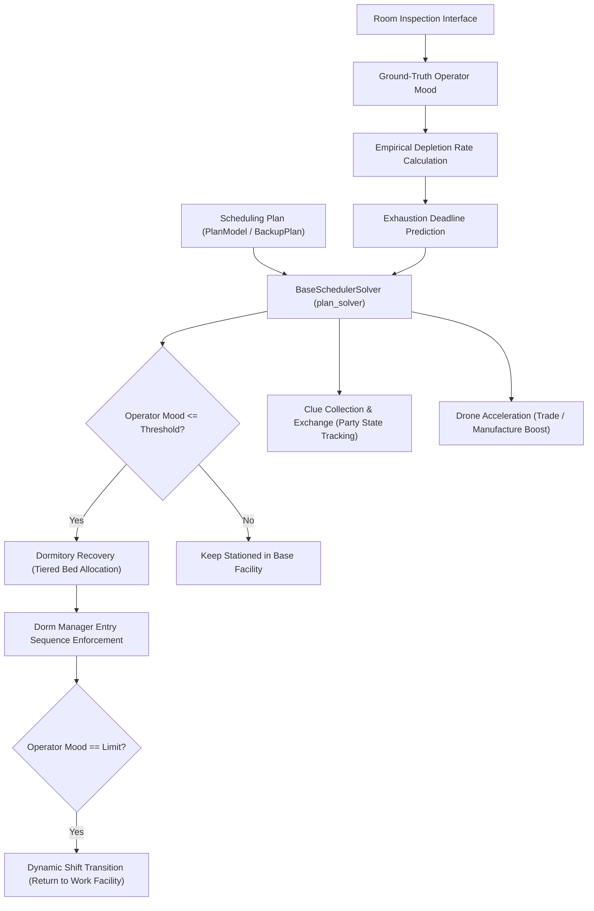

# Base Infrastructure & Scheduling Subsystem Specification

Authoritative specification of the Base Infrastructure & Scheduling Subsystem, governing operator assignments, mood mechanics, dormitory allocation, shift transitions, and facility automation.

---

## 1. Domain Model & Workflow

---

## 2. Core Concepts & Functional Contracts

### 2.1 Scheduling Plan (`Scheduling Plan`)
- Configures assigned primary operators, operator groups, replacements, products, and resting rules across all base facilities.
- Manages the baseline master plan (`plan1`) and condition-triggered backup plans (`backup_plans`).
- Condition triggers monitor facility state, clue party status (`party_time`), and operator exhaustion.

### 2.2 Operator Mood & Depletion Rate
- Tracks operator mood within the numerical range of 0 to 24.
- Captures ground-truth mood values during room inspection.
- Computes empirical depletion rate dynamically between consecutive inspections (`(m1 - m2) / delta_t`) rather than relying on hardcoded rates.
- Evaluates predicted exhaustion deadlines to dispatch timely dynamic shift transitions before morale depletion occurs.

### 2.3 Base Facilities
- Encapsulates distinct working facilities (Control Center, Manufacturing Station, Trading Post, Power Plant, HR Office, Reception Room, Training Room, Workshop) and resting facilities (Dormitories 1 through 4).
- Serves as the primary operational unit for operator assignment, production monitoring, and capacity validation.

### 2.4 Dormitory Recovery
- Uses one policy for every configuration. Bed priority is high, normal, low, priority replacement, standby, ordinary replacement, then other idle operators; work shift order uses mood above each operator's lower limit. Equal bed priorities compare missing mood points to the recovery target, not percentages.
- Existing ordinary beds remain stable. Higher-priority admissions can reassign single-target recovery. Only marked managers in slots 1–2 provide single-target recovery; moving the target or a provider invalidates the recorded assignment.
- Establishes recovery with the target already at its final slot. Earlier non-manager slots retain full residents or use the highest-mood eligible idle operators; actual readback verifies the target before the final roster is restored without moving it.
- Fills empty beds even when idle release is disabled. Blacklisted and zero-mood workers are excluded. Due trade order and training tasks take precedence; nearby deadlines use a simple fill or defer filling when time is insufficient.
- Idle release preserves its configured merge window and exclusion list. Personal and Ling/Xi limits force release regardless of idle-release exclusions; global recovery limits alone do not leave beds empty. Bed movement invalidates the stored recovery time.
- Initial mood sampling updates mood without treating temporary placements as backup-plan occupancy. Backup convergence starts only after sampling finishes, using original occupants and new mood readings.
- Retired configuration keys are ignored on import and omitted from saved configuration and UI. Legacy global dorm order migrates to per-plan room order.
- Decision record: [Unified dormitory recovery](../../.agents/notes/implemented/simplification/2026-09-29-unified-dorm-recovery.md).

### 2.5 Dynamic Shift Transition
- Replaces static timetable rotations with condition-driven transitions between work facilities and dormitories.
- Handles off-shift rotation for exhausted operators, on-shift deployment for replacements, post-rest stationing, trade order runs (Proviso, Tequila, Closure), and Fiammetta energy charges.

- Ordinary shifts converge backup conditions, subsequent eligible off-shift groups, cached corrections, and final empty-bed filling in an isolated projection. Failed convergence preserves actual occupancy and the original task.
- Temporary Fiammetta dorm visits retain the measured work depletion rate; mood and sample timestamps still refresh.
- Decision record: [Complete shift convergence](../../.agents/notes/implemented/simplification/2026-09-29-complete-shift-convergence.md).

### 2.6 Clue Collection & Exchange
- Directs operators stationed in the Reception Room to gather clues 1 through 7, receive clues from friends, and gift surplus clues.
- Initiates 24-hour Clue Parties upon completing full clue sets and tracks active party state (`party_time`) to activate corresponding backup plans.

### 2.7 Drone Acceleration
- Consumes Power Plant drones (each drone deducting 3 minutes) to accelerate manufacturing lines or trading post orders.
- Deconflicts concurrent trade order runs with scheduled acceleration windows.
- Calculates current-unit drone counts before manufacturing product switches, subject to the configured progress-loss tolerance.
- After Drone Acceleration, carries the accelerated current unit's remaining time to the product change confirmation. A countdown for the next unit does not defer the switch.
- The [manufacturing switch boundary decision](../../.agents/notes/implemented/bug-fix/2026-09-29-manufacturing-switch-boundary.md) records the failure case and verification.

### 2.8 Operator Selection Verification
- Confirms a selected card by its blue border before committing a facility assignment.
- When a scrolling notice obscures the upper border, the remaining two vertical borders and the leading portion of the lower border confirm selection. Ambiguous borders retain the existing bounded recognition retry.
- The [operator selection decision](../../.agents/notes/implemented/bug-fix/2026-09-29-notice-occluded-operator-selection.md) records the failure case and verification.

---

## 3. Subsystem Invariants

- **[INV-SCHED-01] Empirical Depletion Rate**: Operator exhaustion forecasts must be derived dynamically from sequential inspection deltas rather than uncalibrated static assumptions.
- **[INV-SCHED-02] Stable Recovery Position**: The target retains its final slot during recovery setup and roster restoration; earlier non-manager slots use confirmed full residents or the highest-mood eligible idle padding, with actual readback required before recording recovery.
- **[INV-SCHED-03] Bed Ownership and Release**: Beds have one occupant; release validates occupant identity and respects idle-release exclusions and full-occupancy fallback, while personal mood limits remain mandatory.
- **[INV-SCHED-04] Shift Transition Compensation**: Condition-triggered shifts (order runs, backup plans) must preserve state rollback on failure, avoiding orphaned room assignments.
- **[INV-SCHED-06] Manufacturing Switch Boundary**: After Drone Acceleration, a manufacturing product switch tracks completion of the accelerated current unit; the next unit's countdown never postpones that switch.
- **[INV-SCHED-07] Unified Dormitory Policy**: All scheduling uses the same dormitory policy; retired mode keys neither select legacy behavior nor prevent old configuration imports.
- **[INV-REC-02] Occluded Operator Selection**: A card with an obscured upper selection border is confirmed only when both vertical borders and the leading portion of its lower border are visible; adjacent card borders cannot confirm selection.
- **[INV-SCHED-05] Complete Shift Projection**: Ordinary shifts submit only after backup conditions, eligible rotations, cached corrections, and final bed filling stabilize on an isolated projection; failure preserves the original task and actual occupancy.

---

## 4. Subsystem Implementation Boundaries

- Configuration parser: [`PlanModel`](../../arknights_mower/utils/config/plan.py), [`PlanConfig`](../../arknights_mower/utils/plan.py).
- Scheduler solver: [`BaseSchedulerSolver`](../../arknights_mower/solvers/base_schedule.py).
- Operator data model: [`Operator`](../../arknights_mower/utils/operators.py), [`Operators`](../../arknights_mower/utils/operators.py).
- Dormitory recovery engine: [`dorm_recovery.py`](../../arknights_mower/utils/dorm_recovery.py), [`resting_priority.py`](../../arknights_mower/utils/resting_priority.py).
- Facility acceleration: [`drone_plan`](../../arknights_mower/utils/manufacture_product.py).
