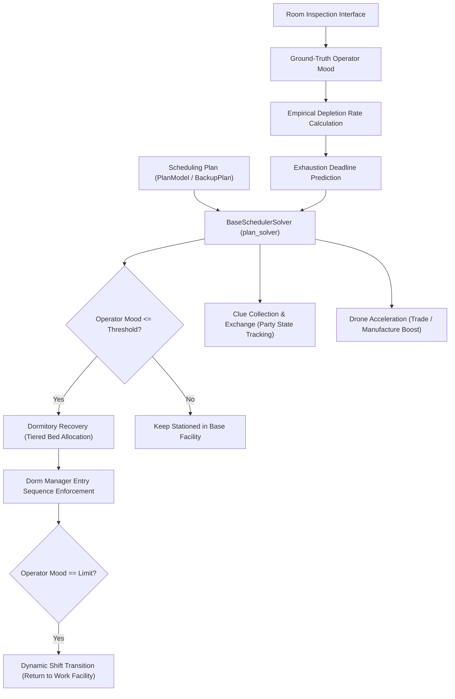

# Base Infrastructure & Scheduling Subsystem Specification

Authoritative specification of the Base Infrastructure & Scheduling Subsystem, governing operator assignments, mood mechanics, dormitory allocation, shift transitions, and facility automation.

---

## 1. Domain Model & Workflow

---

## 2. Core Concepts & Functional Contracts

### 2.1 Scheduling Plan (`Scheduling Plan`)

The shared roster precheck checks training-slot eligibility in main and backup assignments, every binding replacement, and explicit backup staffing tasks. The [training-slot validation decision](../../.agents/notes/implemented/bug-fix/2026-10-09-training-slot-validation.md) defines cache, synchronization and exemption behavior.
- Running-plan restoration restores the baseline, backups and advanced settings captured at scheduler startup. The advanced-settings snapshot comes from the actual global configuration rather than editable plan metadata. The endpoint preserves unrelated global settings, rejects missing or invalid snapshots before writing, and compensates either file-write failure with the original models and file bytes. The frontend pauses and drains autosave, reloads configuration and plan after success, and keeps autosave paused until a page refresh if either read fails. The [restore-cohesion decision](../../.agents/notes/implemented/simplification/2026-10-06-running-plan-restore-cohesion.md) records the regression coverage.
- Manual and startup validation check the baseline and every possible backup activation combination with `Operators.swap_plan(..., refresh=True)`, the same merged-plan checker used by shift projection. Checks retain declaration-order overrides and whole-slot `Current` inheritance, including replacements. Independent operator models preserve actual occupancy and active conditions; failures identify the active backups.
- Static trigger analysis shares known operator working/resting states, room string comparisons, same-room facility-product comparisons and clue-party null checks through supported Boolean logic. Unsupported, missing, time-dependent and state-mutating conditions retain independent activation choices. The validator excludes only logically impossible combinations, admits at most 16384 distinct activation combinations and analyzes at most 262144 symbolic states. Results distinguish `passed`, `failed` and `incomplete`; only `passed` has `success: true`. Startup condition analysis and combination checks share a five-second monotonic deadline after ownership and baseline validation. Manual validation has no elapsed-time limit. Checkpoints stop after the current synchronous parse, sort or merged-plan check; ownership synchronization and baseline validation remain outside the time budget. The [startup deadline decision](../../.agents/notes/implemented/feature/2026-10-06-backup-validation-deadline.md) defines verification. Exceeding any budget returns `incomplete`: manual validation displays a warning and startup logs the warning and continues. Ownership and baseline errors, confirmed merged-plan conflicts and unexpected validation exceptions remain blocking. Runtime checks still validate active combinations before changing operators. The [budget warning decision](../../.agents/notes/implemented/feature/2026-10-02-backup-validation-warning.md) defines these caller contracts. There is no fixed backup-count limit: 14 independent conditions fit the combination budget, and shared or mutually exclusive conditions permit more backups. Static validation does not prove future dynamic convergence. The [validation decision](../../.agents/notes/implemented/bug-fix/2026-10-02-backup-validation-coverage.md) records the regression.
- Configures assigned primary operators, operator groups, replacements, products, and resting rules across all base facilities.
- Manages the baseline master plan (`plan1`) and condition-triggered backup plans (`backup_plans`).
- Condition triggers monitor facility state, clue party status (`party_time`), and operator exhaustion.
- Optional automatic rescue evaluates initialization observations against individual rescue lines and shared native rotation projection. Unknown observations and incomplete projections do not establish recovery blockage. Cached startup still checks actual staffing before planning temporary assignments.
- Each automatic rescue episode persists unfinished local staffing, uses an independently configured rescue schedule for ordinary working facilities, and freezes normal backup transitions and ordinary working shifts. Fiammetta, crafting and mastery retain specialized temporary swaps; explicit rescue trade order agents stay reserved for normally eligible order runs without suppressing ordinary order and product collection during ordinary observations or dormitory rotation. Collection shares existing scheduler and dormitory-rotation wakeups and retains the ordinary collection cooldown.
- Every automatic rescue tick reconciles personal mood-limit release deadlines through the existing strict-release planner, reusing unchanged tasks and their reserved operation starts, after due room observations and before bed reservations; ordinary working shifts remain frozen. Automatic rescue retains configured operator identities and personal limits while manager positions provide episode-local recovery capacity, including the configured Fiammetta position when primaries await beds. Pending strict releases reserve their occupants and original beds; completed personal-limit recovery cannot re-enter emergency beds or manager positions. Completion markers and predicted mood do not establish measured rescue targets. Strict releases read departing mood before selection even when idle recovery is disabled. Predicted idle targets lose only their unverified timestamp and release marker so bed planning can obtain a real reading. Trade order and Fiammetta compensation preserves explicit vacant slots from observed temporary staffing, while `Free` remains a filling request. The [specialized boundary decision](../../.agents/notes/implemented/bug-fix/2026-10-02-emergency-specialized-boundaries.md) and [measured-handoff decision](../../.agents/notes/implemented/bug-fix/2026-10-02-emergency-measured-handoff.md) define verification.
- Correction, backup transitions and handoff suppress completed personal-limit residents from vacant dormitory positions while applying the rescue bed priority to Fiammetta and preserving unfinished recovery primaries during manager restoration. Started trade order retries retain compensation snapshots and original-worker reservations; occupied workers remain at their other working facilities until release. Staffing arrangements preserve unfinished group positions and yield before strict release operation windows; failed handoff reopens beds and restores deadlines only for matching actual occupants. The [rescue admission and dispatch decision](../../.agents/notes/implemented/bug-fix/2026-10-02-emergency-admission-dispatch.md) defines regression coverage.
- History-derived targets use compatible measured segments and native recovery opportunities. Insufficient history uses the normal shift-off threshold. Eligible normal standby operators instead use their personal rescue thresholds; full-recovery requirements retain personal mood caps. Actual observations confirm each primary's recovery target and permit reserved standby; automatic rescue restores ready groups at final handoff when complete normal replacements and available beds from the normal schedule cover unfinished resting groups; manager positions temporarily opened by rescue do not increase normal bed capacity. Handoff and final readback verify current coverage without forecasting the next rotation; unknown recovery times or depletion rates do not independently block exit. Restarts reconcile actual staffing and retain only unfinished arrangements.
- Automatic rescue room readback captures the pre-read occupants and invalidates measured mood timestamps for absent names, including names whose positions the reader already clears. The handoff arrangement uses a dedicated ordinary `SchedulerTask`; its `finally` boundary restores the prior task before room readback and final scheduling, including after deferral and errors. The [observation and handoff decision](../../.agents/notes/implemented/bug-fix/2026-10-02-emergency-observation-handoff.md) records the regression coverage.
- Automatic rescue opens configured manager positions as recovery capacity, including the configured Fiammetta position when primaries await beds, and uses shared dormitory recovery priorities. As recovery demand falls, each dormitory restores one group-recovery manager, followed by one single-target manager if beds remain, without displacing unfinished recovery primaries. Collection and room reads use the strict-release operation allowance and persist unread rooms before yielding. Final readback confirms native feasibility and pending specialized restoration before exit. The [handoff fill cancellation decision](../../.agents/notes/implemented/bug-fix/2026-10-02-emergency-handoff-fill-cancellation.md) defines removal of obsolete episode filling before return. The [startup progress lifecycle decision](../../.agents/notes/implemented/bug-fix/2026-10-02-rescue-startup-progress-lifecycle.md) defines disabled-setting continuation and completed-snapshot invalidation. The [startup release window decision](../../.agents/notes/implemented/bug-fix/2026-10-02-rescue-startup-release-windows.md) defines initialization progress without a rescue episode. The [measured release and compensation decision](../../.agents/notes/implemented/bug-fix/2026-10-02-emergency-measured-release-compensation.md) defines room-level replanning and expired-order restoration. The [rescue observation budget decision](../../.agents/notes/implemented/bug-fix/2026-10-02-emergency-observation-budget.md) defines regression coverage.
- Automatic rescue freezes the normal schedule and applies the effective rescue roster to all ordinary workstations before planning dormitory filling. Rescue backups use the shared condition evaluator at entry and overlay the rescue main plan in configured order. Their `Current` slots inherit the preceding rescue roster. Missing rooms, duplicate workers and incorrect slot counts defer entry with a concrete configuration warning. Primaries explicitly assigned to rescue work receive a startup overlap warning and stay outside the episode recovery targets. Partial arrangements resume only outstanding rooms. Measured-ready recovery primaries leave dormitories into reserved standby until final restoration.
- The [configured rescue schedule decision](../../.agents/notes/implemented/simplification/2026-10-04-configured-rescue-schedule.md) defines limits, observation cadence, and handoff.
- The maintenance condition edits as one row with an advance-hour value, defaulting to 0.5 hours. Existing `op_data.major_maintenance_remaining_hours() <= hours` conditions retain their saved thresholds, including nested combinations. The scheduler queues one threshold check. The condition is false at and after announced downtime start, including while the announcement remains cached; unknown maintenance and flash updates also do not activate it. Major downtime saves state and stops the automation thread. After the client update and task restart, the first normal backup check exits the maintenance backup; no exit shift runs during downtime.
- Entry with effective trade order primaries skips the pre-maintenance order batch and cancels ordinary RUN_ORDER and order-time refresh tasks across all trading posts, including previously advanced and future tasks. Existing original-roster restoration remains mandatory and unrelated tasks remain queued. Final active backup precedence applies: Current preserves maintenance-primary permission, while a later explicit assignment replaces it. Entry without effective trade order primaries reuses the existing pre-maintenance order window and Drone Acceleration, retains retry delays and completes roster restoration before switching; new order creation pauses during this batch, and other queued orders are not pulled into it.
- Room arrangement and confirmation use RUN_ORDER task identity for temporary trade-order staffing and countdown calibration. Adjusted orders retain the advanced deadline and confirm without ordinary order waiting before Drone Acceleration. Maintenance primary arrangements use ordinary staffing confirmation.
- An active backup containing this condition permits Proviso, Tequila, Pepe, and Closure in its explicit primary slots, with ordinary replacements still required. Any retained trade order primary pauses every trading post's order tasks and order-time refresh tasks. Later explicit overrides replace this permission; `Current` inherits it. Exit or removal of all such primaries resumes order creation. A maintenance backup without trade order primaries keeps normal order runs.
- Decision records: [Maintenance backup ordering](../../.agents/notes/implemented/feature/2026-09-30-maintenance-backup-ordering.md) and [Maintenance cutoff and condition evaluation](../../.agents/notes/implemented/bug-fix/2026-09-30-maintenance-cutoff-condition-evaluation.md).

### Backup product and replacement transitions

When a slot retains its primary, facility type and ordered group bindings, product or replacement-list changes prefer to preserve its primary's shift state, recovery bed and deadline. Working primaries remain at their slots; unobserved slots retain initialization correction. Matching maximizes available covers across affected slots before recalling eligible primaries early for the remaining shortages. Current valid covers have priority. Cover selection and recalls respect mastery protection, task and product reservations, occupied recovery beds and unrelated working assignments. Ordinary return tasks are derived schedules and are rebuilt after a recall; locked product shifts remain protected. Infeasible arrangements defer the transition and retain active backup conditions and queued staffing tasks. Product observation and switching retain their existing execution boundary. Binding changes and explicit entry staffing tasks retain their existing behavior. Same-primary relocations between ordinary workstations of the same facility type preserve resting primaries through cover matching; working primaries move to their new posts. Exit restoration uses covers instead of forcing resting primaries to work, including unchanged slots touched only by a deactivated staffing task. Dormitory group slots follow the group state; primaries without recovery retain task-exit restoration. Required dorm layout changes retain recovery ownership and require fresh deadlines for moved residents; normal dorm priority handling remains active after the transition. The [relocation decision](../../.agents/notes/implemented/simplification/2026-10-06-backup-relocation-rest-state.md) records regression coverage. Normal backup checks and full shift projections share this rule. The [product rest state decision](../../.agents/notes/implemented/simplification/2026-10-06-backup-product-rest-state.md) records verification; the [replacement transition decision](../../.agents/notes/implemented/simplification/2026-10-06-backup-replacement-state.md) defines the shared transition boundary.

### 2.1.1 Multiple Group Bindings

`Plans.group` and `Plans.replacement` retain the first column. `Plans.group_bindings` stores additional `{group, replacement}` columns and defaults to an empty list. Each operator owns one facility slot. Startup and manual validation require distinct nonempty group names, replacements for every binding, and at least one non-workaholic working operator with a single binding in each referenced group. Existing primary/replacement identity checks apply to every column.

Schedule membership and role queries collect the ordered union of all binding replacements. Ownership validation, mastery exclusions, workshop recommendations, resting priority, normal staffing identity during rescue, and trade order detection use that union within their existing table and facility scope. Mastery retains the training-room exception; workshop recommendations retain dormitory and workshop exceptions. Runtime group replacement matching retains its per-group lists and common-candidate intersection. The [complete membership decision](../../.agents/notes/implemented/bug-fix/2026-10-07-plan-binding-membership.md) records the consumer audit and verification.

Each group has an independent confirmed on/off-shift state. A group changes state after its arrangement targets are confirmed; planning, failed selection and skipped rooms leave that transition pending. Pending transitions and expected targets survive task serialization. Overlapping execution waits for confirmation, and incompatible queued shifts remain separate during convergence. Legacy runtime snapshots infer initial state from ordinary single-group anchors; followers, workaholics and fixed dormitory residents do not supply group state.

At the dormitory selection boundary, reaching a personal mood cap cancels a dynamic recovery target and its matching pending confirmation. Fixed dormitory posts and unconfirmed working slots retain their targets. Shared replacement ordering keeps all compatible alternatives after current and requested covers. Execution excludes reservations held by other tasks while retaining access to its own product-shift reservations; a name reserved by both remains unavailable. The [retry confirmation decision](../../.agents/notes/implemented/bug-fix/2026-10-07-group-shift-retry-confirmation.md) records these boundaries and regression tests. The [shared source-release decision](../../.agents/notes/implemented/bug-fix/2026-10-08-shared-shift-source-release.md) covers simultaneous fixed-post moves and conflict retry deadlines.

Tasks with pending group confirmation retain their identity, retry time and remaining targets during return-queue rebuilding and operator-specific return cancellation, even without an active backup transition. Backup condition evaluation waits for that confirmation. Once confirmation completes, ordinary queue rebuilding resumes. Shared replacement revalidation permits a zero-mood common candidate when slot occupancy and reservation checks allow it; this revalidation does not add a mood-based rejection.

Groups sharing a primary can rest concurrently when every shared slot has a replacement compatible with all resting bindings. Candidate lists intersect across the complete dependent group set, and replacement matching prevents reuse across different slots. A disjoint intersection defers the new group. A shared recovering primary keeps one bed, including when multiple groups enter the same unexecuted plan. Shared primaries configured to work at zero mood use no recovery beds. Group mood extrema, average working mood, off-shift triggers, exhaustion triggers and group return deadlines exclude multiple-group followers; measured individual mood and personal dormitory release limits remain available.

A returning group retains shared replacements required by other resting groups. The last dependent group restores the shared primary. Return planning uses isolated group state, and execution revalidates queued returns against groups that start resting later. Fixed dormitory followers follow the same compatibility rule without an extra recovery bed. A shared `Free` binding keeps the temporary bed open until the final dependent group returns; closing it rebalances occupants. Same-group working primaries remain valid dormitory replacements under each configured binding and retain fixed recovery tracking. The [secondary binding decision](../../.agents/notes/implemented/bug-fix/2026-10-06-secondary-binding-dorm-replacements.md) defines membership validation.

Ordinary admission includes configured followers outside the active member list. Capacity checks use the target binding, while complete admission validates the common replacement set and reserves each primary once. The active membership column adapts existing bed helpers and does not determine group state. Successful planning restores that column as well as failed planning. Backup refresh and saved-state restoration retain confirmed group state; unavailable backup replacements defer a transition while a shared primary remains required. Explicit backup staffing retains the existing configuration override boundary.

`Operators.group_shift_state` and the active membership map are isolated in occupancy projections and never rewrite the Scheduling Plan. Training-room `Current` placeholders reach the live room reader without substitution from stale occupancy. The [explicit group-state decision](../../.agents/notes/implemented/simplification/2026-10-07-explicit-group-shifts.md) records the implementation and tests.

### 2.2 Operator Mood & Depletion Rate
- Charging history reconstructs Fiammetta's before mood as 24 from the full-mood charging requirement after both exchange participants are observed. Both operators share the before display time and the after display time one second later. Fiammetta's points retain the charged operator annotation and `fiammetta_charge` marker; actual samples and recovery deadlines remain separate. Incomplete observations and ordinary roster restoration add no synthetic before points. The [aligned charging history decision](../../.agents/notes/implemented/bug-fix/2026-10-08-fiammetta-aligned-mood-history.md) defines offline verification.
- Tracks operator mood within the numerical range of 0 to 24.
- Captures ground-truth mood values during room inspection.
- Reuses recognized selection-card faces for candidate screening and ordering: green is 24, red is 0, and yellow uses approximate white-bar length strictly between these endpoints. Estimates remain separate from measured mood and expire after one hour. Actual mood readings and position changes invalidate only the observed operator; cached occupancy reads preserve estimates. Craft completion, completed group shifts, and training assistant releases reopen idle search and refresh only the affected candidates. The hourly exhausted-search reset clears the whole candidate snapshot. Unreadable cards remain unknown, and mandatory personal limits require room readings. The [selection-card decision](../../.agents/notes/implemented/simplification/2026-10-01-selection-card-mood.md) defines verification.
- Computes empirical depletion rate dynamically between consecutive inspections (`(m1 - m2) / delta_t`) rather than relying on hardcoded rates.
- Evaluates predicted exhaustion deadlines to dispatch timely dynamic shift transitions before morale depletion occurs.

### 2.3 Base Facilities
- Encapsulates distinct working facilities (Control Center, Manufacturing Station, Trading Post, Power Plant, HR Office, Reception Room, Training Room, Workshop, Recycling Station) and resting facilities (Dormitories 1 through 4).
- Serves as the primary operational unit for operator assignment, production monitoring, and capacity validation.

Recycling uses two physical slots, title recognition and the shared multi-operator selector. Selection enters from the shared residence-information list; mood and occupancy readback use the same list. A detected dashboard returns to the room view before opening residence information. The local three-facility order controls right-side map positions. The [recycling decision](../../.agents/notes/implemented/feature/2026-10-08-recycle-station-selection.md) separates verified preview behavior from live validation.

### 2.4 Dormitory Recovery

The [Rescue Capacity and Standby decision](../../.agents/notes/implemented/simplification/2026-10-03-rescue-capacity-and-standby.md) defines individual rescue bed allocation, measured standby and episode-local manager capacity. The [Group Recovery Managers decision](../../.agents/notes/implemented/simplification/2026-10-03-group-recovery-managers.md) defines skill eligibility for manager restoration.

- Uses one policy for every configuration. Bed priority is high, normal, low, priority replacement, standby, ordinary replacement, then other idle operators; work shift order uses mood above each operator's lower limit. Equal bed priorities compare missing mood points to the recovery target, not percentages.
- Occupied beds of explicit-priority operators, normal primaries, low-priority primaries and priority replacements are protected from recovery takeovers. These four tiers take over standby, ordinary replacement and idle beds, including completed residents. Standby primaries take over ordinary replacement and idle beds, and ordinary replacements take over idle beds, when the applicant has valid current mood no greater than 80% of its own mood upper limit. Automatic named fill tasks replan against actual occupancy and current tiers before live compensation and input, then reenter critical-task admission. Planning compensation uses isolated beds and task copies. Normal returns, ordinary releases, mandatory personal limits and explicit staffing keep their own lifecycle. The [protected-bed decision](../../.agents/notes/implemented/bug-fix/2026-10-09-protected-dorm-bed-tiers.md) defines this boundary.
- The idle-release switch controls only ordinary full-mood release task creation. Both settings share candidate observation, vacant-bed filling, occupied-bed recovery admission, shift projection, selection and recovery timing. Vacancies receive candidates first; occupied-bed takeovers follow [INV-SCHED-43] regardless of recovery completion. Reservations, exclusions, full-occupancy fallback and measured-mood isolation remain binding; personal mood-limit release remains mandatory. The [independent dormitory recovery decision](../../.agents/notes/implemented/simplification/2026-10-05-priority-replacement-admission.md) defines this boundary.
- Existing single-target residents do not proactively reorder. New arrivals are identified from actual pre-arrangement occupancy, including arrivals already projected into target slots. A new arrival may preempt a strictly lower-tier target; the displaced target continues toward subsequent lower-tier targets or an empty slot, without preempting equal tiers even for larger mood deficits. Ordinary vacancies admit eligible non-target residents and arrivals, preferring local candidates within a tier before mood deficit. Only vacancy filling has a two-room bound per slot; admission preemption may span more rooms. Reservations, protected residents and mandatory limits remain binding. Mood changes and unrelated plans do not initiate allocation. The [resident recovery priority decision](../../.agents/notes/implemented/bug-fix/2026-10-06-dorm-resident-recovery-priority.md) defines this policy.
- Establishes recovery with the target already at its final slot. Earlier non-manager slots retain Fiammetta regardless of mood, retain full residents or use the highest-mood eligible idle operators; actual readback verifies the target before the final roster is restored without moving it. Fiammetta does not participate in the padding mood check because she never receives single-target recovery. The [Fiammetta recovery-position decision](../../.agents/notes/implemented/simplification/2026-10-05-fiammetta-recovery-position.md) defines this exception. The [flexible dormitory managers decision](../../.agents/notes/implemented/simplification/2026-10-08-flexible-dorm-managers.md) defines zero-manager validation, recognition across all five slots and cached skill lookup verification.
- Fills empty beds even when idle release is disabled. Blacklisted and zero-mood workers are excluded. Due trade order and training tasks take precedence; nearby deadlines use a simple fill or defer filling when time is insufficient.
- Idle release merges queued tasks per dormitory within its configured window, orders rooms by number, and preserves occupant identities and its exclusion list. Other tasks and mandatory limits separate batches; workshop configuration does not split releases. Personal and Ling/Xi limits force release regardless of idle-release exclusions; global recovery limits alone do not leave beds empty. Bed movement invalidates the stored recovery time.
- Retired configuration keys are ignored on import and omitted from saved configuration and UI. Legacy global dorm order migrates to per-plan room order.
- Queue merging: [Dormitory release queue merge](../../.agents/notes/implemented/simplification/2026-09-29-dorm-release-queue-merge.md).
- Decision record: [Unified dormitory recovery](../../.agents/notes/implemented/simplification/2026-09-29-unified-dorm-recovery.md).

- Idle recovery uses shared candidate states and reservations; unknown readings are confirmed in the game before completed residents are retained. Primary recovery precedes ordinary vacancy filling; ordinary fillers remain able to yield beds, including after runtime snapshot restoration. Admission markers do not override recovery tiers; legacy ordinary residents yield according to the shared bed takeover boundary. The [priority-aware recovery decision](../../.agents/notes/implemented/simplification/2026-10-02-priority-aware-dorm-recovery.md) defines bed takeover and standby compensation. The [shared candidate decision](../../.agents/notes/implemented/simplification/2026-10-01-idle-dorm-candidate-pipeline.md) defines this contract.
- Valid low selection-card estimates support candidate screening and filling vacant beds, including vacancies admitted by an ordinary release. They do not independently replace occupied residents or clear full-occupancy retention. Estimated candidates in the first four protected tiers may take over eligible lower-tier beds under [INV-SCHED-43]; standby and ordinary replacement applicants require valid current mood no greater than 80% of their own upper limit, and same-tier takeovers remain denied. Unknown candidates still require selection-page confirmation; reservations, exclusions, measured mood and recovery deadlines remain binding. The [estimated idle replacement decision](../../.agents/notes/implemented/bug-fix/2026-10-02-estimated-idle-replacement.md) records the superseded guarantee and current regression tests.
- Crafting uses independent tasks after dormitory arrangements, checks recipe scope and stock before movement, and replans dormitory recovery after actual staff restoration. Queue admission and dispatch share specific rejection reasons for mood, recovery protection, task reservations, disabled settings, recipe scope, missing inventory readings, material reserves, and output caps. Each bed retains its own recovery deadline; event-triggered idle replacement does not wait for the automatic crafting admission window.
- Grouped shifts use complete replacement matching and exhausted-group support coordinates only remaining matching shortages. The [group and dormitory planning decision](../../.agents/notes/implemented/bug-fix/2026-10-01-dormitory-and-group-shift-planning.md) defines verification.

- Workshop tasks read and arrange the single physical workshop slot independently of static Scheduling Plan staff. Missing, empty, and populated workshop entries do not change its capacity; task execution never inserts workshop staff into the plan. Before the first selection, each crafting batch reads actual occupants to establish its restoration snapshot; a confirmed vacant workshop retains the first crafter under the existing rule. Existing crafting admission, consecutive batches, staff restoration, and dormitory recovery retain their contracts. Decision record: [Unscheduled workshop slot](../../.agents/notes/implemented/bug-fix/2026-10-03-unscheduled-workshop-slot.md).

### 2.5 Dynamic Shift Transition
- Trade order tasks retain their times across mastery conflicts. Conflict detection uses the later of dispatch start and scheduled start plus the configured entry delay, independently of order collision spacing, followed by two per-room operation allowances; elapsed entry time is not reserved again. A run that finishes before the handoff or starts after its operation allowance does not conflict. A conflicting future handoff advances to the later of now and one second before the order start minus its operation allowance. Orders are checked from latest to earliest so new conflicts created by advancing a handoff resolve in the same pass; repeated protection at the same time preserves the result. A training-room handoff reserves one minute; additional planned rooms expand its allowance with per-room operation estimates. Conflicting due or advanced handoffs dispatch before overdue orders; after removal, the original order dispatches immediately when due. Planned early handoffs retain training, slot and candidate checks and execute without waiting for their ideal timing. Mastery conflicts neither defer orders nor request Drone Acceleration; order-to-order collision handling remains available.
- Enabled mastery handoffs inside the announced maintenance interval or its pre-maintenance buffer advance before downtime. The buffer is at least ten minutes or twice the scheduling run-order interval; each handoff additionally reserves its existing operation allowance. The full announced end applies, including the final half hour that early-login handling omits. Multiple handoffs retain their order. Late announcements before downtime make affected handoffs immediately due; protection never postpones an already due handoff or attempts pre-maintenance execution after downtime starts. The same early-execution marker preserves training and candidate checks without requeueing the ideal time. Protection runs before main-loop daily-work budgets and task-to-task idle waiting, including restored tasks. Existing trade order maintenance acceleration and post-handoff countdown reading remain unchanged.
- Decision record: [Mastery order operation windows](../../.agents/notes/implemented/simplification/2026-10-02-mastery-order-operation-windows.md).
- Replaces static timetable rotations with condition-driven transitions between work facilities and dormitories.
- Handles off-shift rotation for exhausted operators, on-shift deployment for replacements, post-rest stationing, trade order runs (Proviso, Tequila, Closure), and Fiammetta energy charges.

- Ordinary shifts converge backup conditions, subsequent eligible off-shift groups, cached corrections, and final empty-bed filling in an isolated projection. Failed convergence preserves actual occupancy and the original task.
- Temporary Fiammetta dorm visits retain the measured work depletion rate; mood and sample timestamps still refresh.
- Decision record: [Complete shift convergence](../../.agents/notes/implemented/simplification/2026-09-29-complete-shift-convergence.md).

- Unconfigured training-room slots do not generate static correction targets. Automatic mastery reads both physical slots independently of the Scheduling Plan.
- Decision record: [Correction from an unconfigured training room](../../.agents/notes/implemented/bug-fix/2026-09-29-unconfigured-training-correction.md).

### 2.6 Clue Collection & Exchange
- Directs operators stationed in the Reception Room to gather clues 1 through 7, receive clues from friends, and gift surplus clues.
- Initiates 24-hour Clue Parties upon completing full clue sets and tracks active party state (`party_time`) to activate corresponding backup plans.

### 2.7 Drone Acceleration
- Consumes Power Plant drones (each drone deducting 3 minutes) to accelerate manufacturing lines or trading post orders.
- Deconflicts concurrent trade order runs with scheduled acceleration windows.
- Calculates current-unit drone counts before manufacturing product switches, subject to the configured progress-loss tolerance.
- After Drone Acceleration, carries the accelerated current unit's remaining time to the product change confirmation. A countdown for the next unit does not defer the switch.
- The [manufacturing switch boundary decision](../../.agents/notes/implemented/bug-fix/2026-09-29-manufacturing-switch-boundary.md) records the failure case and verification.

### 2.8 Operator Selection Verification
- Normal roster readings add no page-template lookup. Empty pages, unknown names, clipped first columns, read errors and unknown borders check the current Capture Frame for `arrange_check_in_on`; that facility roster marker raises `AgentSelectionPageChanged` without selection-page filter reset or further card inputs. Existing room recovery reads actual occupants before retrying and retains pending tasks on bounded failure.
- Reordering completes target clicks before verifying the full selected roster; high adds no per-target roster observation. Target-click intervals are 0.1 seconds for high, 0.2 seconds for medium and low, and zero for xhigh. In high mode, clearing waits 0.3 seconds, each ordinary page swipe waits 0.1 seconds, and the resting-operator tail shortcut waits 0.5 seconds before scanning. Clearing adds no extra observation. The complete roster is verified before confirmation, and actual occupants are read afterward. The [selection page exit decision](../../.agents/notes/implemented/bug-fix/2026-10-07-selection-page-exit.md) records the original-frame evidence and diagnosis limits.
- Confirms a selected card by its blue border before committing a facility assignment.
- Normal card border geometry uses the name region's left edge and the standard Capture Frame layout; selection-induced widening of the name region does not move the detection boundary. The blue mask includes dim borders under the card shadow. The [selection border geometry decision](../../.agents/notes/implemented/bug-fix/2026-09-30-selection-border-geometry.md) defines the captured-frame regression.
- When a scrolling notice obscures the upper border, the remaining two vertical borders and the leading portion of the lower border confirm selection. Ambiguous borders retain the existing bounded recognition retry.
- A normal card with less than 45% blue coverage on each horizontal edge, less than 20% on each vertical edge and less than 20% on the leading lower edge is unselected. Partial status-badge color and an adjacent lower card's border do not block roster verification. Unknown borders log their card names and name scopes before the next observation. The [status badge decision](../../.agents/notes/implemented/bug-fix/2026-10-07-selection-status-badge.md) defines the color-boundary regression and archive evidence limits.
- The [operator selection decision](../../.agents/notes/implemented/bug-fix/2026-09-29-notice-occluded-operator-selection.md) records the failure case and verification.

### 2.9 Worker Status
- `/status` reports `starting` while a live worker initializes without a scheduler, and `recovering` while the device state is failed or paused. An established scheduler also reports `recovering` during device startup; its task times and backup-plan metadata remain visible. Normal dispatch retains `working` and `sleeping`.
- Only a missing or finished worker reports `stopped`. The log toolbar retains Stop during startup and recovery and labels those states explicitly; device settings remain locked while the worker owns the target. Stopping the worker releases that lock through the existing cleanup and settings cancellation boundaries.
- The [shared ADB recovery decision](../../.agents/notes/implemented/simplification/2026-10-01-shared-adb-recovery.md) retains status and repair regressions independently of shared-server recovery.

---

- Automatic rescue entry requires at least two distinct recovery groups with measured primary mood strictly below each personal rescue threshold, at least one primary waiting to rest, and an infeasible current-only native rotation search after initialization reads and schedule reconciliation. Bound schedule groups count once; ungrouped primaries count individually. Resting groups still below their rescue thresholds count toward recovery contention. The current search shares ordinary complete-group replacement and bed planning, includes already-due concrete tasks and measured full-mood Fiammetta charges, excludes future events and depletion forecasts, and preserves the source snapshot without promoting due-task residents to full mood. Current release tasks reuse dispatch resident/bed validation. Ordinary releases require measured completion; due strict personal-limit releases keep their operation-time allowance and validate the current personal limit without requiring completion; projected Fiammetta mood is consumed after one charge, and position mismatches or arrangement retries do not establish a charge opportunity. Missing full-resident recovery timers and zero-mood depletion rates do not make this check incomplete; structural planning exceptions or an exhausted search budget still prevent entry. Historical data remains available for recovery targets and observation timing. The [measured entry decision](../../.agents/notes/implemented/simplification/2026-10-03-measured-rescue-entry.md) defines the regression coverage.

Recovery-target updates reuse a complete group's native opportunity within each update; individual histories and targets remain separate. Rescue staffing persists the effective user roster before dispatch. Dormitory filling follows confirmation of the complete working roster and uses one task containing all planned dormitories.

The [replanning boundary decision](../../.agents/notes/implemented/bug-fix/2026-10-08-scheduler-replanning-boundaries.md) specifies recovery-window continuity and facility placeholder bounds.

The [backup facility validation decision](../../.agents/notes/implemented/bug-fix/2026-10-08-backup-facility-validation.md) specifies static layout and task validation before combination analysis, with capability checks before runtime activation.

### 2.10 Critical Task Admission

`scheduling(..., op_data=Operators)` and `protect_priority_tasks(..., op_data=Operators)` share one forward admission cursor for trade orders and enabled mastery handoffs. Mastery conflicts advance handoffs before admission without changing trade order task times. Each queued operation counts once, including future task starts and prior critical task occupancy. Order occupancy reserves insertion and restoration, plus the remaining configured waiting period. Overdue and accelerated orders still reserve both staff arrangements. Mastery handoffs reserve at least one minute and their existing per-room operation allowance, increased by observed room budgets. An explicit `execution_time` retains the per-work-room override; dormitory budgets retain their observed conservative minimum.

Ordinary work uses 45 seconds per changed facility, 15 seconds per observed unchanged facility and 10 seconds per task. Successful room observations increase changed-work estimates to the recent maximum times 1.2 plus 15 seconds. Each facility retains at most eight measurements. Dormitories retain the existing 90-second minimum and recent observed budget. Admission leaves 15 seconds before either critical task for work and one minute for any dormitory plan. Work may exactly meet its admission deadline; dormitory plans yield at equality, matching runtime room rechecks.

Independent future ordinary work defers for trade orders only within ten minutes of the order, inclusive. Due work still checks its full operation budget before starting, including large arrangements and workshop batches; its dependent suffix defers with it. Future dormitory-only tasks retain advance protection outside that window and defer with later arrangements sharing target or displaced operators, changed slots or any configured group binding. Dependencies propagate through successive arrangements. Only confirmed independent work retains its original time. Unknown occupancy, backup plans, dynamic Free selection or task phase state retain the unproven suffix, preserving its identities and plans. A suffix containing a protected strict release or adjusted task keeps its original times for normal admission. Tasks deferred after the same order retain their original relative order, including equal original timestamps, at the existing one-second offset without passing later queued arrangements; later order conflicts preserve that order. Strict releases, adjusted tasks and recovery restoration retain their protection. Mastery admission retains its existing horizon. Future deferral logs use DEBUG; due deferral and runtime dormitory rechecks use INFO. Admission logs identify the facility, original task time and critical task time, so a future operation window is distinguishable from time available now.

An admitted staffing prefix remains before the next critical task. Workshop tasks before the same critical task form one batch: admission counts scheduled waiting and intervening operations through its last workshop task, and insufficient time defers the entire pending batch and its dependent suffix. Only ordinary plans with complete observed occupancy, explicit named targets and no backup or task phase state split into independent room components. Current and target operators and every configured group binding connect dependent facilities. Unknown targets, return windows, restoration state and adjusted tasks retain complete plans. Deferred ordinary dormitory phases compose only within an uninterrupted unprotected batch. All remaining work stays queued and participates in admission before subsequent critical tasks. Strict mood releases retain their departure deadlines. Vacancy fills can defer and retain their own phase state outside dormitory composition. Adjusted ordinary tasks preserve their trade-order boundary and yield before mastery handoffs.

Admission reuses `Operators.project_arrangements` without changing Actual Occupancy. Dynamic operations invalidate later projections. Runtime dispatch and rescue protection pass available observed staffing into the same admission entry point. The [time-budget decision](../../.agents/notes/implemented/bug-fix/2026-10-08-order-admission-time-budget.md) records log evidence and verification; the [shared admission decision](../../.agents/notes/implemented/simplification/2026-10-08-shared-priority-admission.md) records caller evidence and mastery parity.

---

### Configurable dormitory bed order

`dorm_order` defaults to the four high-priority options, `dormitory_1` through `dormitory_4`. Optional `dormitory_N_low` entries place that room's remaining effective Free positions anywhere in the order. Omitted low-priority entries follow the configured room order at the end. The earliest effective position is the room's high-priority bed; group transitions recompute it without adding capacity. Fixed named replacements remain excluded from recovery capacity.

`Operators.ordered_dorms` supplies the allocation order without mutating the stored bed sequence. Admission, necessary bed relocation and idle filling use this order. Explicit low-priority options determine the selected beds instead of physical single-target-first allocation. Isolation can exchange equally ranked new occupants between selected non-target beds; it cannot choose lower-ranked beds, alter recovery ranking, move existing residents or use reservations. Recovery tiers, reservations and valid existing positions remain authoritative; new arrivals retain strictly-lower-tier preemption. A backup transition that changes the effective order reallocates existing movable residents by recovery rank and the new bed order, including when the backup deactivates. Unchanged effective order does not cause priority reallocation. Moved beds lose their old recovery deadline and require a new reading; queued tasks, product reservations, named fixed beds and explicit backup arrangements remain protected. Backup and rescue plans reuse the existing inheritance and override rules. Legacy numeric bed keys normalize to their room while low-priority options survive import and save.

The [manual dormitory priority decision](../../.agents/notes/implemented/feature/2026-10-08-manual-dorm-priority.md) records verification.

## 3. Subsystem Invariants

- **[INV-SCHED-44] Training Slot Eligibility**: Manual and startup validation reject named training-slot assignments with synchronized basic skill level below seven or all skills at mastery three; assistant slots and placeholders are exempt, missing skill fields request synchronization, a failed refresh does not suppress known training eligibility errors, and failure messages direct users to meet the conditions and manually refresh Growth Planning.

Displacement compensation snapshots all recovery positions, including fixed same-group recovery beds, and prefers observed occupants to stale bed names. Group allocation supplies explicit admitted reservations; compensation overlays them and the final arrangement onto the same snapshot. Standby and shared-primary displacement never triggers group return, regardless of mood or the remaining recovery positions. Ordinary whole-group returns still recall working members on fixed recovery beds. Existing single-target manager and target positions remain unchanged without a legal single-target reassignment, departure or configuration transition.

`Operators.init_and_validate` requires at least one member accepted by `is_group_shift_anchor` in every primary or additional group and every effective backup combination. A qualifying member is a fixed working primary, neither a dormitory primary, a zero-mood worker, a shared primary nor an eligible standby. Groups without such a member fail even with sufficient beds; ungrouped standby remains supported. Exhausted-shift and full-recovery requirements retain their existing precedence over standby eligibility. The [protected-bed decision](../../.agents/notes/implemented/bug-fix/2026-10-09-protected-dorm-bed-tiers.md) records the validation regressions.

`Operators.is_group_shift_anchor` limits group mood, legacy state inference, confirmed transitions, shift triggers, return deadlines and indirect recalls during bed compensation, capacity changes and correction to ordinary fixed working primaries. Standby identity remains independent of a temporary `LOW_MAIN` recovery tier. Before off-shift allocation, a standby primary below its personal rescue threshold receives that tier and requires a bed; insufficient capacity defers admission. Occupancy readings do not start that promotion, recovery does not clear it, and an observed return to the original working post clears it. Optional standby members may wait without a bed and follow confirmed group state; their positions and mood cannot start or end the group’s shift.

Grouped dormitory `Free` capacity is a quantity shared across physical recovery positions. `Operators.dorm_capacity_allows` matches protected residents and pending arrivals against ordinary capacity or their own departing working group's dynamic capacity, preferring group capacity before ordinary capacity. Standby primaries, ordinary replacements and idle operators may use remaining capacity, with dynamic capacity consumed first. Unrelated protected applicants cannot consume another group's capacity. Every group binding participates in admission, and one shared dormitory primary contributes at most one unit. Planning, rescue, named dispatch and selection-page fallback recheck the same capacity boundary. Capacity admission does not authorize occupied-bed takeovers; [INV-SCHED-43] still applies. Single-target moves retain capacity assignments independently of physical positions. Group returns remove their dynamic capacity and rebalance residents through the existing return lifecycle.

- **[INV-SCHED-43] Protected Recovery Beds**: Occupied beds of explicitly prioritized operators, normal primaries, low-priority primaries and priority replacements cannot be taken over by recovery applicants. These four tiers may take over standby, ordinary replacement and idle beds. Standby primaries may take over ordinary replacement and idle beds, and ordinary replacements may take over idle beds, only with valid current mood no greater than 80% of the applicant’s own mood upper limit. Ordinary and rescue planning and selection share this boundary, including completed residents; reservations and normal departure lifecycles remain binding. Grouped Free capacity admits only same-group working primaries or the last three tiers, independently of physical bed positions, and is used before ordinary capacity. Capacity matching starts from observed occupants and overlays explicit arrangements and successful admissions from the current planning round; stale bed names cannot substitute for occupancy or reservations.
- **[INV-SCHED-42] Standby Validation Capacity**: Group validation counts eligible standby workers as optional only when a non-standby recovery member exists, subtracts fixed dormitory assignments only for mandatory workers, and retains complete unique replacements, mandatory recovery restrictions and runtime admission checks for every binding and backup combination. Static bed counts include ordinary Free capacity and only the validated group’s dynamic Free capacity, independently of live group or occupancy state. The [standby capacity validation decision](../../.agents/notes/implemented/simplification/2026-10-09-standby-validation-capacity.md) defines verification. Static validation uses configured eligibility; runtime admission still requires a recovering anchor and available beds for mandatory members.

- **[INV-REC-09] Training Name Decoration**: Training name recognition preserves complete operator names with the user-configured Special Focus marker, including overlapping decoration, and retains the existing unknown-name matching threshold. Marked name regions and training templates align at their right edge. Only a separated leading decoration region is removed; shared model arrays remain unchanged, and resource reload clears both alignment modes from the bounded name cache. Unmarked training names and ordinary selection retain their existing normalization. The [training name decoration decision](../../.agents/notes/implemented/bug-fix/2026-10-09-training-name-decoration.md) defines the archive replay and name-preservation regressions.
- **[INV-REC-08] Idle Observation Boundary**: Successful scheduler idle resumption discards cached Capture Frames and scene state and restarts continuous scene and loading observation, excluding idle time from scene timeout while routine capture refresh and active observation retain freeze detection.
- `_idle_sleep` applies the recognition reset after deadline or permitted early wake and after any required simulator recovery succeeds. If startup or reconnect fails, the observation boundary remains pending until `_resume_device_dispatch` successfully recovers the device and completes the reset. Subsequent active device recovery preserves continuous scene timing. Maintenance waits ignore ordinary scheduler wake events; cancellation propagates without starting recovery or recognition. The [idle observation decision](../../.agents/notes/implemented/bug-fix/2026-10-08-idle-wait-scene-watchdog.md) records the shared boundary and offline coverage.

- **[INV-UI-11] Workshop Threshold Fallback**: One-click workshop setup synchronizes BOX once, lowers only empty categories by five percentage points down to zero, keeps each category at its first nonempty selection, and applies all lists only after successful reads without changing the configured threshold.
- Ordinary recommendation reads retain the configured threshold. The recommendation endpoint accepts optional `fodder_min_bonus`, `t5_min_bonus` and `book_min_bonus` integers from 0 through 1000; omitted categories use `min_bonus`. One-click setup requests each empty category independently with only its override, freezes its first nonempty list and preserves populated categories. Zero can retain empty lists, and failed reads preserve configured lists and threshold. Decision record: [Workshop threshold fallback](../../.agents/notes/implemented/feature/2026-10-07-workshop-threshold-fallback.md).

- **[INV-SCHED-34] Backup Facility Capabilities**: Backup validation rejects changed production facility types or slot counts, explicit staffing overflow and product targets that differ from the primary plan while switching is disabled, before combination analysis; runtime activation rechecks these constraints before mutating live state. Automatic switching defaults to disabled and retains explicitly saved enabled states. Right-side facilities bypass facility validation: absent primary staffing is permitted, empty backup entries preserve staffing, and populated entries and explicit tasks reach the final arrangement without truncation to primary staffing.
- **[INV-SCHED-38] Pending Exhaust Recovery**: Exhausted-shift generation and dispatch reuse a pending concrete off-shift arrangement only when it covers every recovery-requiring working group member through explicit dormitory assignments or preserved current rest positions; incomplete groups, unrelated tasks and specialized staffing retain their existing admission, and task consumption or cancellation reopens generation. The [deferred exhaust recovery decision](../../.agents/notes/implemented/bug-fix/2026-10-08-deferred-exhaust-task-duplication.md) defines coverage and regression tests.
- **[INV-SCHED-37] Recycle Staffing Capacity**: Recycling has two physical operator slots regardless of configured staffing; the recycling plan and task schemas reject more than two slots, explicit backup tasks allow two recycling targets even when primary staffing is absent or partial, selection and mood reading use the shared residence-information list, confirmation accepts the dashboard return, rescue evaluation and initial mood sampling retain configured recycling staff, and occupancy is committed only through existing room readback.
- **[INV-SCHED-36] Single Scheduling Cursor**: Trade orders and enabled mastery handoffs share one admission cursor that counts each queued operation once, includes scheduled waiting and prior critical operations, preserves executable staffing prefixes, admits workshop batches in full or defers them after the next critical task, and defers dependent suffixes without losing tasks or mutating actual occupancy; only fully observed ordinary room components without shared operators, group bindings or task phase state split.
- **[INV-SCHED-35] Aligned Charging History**: A complete Fiammetta exchange observation records both operators at the same before time and the same after time one second later; Fiammetta's before point is 24, and history display times never replace measured mood or recovery timestamps. Incomplete observations and roster restoration do not synthesize before points.
- **[INV-SCHED-32] Stable Return Window**: Replanning the same recovery episode retains the first thirty-minute return window; changed recovery positions or staffing targets create a new window, while current mood predictions, full-recovery requirements and pending arrangement reservations remain authoritative.
- **[INV-SCHED-33] Facility Placeholder Bounds**: Facility arrangement tasks cannot exceed the current roster slot count; excess named targets and placeholders log an explicit error and stop automation before selection, preserving the task without retry or silent truncation.
- **[INV-SCHED-31] Complete Schedule Membership**: Schedule-wide membership and role queries include primary operators and every configured binding replacement within their existing table and facility scope, deduplicate names without mutating configuration, and preserve per-group candidate restrictions during actual shift matching.
- **[INV-SCHED-30] Automatic Selection Baseline**: Desktop automatic selection starts at `xhigh`, Android starts at `medium`, and repeated failures lower one level without exceeding the active cap or changing explicit modes and timing settings. The [automatic performance baseline decision](../../.agents/notes/implemented/feature/2026-10-07-auto-performance-xhigh.md) defines feedback hysteresis and offline coverage.

- **[INV-REC-07] Base Report Field Integrity**: Each base report field preserves its independent reading; unavailable fields remain unread, compatible digit templates retain their scores, and a digit without a compatible score makes its complete field unread. Reports with no readings or failed storage return failure without post-storage panel input or email, while confirmed storage ends reading retries; cancellation and Device Control recovery propagate without consuming reading attempts or replaying uncertain input. The [field integrity decision](../../.agents/notes/implemented/bug-fix/2026-10-07-base-report-field-integrity.md) defines the reading, storage and retry boundaries.
- **[INV-REC-06] Selection Page Exit**: Known facility roster pages detected during anomalous selection readings abort selection inputs and page-local fallback; normal readings add no page-template lookup or capture.
- **[INV-SCHED-40] Confirmed Crafting Dispatch**: With automatic mastery enabled, confirmed crafting batches reevaluate idle plans against local stock and queue eligible starts once per plan without another depot scan; unconfirmed output, unknown stock and disabled automation never admit a start, and training-room protections remain binding.
- Confirmed batches supply material-name counts from the local inventory database to the existing mastery candidate selection and start queue. A missing local count remains unavailable; this path never substitutes a cloud count or performs another warehouse scan. Dispatch errors retain confirmed crafting inventory. Staffing restoration completes before queued training executes.
- Decision record: [Confirmed crafting mastery dispatch](../../.agents/notes/implemented/simplification/2026-10-09-workshop-mastery-dispatch.md).

- **[INV-SCHED-29] Mastery Material Selection**: Automatic mastery dispatch skips unstarted idle skills whose remaining target costs cannot be supplied by stock and permitted crafting without changing plan state or priority, reevaluates them with refreshed inventory, and preserves confirmed-training material reservations. A material shortage after confirmed training retains the current plan boundary until its materials are ready. Material preparation uses the independent [ordered growth project contract](growth-planning.md#2-materials-and-farming); preparation order never changes mastery execution priority.
- Decision record: [Mastery material candidate selection](../../.agents/notes/implemented/simplification/2026-10-07-mastery-material-skip.md).
- A material failure with a recorded confirmed-training expiry retains its failure reason when warehouse scanning resets it to idle. Preparation and scan admission select only that plan until materials are ready; empty-room dispatch rejects other plan keys. Confirmed training clears the material-wait reason. Failures before the first confirmed training remain eligible for shortage skipping.
- Training-room protection remains active when plans lack materials. Protected empty rooms permit any skill of the same reliably observed trainee. Skill tiers determine protection without identifying a previous skill. Protected collection uses strict panel matching to attribute progress; an unmatched skill uses collection without plan credit instead of blocking the room. After collection, start admission checks the observed trainee without requiring the same skill.
- Decision record: [Mastery trainee and material boundaries](../../.agents/notes/implemented/bug-fix/2026-10-07-mastery-trainee-material-boundary.md).

- **[INV-SCHED-28] Backup Replacement State Preservation**: Backup product or replacement-list changes and same-primary relocations with unchanged facility type and group bindings prefer to preserve primary shift state, recovery beds and deadlines. Matching maximizes available covers before recalling eligible primaries early; reservations, mastery protection and occupied slots remain binding. Infeasible arrangements defer the transition without changing active plans or queued tasks. Explicit entry staffing targets survive ordinary correction during shift projection; new primaries and group changes retain their existing semantics; exit restoration preserves eligible resting primaries. Required dorm layout migration retains recovery ownership and invalidates moved-bed deadlines for observation.
- **[INV-SCHED-27] Product Switching Isolation**: Disabling automatic product and order switching prevents product-switch tasks, pre-shift and pre-backup switches, and facility-type, product and order observations, releases deferred product reservations without dropping staffing tasks, and hides subordinate settings and related backup-condition choices while preserving saved values and ordinary trade order runs. Facility-type conditions use observed state and return unknown until first reading. Disabled switching hides facility-type conditions while retaining operator-count and training-room conditions. Orundum-material replenishment follows the effective Scheduling Plan product settings independently of product observations and switching mode. The [product-switch master decision](../../.agents/notes/implemented/simplification/2026-10-06-product-switch-master.md) records configuration, dispatch and editor behavior.

- **[INV-CFG-02] Running Plan Restore Cohesion**: Restoring the running Scheduling Plan restores its startup advanced settings with it, preserves unrelated configuration, retains previous models and files on validation or write failure, and resumes frontend autosave only after both stores reload successfully.

- **[INV-SCHED-25] Multiple Group Shift Bindings**: Every validated group has an ordinary fixed working primary that drives its shifts. Each group records its confirmed shift state. Shared primaries use replacements compatible with every resting binding; incompatible groups wait. A return retains the replacement until the final dependent group returns. Planning, failed execution and isolated projections do not commit live group state; saved state and backup transitions preserve confirmed state. Shared primaries contribute no group mood or return deadline. Named occupants of shared temporary beds participate in the same unique matching as working covers; an explicitly departing resident releases its old bed. Same-arrangement shared-primary departures participate in compatible fixed dormitory matching. Conflicting tasks remain outside dispatch until their blocking groups confirm return and replacement matching succeeds; suspension survives restart without reserving recovery beds. Mastery-protected training slots do not become repeated group-confirmation targets, while other targets still require observation and skipped-only transitions never commit.
- **[INV-SCHED-23] Projected Dormitory Isolation**: Unlimited isolation groups prefer fewer same-group roommates during admission projection, without overriding recovery priority, single-target bed ownership, existing residents or reservations; unavoidable cohabitation remains valid and no post-admission isolation correction is generated.
- `dorm_isolation` in advanced settings stores unlimited operator-name groups and defaults to no groups. The [isolation decision](../../.agents/notes/implemented/feature/2026-10-05-dormitory-isolation-groups.md) specifies admission and configuration persistence; the [shared scoring decision](../../.agents/notes/implemented/simplification/2026-10-05-shared-dorm-isolation-scoring.md) specifies reuse across admission entry points.
- **[INV-SCHED-22] Same-Group Primary Replacements**: Primary-to-primary replacements require distinct primaries in the same nonempty group with at least one grouped dormitory primary, preserve both primary identities and require complete arrangements; replacements between two working primaries are prohibited; fixed dormitory positions record configured working replacements' recovery and group return without becoming ordinary Free capacity, while dormitory members do not trigger exhaustion or consume additional recovery beds and reservations, personal limits, training protection and single-target confirmation remain binding. The [same-group replacement decision](../../.agents/notes/implemented/simplification/2026-10-05-same-group-dorm-replacements.md) defines verification. Fixed dormitory covers remain eligible for their own exact slots regardless of single or multiple bindings; other-slot use, reservations and personal limits retain their existing checks. The [fixed-cover admission decision](../../.agents/notes/implemented/bug-fix/2026-10-08-fixed-dorm-cover-admission.md) records the slot-retention boundary.
- **[INV-SCHED-21] Independent Dormitory Recovery**: The idle-release switch controls only ordinary full-mood release task creation. Candidate observation, recovery admission, occupied-bed replacement, shift projection, selection, recovery timing, exclusions and full-occupancy fallback use the same policy in both switch states. Personal mood-limit release remains mandatory; reservations, actual occupancy and measured-mood isolation remain binding. Unprotected completed grouped residents may yield beds to eligible applicants without recalling unfinished resting members or cancelling their ordinary return tasks. Group recovery spread uses the latest minus earliest eligible completion time, independent of bed order and power-plant count; its configurable threshold defaults to 60 minutes and retains the extra-wait cap.
- **[INV-SCHED-20] Event-Driven Recovery Allocation**: Existing single-target residents do not proactively reorder. New arrivals may preempt strictly lower tiers, and displaced targets continue toward lower-tier targets or an empty slot; equal tiers never preempt. Ordinary vacancies admit non-target residents with same-tier local preference. Reservations, live-state isolation and idle stability remain binding. Explicit low-priority dormitory options interleave with high-priority beds; omitted low-priority options follow the selected order. Backup transitions that change effective bed priority reorder movable residents and invalidate moved recovery deadlines; unrelated transitions and ordinary allocation retain valid existing positions. Reservations, named fixed beds and recovery tiers remain binding.
- **[INV-SCHED-19] Ungrouped Standby Return**: An ungrouped standby primary joins the earliest eligible ordinary shift-on batch without changing its deadline, bypassing reservations, altering actual occupancy or creating an independent return; grouped standby and exhausted replacement handling retain their existing rules. The [ungrouped standby return decision](../../.agents/notes/implemented/bug-fix/2026-10-04-ungrouped-standby-return.md) defines this boundary.
- **[INV-SCHED-17] Mastery Order Timing**: Mastery conflicts preserve trade order task times and advance eligible handoffs using remaining completion and operation allowances; announced maintenance also advances affected handoffs before downtime. Due handoffs run first, and early execution retains training and candidate checks without requeueing the ideal handoff time.
- **[INV-REC-05] Training Panel Identity**: Training panel identity comes from full-name templates on the current Capture Frame; unknown names or missing skills retain bounded retry and never derive actual occupancy from the requested plan.
- Panel names use the bundled 37-pixel full-name templates, independently of OCR names and requested plans. Name score, closing-bracket alignment and distinct-name margin must all pass; missing or stale models and weak or ambiguous evidence retain unknown identity without an OCR fallback. Skill OCR and its existing template validation remain separate. Readability precedes plan disagreement; confirmed disagreement still fails. Terminal arrangement rejection and confirmation timeout retain the ERROR archive boundary defined by [INV-DIAG-06] in [Device Control](device-control.md). The [direct name-template decision](../../.agents/notes/implemented/simplification/2026-10-02-mastery-direct-name-templates.md) records font contracts and real-frame regressions.
- **[INV-SCHED-16] Backup Validation Coverage**: Validation excludes only backup activation combinations disproved by supported trigger logic, reports success only after every remaining combination passes the same merged-plan validation as shift projection, and preserves the caller's active plan and actual occupancy. Budget exhaustion is an incomplete warning that permits startup; confirmed configuration errors remain blocking. Startup backup analysis and combination checks share a five-second monotonic budget; manual validation has no elapsed-time budget.
- **[INV-SCHED-39] Pending Task Preservation**: Device recovery preserves the scheduler and pending tasks, refreshes the Capture Frame before dispatch resumes and pauses unverified side effects without ending the automation worker or replaying uncertain input. Ordinary graph navigation retains its call stack and resumes from a fresh scene; task-level uncertainty retains a local device dispatch pause.
- The [recoverable device failure contract](../../.agents/notes/implemented/simplification/2026-10-01-recoverable-device-failures.md) defines supervision, cooldown and offline verification.
- Resumed scheduler entry rebuilds stale ordinary plans without deleting future explicit `FURNITURE`, `DEPOT`, `CLUE` or `WORKSHOP` tasks, or future `RUN_ORDER` tasks. Critical appointments retain their existing preservation policy; expired ordinary plans and expired noncritical tasks retain their existing cleanup. Queue rebuilding adds an immediate correction task so retained future work does not postpone normal planning. The [release and task retention decision](../../.agents/notes/implemented/bug-fix/2026-10-01-recovery-release-and-task-retention.md) records the real scheduler-entry regressions.

- **[INV-REC-03] Scene Recovery Limit**: Repeated recognition transition exceptions permit one game restart per navigation call, then raise a recognition failure. Ordinary navigation input faults recover the same target and refresh the scene inside the existing call; cancellation and unverified side effects propagate without input replay.
- Scheduling dispatch, arrangement, MAA and local operation boundaries propagate classified device failures without consuming the pending task, invoking recognition retries or restarting the game. A missed trade order retains the existing detection and replanning behavior.
- Scene navigation retries a failing transition six times before device recovery and game restart. A second exhausted retry sequence raises `RecognizeError` to the caller. Device recovery remains responsible for the existing Instance Binding; scene navigation issues no simulator lifecycle commands.
- The [session review repairs](../../.agents/notes/implemented/bug-fix/2026-09-29-session-review-repairs.md) define the offline regression cases.

- **[INV-SCHED-01] Empirical Depletion Rate**: Operator exhaustion forecasts must be derived dynamically from sequential inspection deltas rather than uncalibrated static assumptions.
- **[INV-SCHED-02] Stable Recovery Position**: The target retains its final slot during recovery setup and roster restoration; earlier non-manager slots use confirmed full residents or the highest-mood eligible idle padding, with actual readback required before recording recovery. Fiammetta retains her preceding position regardless of mood and never competes for single-target recovery. Single-target setup selects the first operator with the recognized skill across all five final roster slots, using the existing boolean skill cache without numeric ranking; only that provider is excluded from target selection. Absent providers suppress extra recovery setup without cancelling pending roster restoration.
- **[INV-SCHED-03] Bed Ownership and Release**: Beds have one occupant; release validates occupant identity and respects idle-release exclusions and full-occupancy fallback, while personal mood limits remain mandatory. Unchanged personal-limit releases retain task identity and their reserved operation start across normal and rescue replanning. Merged releases retain each occupant's original bed identity; cancellation removes only that occupant's action. Automatic rescue keeps personal mood-limit release deadlines scheduled while ordinary shifts remain frozen. Automatic rescue retains configured operator identities and personal limits while manager positions provide episode-local recovery capacity, including the configured Fiammetta position when primaries await beds. Pending releases reserve their occupants and original beds; completed personal-limit recovery does not re-enter emergency beds or vacant fixed dormitory positions through correction, backup transitions or handoff. Fiammetta yields to waiting primaries and returns to her effective rescue position before managers; restoring managers never displaces unfinished recovery primaries. Collection, each room observation, staffing operations and handoff yield before strict release operation windows, preserving partial progress and occupant-matched deadlines; partial observations never authorize staffing or exit. Each completed room observation rebuilds strict releases before the next operation; unchanged handoff residents retain deadlines until newer measured deadlines replace them. Startup observations without an active rescue episode obey the same release windows, persist unread rooms and allow selected releases to dispatch before initialization resumes. Disabling automatic rescue retains unfinished initialization; completed initialization clears persisted progress, and later startups ignore completed-snapshot room lists.
- **[INV-SCHED-04] Shift Transition Compensation**: Condition-triggered shifts (order runs, backup plans) must preserve state rollback on failure, avoiding orphaned room assignments. Specialized swaps during automatic rescue restore observed temporary staffing, including explicit vacant slots. Initial measured full-mood Fiammetta charging and restoration precede ordinary post-initialization work and rescue evaluation, while due critical-task protection remains active. Started order retries retain compensation and original-worker reservations across filtering and room changes; restoration waits for workers occupied in other facilities. Expired started order runs become original-roster restoration without another insertion; timeout queue rebuilding retains restoration responsibilities and worker reservations. Completion of the final initial charging or restoration task, dormitory reorder or correction generated by a backup plan enqueues immediate normal planning across deferral and restart; pending restoration and critical tasks retain priority.
- Completed `RE_ORDER` and backup-generated `SELF_CORRECTION` tasks reuse a due anonymous empty task or enqueue one immediately. Completion retains this responsibility when an earlier planning task was consumed during a deferred arrangement or before restart. Unconfirmed arrangements retain their retry without creating a completion wake. Future `SHIFT_ON` tasks remain queued and cannot replace this planning pass; normal run-order admission prevents duplicate room tasks, and original-roster restoration retains its existing executor and vacant-slot semantics.
- The [startup charge planning decision](../../.agents/notes/implemented/bug-fix/2026-10-07-startup-charge-planning.md) defines the immediate planning pass after initial charging and restoration.
- **[INV-SCHED-06] Manufacturing Switch Boundary**: After Drone Acceleration, a manufacturing product switch tracks completion of the accelerated current unit; the next unit's countdown never postpones that switch.
- **[INV-SCHED-07] Unified Dormitory Policy**: All scheduling uses the same dormitory policy; retired mode keys neither select legacy behavior nor prevent old configuration imports. Automatic rescue uses shared recovery-tier admission with episode-local manager-position capacity; normal dormitory configuration is restored at final handoff. Active automatic mastery crafting reorders only the ranking positions already occupied by ordinary idle crafting candidates using interleaved configured lists; other candidates retain their ranking positions, and identity tiers, exclusions and reservations remain authoritative. Dormitory validation imposes no minimum manager count; effective Free positions determine recovery capacity, while main-plan Free continuity and at least one Free position remain required.
- **[INV-SCHED-08] Unscheduled Training Slots**: Unconfigured training-room slots never produce static correction targets; automatic mastery still reads both facility slots.
- **[INV-SCHED-18] Unscheduled Workshop Slot**: Workshop tasks read and arrange the single physical workshop slot without requiring or inserting static workshop staff; restoration snapshots use actual occupants read before the first selection, and other facilities retain their existing slot contracts.
- **[INV-SCHED-09] Rescue Recovery Lifecycle**: Native rescue retains ordinary rotation. Automatic rescue uses initial multigroup contention from measured mood or valid card estimates and current native infeasibility. The independent rescue schedule covers ordinary working facilities; its effective facility types, configured staffing capacities and products match the effective normal schedule before entry, and mismatches retain normal scheduling. Normal backup transitions remain frozen until handoff. The effective rescue roster persists before dispatch, and partial failures retain outstanding room assignments. Configured workers without replacements continue working; recovery targets exclude explicitly overlapping normal primaries after a startup warning. Candidate mood screening preserves measured readings. Dormitory admission prioritizes normal primaries and keeps same-tier group members together where capacity permits; spare beds use normal replacement and idle priorities. Measured-ready primaries enter reserved standby. Manager restoration permits one group-recovery manager followed by one single-target manager per dormitory, restores Fiammetta to her effective rescue position before managers when primaries no longer await beds and never displaces unfinished recovery primaries. Strict personal-limit releases precede conflicting operations. Ordinary observations collect orders and products and reuse existing dormitory rotation deadlines. Specialized swaps retain compensation snapshots. Final handoff uses measured mood and shared normal replacement-and-bed planning. Unfinished groups remain resting with configured normal replacements while other groups resume work; feasible native rotation and resolved compensation permit exit without universal target completion. Partial failure retains actual progress. Projection copies reuse the read-only expression evaluator while isolating mutable scheduling state. The [configured rescue schedule decision](../../.agents/notes/implemented/simplification/2026-10-04-configured-rescue-schedule.md) defines verification. Configured rescue workshop and training-room staffing uses existing arrangement and specialized-task protection; protected training slots do not block completion of other staffing. Daily tasks, clues, drones and replenishment retain ordinary time budgets during rescue. Measured departures and feasible bed filling share one final arrangement; normal full-recovery requirements retain personal mood caps. Available single-target managers precede ordinary fillers even when a group-recovery manager is unavailable. Rescue recovery queue regeneration uses the shared merge interval without crossing specialized tasks or strict personal-limit releases; measured targets remain individual.

- **[INV-SCHED-10] Completed Exhaust Continuation**: An exhausted-shift task whose recovery-requiring working members all rest preserves normal planning and run-order recalculation without reserving another bed or invoking skip; dormitory residents and workaholics do not block completion. Successful backup changes invalidate empty-plan exhausted-shift deadlines only for changed effective staffing or exhaustion settings; unchanged schedules, failed activation, actual occupancy and concrete arrangements remain preserved. The [backup exhaust task decision](../../.agents/notes/implemented/bug-fix/2026-10-04-backup-exhaust-task-invalidation.md) records both live commit boundaries and regression coverage.
- **[INV-SCHED-11] Maintenance Backup Ordering**: A maintenance backup checks its configured deadline and skips the pre-maintenance order batch when its effective primary slots contain trade order agents, suppressing every trading post's order generation and cancelling queued ordinary order tasks; otherwise it completes the existing accelerated batch before switching. Its maintenance condition is false from downtime start, and backup exit waits for a normal check after task restart. Only RUN_ORDER tasks enter temporary trade-order staffing and countdown calibration; adjusted orders retain their advanced deadline and confirm without ordinary order waiting.
- **[INV-SCHED-12] Idle Lifecycle Ownership**: Automatic idle shutdown uses Device Control and the selected Device Profile, with selected identity revalidated before shutdown within the same deadline. A confirmed shutdown records one verified wake; failed or unsupported control leaves the shutdown marker clear and never invokes legacy-path, foreign-instance or host-wide commands. Owned-AVD restrictions and Android isolation remain effective.
- **[INV-SCHED-13] Dormitory Candidate Consistency**: Idle recovery planning and selection share eligibility, reservations, and known/unknown mood classification; unknown readings never establish full recovery, and completed crafting replans recovery after actual staff restoration. Low selection-card estimates support candidate screening and vacancy filling with selection-page confirmation and measured-mood isolation. They do not independently authorize occupied-bed replacement or clear full-occupancy retention; takeover follows [INV-SCHED-43], and ordinary release retains its own admission rules.
- **[INV-SCHED-14] Complete Group Replacement Matching**: A grouped shift considers all eligible replacement assignments and accepts a complete matching whenever one exists; insufficient replacements preserve the group's original working arrangement. Ordinary rotation also requires complete group beds; automatic rescue prefers group admission within shared priorities without a complete-group bed requirement.
- **[INV-SCHED-15] Selection Estimate Isolation**: Selection-card mood estimates support candidate screening, ordering, and primary shift selection only; they never overwrite measured mood, timestamps, depletion rates, recovery deadlines, or mandatory personal limits. Facility-completion events refresh only affected candidates and preserve unrelated estimates and search checks. Regular candidate planning scans cards only when no eligible idle recovery candidate has valid measured or estimated mood.
- The [shared idle recovery decision](../../.agents/notes/implemented/bug-fix/2026-10-01-shared-idle-recovery.md) specifies shutdown authority, runtime launch recovery and classified device failure propagation.

- **[INV-REC-02] Occluded Operator Selection**: A card with an obscured upper selection border is confirmed only when both vertical borders and the leading portion of its lower border are visible; adjacent card borders cannot confirm selection.
- **[INV-REC-04] Selection Border Geometry**: Normal operator card borders remain anchored to card geometry when a selected border widens the recognized name region; dim blue borders preserve selection. Partial horizontal color from status badges and adjacent cards does not make a normal card unknown when both vertical borders and the leading lower border are absent; genuinely clipped or ambiguous borders retain bounded recognition recovery.
- **[INV-SCHED-05] Complete Shift Projection**: Ordinary shifts submit only after backup conditions, eligible rotations, cached corrections, and final bed filling stabilize on an isolated projection; failure preserves the original task and actual occupancy.

Automatic rescue lifecycle: [Configured rescue schedule](../../.agents/notes/implemented/simplification/2026-10-04-configured-rescue-schedule.md).

The default-off `automatic_rescue_enable` checkbox and rescue-editor link appear in Mower infrastructure settings and are excluded from normal schedule transfer. The rescue editor shares the facility map, main/backup toolbar and condition editor through an independent store and `/rescue-plan` endpoint. Rescue imports, exports and autosaves do not replace normal schedule data. The shared toolbar, facility editor, group inputs and replacement inputs retain the normal schedule layout and labels; only the lower operator-rule settings are hidden. The rescue toolbar returns to Mower settings. File import remains the main action; its right dropdown copies only the normal main roster and preserves rescue backups. Export includes the entire rescue schedule. Facility type, configured staffing capacity and product determine entry compatibility after both schedules apply their active backups. Static validation with backup conditions reports incomplete validation; initialization observations determine runtime entry. The [rescue editor decision](../../.agents/notes/implemented/simplification/2026-10-04-rescue-editor-parity.md) records UI and transfer verification. Rescue dormitory rows independently choose manager candidates; empty slots provide recovery capacity. Shared recovery logic admits managers as demand falls. Rescue run-order selections, manager positions and Fiammetta charging configuration are independent; omitted selections disable those rescue tasks. Measured relocation updates Fiammetta’s charging-room identity. Configured workshop and training-room staff deploy through the shared arrangement path. Their fixed capacities are one workshop slot and two training slots; omitted facilities remain untouched, and empty configured slots remain vacant. Workshop and training retain their specialized scheduling owners and existing training-slot protection.

The building-skill page reads `/basement-skill/operators` and shares the cached Skland character data with automatic mastery. It marks unowned operators, locked skills and replaced versions only when corresponding data is available. Facility, ownership, skill-state and text filters apply to this catalog; missing data has no per-operator status label. Same-name forms share building skills and use the highest valid owned progression.

---

## 4. Subsystem Implementation Boundaries

- Startup observes actual room occupancy before backup evaluation and reads missing mood on an ordinary facility selection page without confirming arrangements. Enabled Idle Dormitory Recovery reuses eligible idle recovery candidates with valid measured or estimated mood across runs. Only an empty eligible cached recovery pool permits an ascending-card scan, with at most one physical scan per scheduler run. Eligibility shares the normal candidate and reservation rules; working, reserved, excluded, full, unknown, and expired-estimate names cannot suppress observation. Startup retains its missing-primary-mood observation; completed crafting replans after restoration with updated operator readings and existing estimates, without opening a card scan. Enabled Idle Dormitory Recovery reads departing occupants before normal facility replacement and reads new arrivals despite recent cached samples; training changes use the existing slot scan. These mood-only refreshes do not request additional countdown readings. Shift projection performs no observation. Ascending-mood observation stops at the first green face and treats unscanned names as transient 24 estimates; earlier unreadable names remain unknown. The bounded card scan and legacy pending-cache recovery follow the [startup card mood contract](../../.agents/notes/implemented/simplification/2026-10-01-startup-card-mood.md).
- Configuration parser: [`PlanModel`](../../arknights_mower/utils/config/plan.py), [`PlanConfig`](../../arknights_mower/utils/plan.py).
- Scheduler solver: [`BaseSchedulerSolver`](../../arknights_mower/solvers/base_schedule.py).
- Operator data model: [`Operator`](../../arknights_mower/utils/operators.py), [`Operators`](../../arknights_mower/utils/operators.py).
- Dormitory recovery engine: [`dorm_recovery.py`](../../arknights_mower/utils/dorm_recovery.py), [`resting_priority.py`](../../arknights_mower/utils/resting_priority.py).
- Facility acceleration: [`drone_plan`](../../arknights_mower/utils/manufacture_product.py).

The [initial Fiammetta and release stability decision](../../.agents/notes/implemented/bug-fix/2026-10-04-initial-fia-and-release-stability.md) defines startup charging priority and unchanged personal-limit task reuse.

The [rescue fixed-facility staffing decision](../../.agents/notes/implemented/bug-fix/2026-10-04-rescue-fixed-facility-staffing.md) verifies workshop and training-room deployment through shared task boundaries.

The [Fiammetta bed priority decision](../../.agents/notes/implemented/bug-fix/2026-10-04-rescue-fiammetta-bed-priority.md) defines rescue yielding and configured-position restoration before managers.

The [rescue daily and dormitory dispatch decision](../../.agents/notes/implemented/simplification/2026-10-04-rescue-daily-and-dorm-dispatch.md) records ordinary daily budgets, combined dormitory arrangements and normal full-recovery requirements.

The [rescue manager priority decision](../../.agents/notes/implemented/bug-fix/2026-10-04-rescue-manager-before-fillers.md) verifies available single-target managers preceding ordinary fillers without a group-manager prerequisite.

The [rescue queue merging decision](../../.agents/notes/implemented/bug-fix/2026-10-04-rescue-queue-merge.md) defines shared interval batching and per-member measured verification.

Rescue worker groups use personal rescue thresholds for replacement triggers. Workers referenced by the normal main plan, including replacement lists, remain eligible for shared spare-bed recovery after leaving rescue work; episode standby tracking does not independently reserve them. Concrete staffing, departure and specialized reservations remain binding. Normal primary recovery targets retain precedence over ordinary filling.

Within each explicit resting-priority tier, rescue bed planning compares at most 64 isolated recovery combinations through the normal handoff check. Remaining measured mood deficits estimate group recovery effort; selected combinations precede other groups in the same tier. Projections share only the read-only evaluation model and never update live observations or authorize exit.

Exhaustion groups participate in current rescue admission and native projections when already resting, at their personal mood floor or due for an existing exhaustion shift-off task. Training-room deployment retains reservation and slot protection checks without requiring training-card mood; other facilities retain their mood validation. Exhaustion replacement coordination remains execution-time support, without advance replacement reservations.

Current native feasibility includes existing exhaustion replacement coordination: a projected support arrangement must lead to a valid group rest plan before admission considers the blockage resolved. Projection neither dispatches the support task nor changes actual residents.

The [crafting idle priority decision](../../.agents/notes/implemented/feature/2026-10-06-workshop-idle-rest-priority.md) defines the automatic crafting list order within the ordinary idle tier. `resting_key` retains identity tier and mood deficit. `crafting_rest_order` only permutes eligible crafting candidates inside an already ordered list before bed limits apply; normal filling, rescue filling and single-target allocation share this operation. Same-tier takeover is unchanged.
