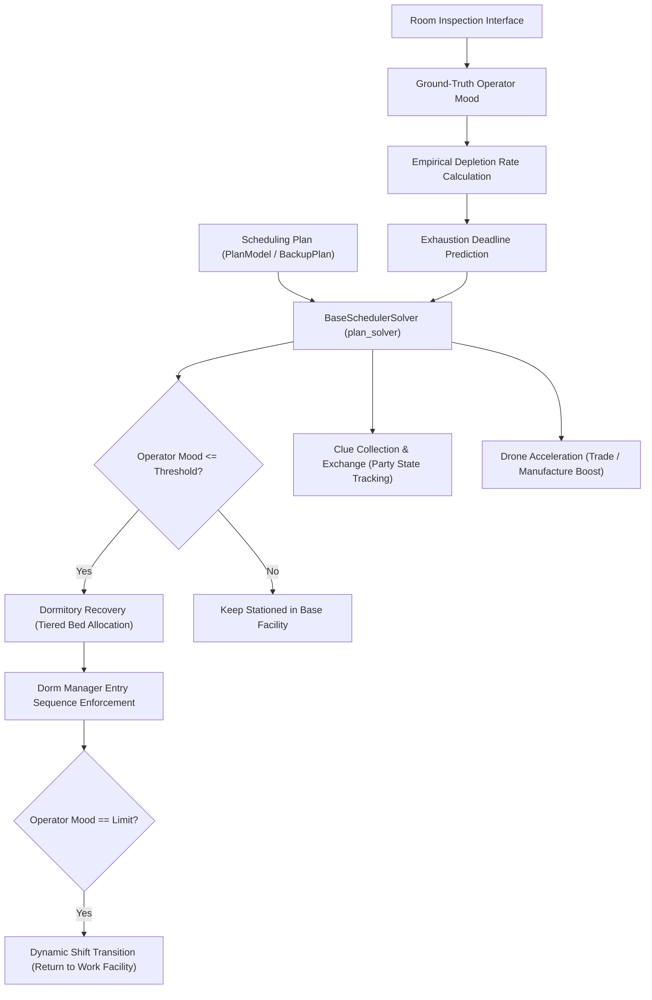

# Base Infrastructure & Scheduling Subsystem Specification

Authoritative specification of the Base Infrastructure & Scheduling Subsystem, governing operator assignments, mood mechanics, dormitory allocation, shift transitions, and facility automation.

---

## 1. Domain Model & Workflow

---

## 2. Core Concepts & Functional Contracts

### 2.1 Scheduling Plan (`Scheduling Plan`)
- Manual and startup validation check the baseline and every possible backup activation combination with `Operators.swap_plan(..., refresh=True)`, the same merged-plan checker used by shift projection. Checks retain declaration-order overrides and whole-slot `Current` inheritance, including replacements. Independent operator models preserve actual occupancy and active conditions; failures identify the active backups.
- Static trigger analysis shares known operator working/resting states, room string comparisons, same-room facility-product comparisons and clue-party null checks through supported Boolean logic. Unsupported, missing, time-dependent and state-mutating conditions retain independent activation choices. The validator excludes only logically impossible combinations, admits at most 16384 distinct activation combinations and analyzes at most 262144 symbolic states. Results distinguish `passed`, `failed` and `incomplete`; only `passed` has `success: true`. Exceeding either budget returns `incomplete`: manual validation displays a warning and startup logs the warning and continues. Ownership and baseline errors, confirmed merged-plan conflicts and unexpected validation exceptions remain blocking. Runtime checks still validate active combinations before changing operators. The [budget warning decision](../../.agents/notes/implemented/feature/2026-10-02-backup-validation-warning.md) defines these caller contracts. There is no fixed backup-count limit: 14 independent conditions fit the combination budget, and shared or mutually exclusive conditions permit more backups. Static validation does not prove future dynamic convergence. The [validation decision](../../.agents/notes/implemented/bug-fix/2026-10-02-backup-validation-coverage.md) records the regression.
- Configures assigned primary operators, operator groups, replacements, products, and resting rules across all base facilities.
- Manages the baseline master plan (`plan1`) and condition-triggered backup plans (`backup_plans`).
- Condition triggers monitor facility state, clue party status (`party_time`), and operator exhaustion.
- Optional intelligent rescue evaluates initialization observations against individual rescue lines and shared native rotation projection. Unknown observations and incomplete projections do not establish recovery blockage. Cached startup still checks actual staffing before planning temporary assignments.
- Each intelligent rescue episode persists unfinished local staffing, excludes dormitories and training from working-facility scoring, and freezes backup transitions and ordinary working shifts. Fiammetta, crafting and mastery retain specialized temporary swaps; all trade order agents stay reserved for normally eligible order runs without suppressing ordinary order and product collection during mood checks. Collection shares mood-check wakeups and retains the ordinary collection cooldown.
- Every intelligent rescue tick rebuilds personal mood-limit release deadlines through the existing strict-release planner, after due room observations and before bed reservations; ordinary working shifts remain frozen. Intelligent rescue retains configured operator identities and personal limits while manager positions provide episode-local recovery capacity, except the configured Fiammetta position. Pending strict releases reserve their occupants and original beds; completed personal-limit recovery cannot re-enter emergency beds or manager positions. Completion markers and predicted mood do not establish measured rescue targets. Strict releases read departing mood before selection even when idle recovery is disabled. Predicted idle targets lose only their unverified timestamp and release marker so bed planning can obtain a real reading. Trade order and Fiammetta compensation preserves explicit vacant slots from observed temporary staffing, while `Free` remains a filling request. The [specialized boundary decision](../../.agents/notes/implemented/bug-fix/2026-10-02-emergency-specialized-boundaries.md) and [measured-handoff decision](../../.agents/notes/implemented/bug-fix/2026-10-02-emergency-measured-handoff.md) define verification.
- Correction, backup transitions and handoff suppress completed personal-limit residents from vacant dormitory positions while retaining the configured Fiammetta position and preserving unfinished recovery primaries during manager restoration. Started trade order retries retain compensation snapshots and original-worker reservations; occupied workers remain at their other working facilities until release. Staffing arrangements preserve unfinished group positions and yield before strict release operation windows; failed handoff reopens beds and restores deadlines only for matching actual occupants. The [rescue admission and dispatch decision](../../.agents/notes/implemented/bug-fix/2026-10-02-emergency-admission-dispatch.md) defines regression coverage.
- History-derived targets use compatible measured segments and native recovery opportunities. Insufficient history uses the normal shift-off threshold plus one mood point. Actual observations confirm each primary's recovery target and permit reserved standby; intelligent rescue restores staffing only at final handoff after all required targets and native rotation feasibility are measured. Restarts reconcile actual staffing and retain only unfinished arrangements.
- Intelligent rescue room readback captures the pre-read occupants and invalidates measured mood timestamps for absent names, including names whose positions the reader already clears. The handoff arrangement uses a dedicated ordinary `SchedulerTask`; its `finally` boundary restores the prior task before room readback and final scheduling, including after deferral and errors. The [observation and handoff decision](../../.agents/notes/implemented/bug-fix/2026-10-02-emergency-observation-handoff.md) records the regression coverage.
- Intelligent rescue opens configured manager positions as recovery capacity, except the configured Fiammetta position, and uses shared dormitory recovery priorities. As recovery demand falls, managers return to available first positions across dormitories before second positions without displacing unfinished recovery primaries. Collection and room reads use the strict-release operation allowance and persist unread rooms before yielding. Final readback confirms native feasibility and pending specialized restoration before exit. The [handoff fill cancellation decision](../../.agents/notes/implemented/bug-fix/2026-10-02-emergency-handoff-fill-cancellation.md) defines removal of obsolete episode filling before return. The [startup progress lifecycle decision](../../.agents/notes/implemented/bug-fix/2026-10-02-rescue-startup-progress-lifecycle.md) defines disabled-setting continuation and completed-snapshot invalidation. The [startup release window decision](../../.agents/notes/implemented/bug-fix/2026-10-02-rescue-startup-release-windows.md) defines initialization progress without a rescue episode. The [measured release and compensation decision](../../.agents/notes/implemented/bug-fix/2026-10-02-emergency-measured-release-compensation.md) defines room-level replanning and expired-order restoration. The [rescue observation budget decision](../../.agents/notes/implemented/bug-fix/2026-10-02-emergency-observation-budget.md) defines regression coverage.
- Intelligent rescue retains the frozen primary positions and obtains complete automatic skill-based replacements for a working group before shift-off; configured replacement lists do not limit rescue matching. Dormitory admission follows individual needs and shared priority, including when a group exceeds available capacity. Each primary whose measured mood reaches its recovery target leaves the dormitory into reserved standby; other members continue recovering. Standby primaries neither enter temporary working combinations nor regain beds through ordinary filling. Recovery completion keeps existing temporary combinations stable. Partial working arrangements retain complete group responsibility and revalidate outstanding positions after restart; persisted standby is reconciled against actual occupancy. Backup evaluation remains blocked throughout recovery and resumes only during final handoff. Spare beds accept eligible replacement, ungrouped primary and idle recovery candidates after unfinished episode recovery needs.
- The [intelligent rescue decision](../../.agents/notes/implemented/simplification/2026-10-02-native-automatic-rescue.md) defines limits, observation cadence, and handoff.
- The maintenance condition edits as one row with an advance-hour value, defaulting to 0.5 hours. Existing `op_data.major_maintenance_remaining_hours() <= hours` conditions retain their saved thresholds, including nested combinations. The scheduler queues one threshold check. The condition is false at and after announced downtime start, including while the announcement remains cached; unknown maintenance and flash updates also do not activate it. Major downtime saves state and stops the automation thread. After the client update and task restart, the first normal backup check exits the maintenance backup; no exit shift runs during downtime.
- Entry reuses the existing pre-maintenance order window and Drone Acceleration. Its queued orders execute earlier, retaining retry delays and completing roster restoration before the backup switch. New order creation pauses during this batch. Other queued orders are not pulled into the batch.
- An active backup containing this condition permits Proviso, Tequila, Pepe, and Closure in its explicit primary slots, with ordinary replacements still required. Any retained trade order primary pauses every trading post's order tasks and order-time refresh tasks. Later explicit overrides replace this permission; `Current` inherits it. Exit or removal of all such primaries resumes order creation. A maintenance backup without trade order primaries keeps normal order runs.
- Decision records: [Maintenance backup ordering](../../.agents/notes/implemented/feature/2026-09-30-maintenance-backup-ordering.md) and [Maintenance cutoff and condition evaluation](../../.agents/notes/implemented/bug-fix/2026-09-30-maintenance-cutoff-condition-evaluation.md).

### 2.2 Operator Mood & Depletion Rate
- Tracks operator mood within the numerical range of 0 to 24.
- Captures ground-truth mood values during room inspection.
- Reuses recognized selection-card faces for candidate screening and ordering: green is 24, red is 0, and yellow uses approximate white-bar length strictly between these endpoints. Estimates remain separate from measured mood and expire after one hour. Actual mood readings and position changes invalidate only the observed operator; cached occupancy reads preserve estimates. Craft completion, completed group shifts, and training assistant releases reopen idle search and refresh only the affected candidates. The hourly exhausted-search reset clears the whole candidate snapshot. Unreadable cards remain unknown, and mandatory personal limits require room readings. The [selection-card decision](../../.agents/notes/implemented/simplification/2026-10-01-selection-card-mood.md) defines verification.
- Computes empirical depletion rate dynamically between consecutive inspections (`(m1 - m2) / delta_t`) rather than relying on hardcoded rates.
- Evaluates predicted exhaustion deadlines to dispatch timely dynamic shift transitions before morale depletion occurs.

### 2.3 Base Facilities
- Encapsulates distinct working facilities (Control Center, Manufacturing Station, Trading Post, Power Plant, HR Office, Reception Room, Training Room, Workshop) and resting facilities (Dormitories 1 through 4).
- Serves as the primary operational unit for operator assignment, production monitoring, and capacity validation.

### 2.4 Dormitory Recovery
- Uses one policy for every configuration. Bed priority is high, normal, low, priority replacement, standby, ordinary replacement, then other idle operators; work shift order uses mood above each operator's lower limit. Equal bed priorities compare missing mood points to the recovery target, not percentages.
- Existing ordinary beds remain stable. Higher-priority admissions can reassign single-target recovery. Only marked managers in slots 1–2 provide single-target recovery; moving the target or a provider invalidates the recorded assignment.
- Establishes recovery with the target already at its final slot. Earlier non-manager slots retain full residents or use the highest-mood eligible idle operators; actual readback verifies the target before the final roster is restored without moving it.
- Fills empty beds even when idle release is disabled. Blacklisted and zero-mood workers are excluded. Due trade order and training tasks take precedence; nearby deadlines use a simple fill or defer filling when time is insufficient.
- Idle release merges queued tasks per dormitory within its configured window, orders rooms by number, and preserves occupant identities and its exclusion list. Other tasks and mandatory limits separate batches; workshop configuration does not split releases. Personal and Ling/Xi limits force release regardless of idle-release exclusions; global recovery limits alone do not leave beds empty. Bed movement invalidates the stored recovery time.
- Retired configuration keys are ignored on import and omitted from saved configuration and UI. Legacy global dorm order migrates to per-plan room order.
- Queue merging: [Dormitory release queue merge](../../.agents/notes/implemented/simplification/2026-09-29-dorm-release-queue-merge.md).
- Decision record: [Unified dormitory recovery](../../.agents/notes/implemented/simplification/2026-09-29-unified-dorm-recovery.md).

- Idle recovery uses shared candidate states and reservations; unknown readings are confirmed in the game before completed residents are retained. Primary recovery precedes ordinary vacancy filling; ordinary fillers remain able to yield beds, including after runtime snapshot restoration. Admission markers do not override recovery tiers; legacy ordinary residents can yield to higher-tier recovery candidates. The [priority-aware recovery decision](../../.agents/notes/implemented/simplification/2026-10-02-priority-aware-dorm-recovery.md) defines bed takeover and standby compensation. The [shared candidate decision](../../.agents/notes/implemented/simplification/2026-10-01-idle-dorm-candidate-pipeline.md) defines this contract.
- Crafting uses independent tasks after dormitory arrangements, checks recipe scope and stock before movement, and replans dormitory recovery after actual staff restoration. Queue admission and dispatch share specific rejection reasons for mood, recovery protection, task reservations, disabled settings, recipe scope, missing inventory readings, material reserves, and output caps. Each bed retains its own recovery deadline; event-triggered idle replacement does not wait for the automatic crafting admission window.
- Grouped shifts use complete replacement matching and exhausted-group support coordinates only remaining matching shortages. The [group and dormitory planning decision](../../.agents/notes/implemented/bug-fix/2026-10-01-dormitory-and-group-shift-planning.md) defines verification.

### 2.5 Dynamic Shift Transition
- Replaces static timetable rotations with condition-driven transitions between work facilities and dormitories.
- Handles off-shift rotation for exhausted operators, on-shift deployment for replacements, post-rest stationing, trade order runs (Proviso, Tequila, Closure), and Fiammetta energy charges.

- Ordinary shifts converge backup conditions, subsequent eligible off-shift groups, cached corrections, and final empty-bed filling in an isolated projection. Failed convergence preserves actual occupancy and the original task.
- Temporary Fiammetta dorm visits retain the measured work depletion rate; mood and sample timestamps still refresh.
- Decision record: [Complete shift convergence](../../.agents/notes/implemented/simplification/2026-09-29-complete-shift-convergence.md).

- Unconfigured training-room slots do not generate static correction targets. Automatic mastery reads both physical slots independently of the Scheduling Plan.
- Decision record: [Correction from an unconfigured training room](../../.agents/notes/implemented/bug-fix/2026-09-29-unconfigured-training-correction.md).

### 2.6 Clue Collection & Exchange
- Directs operators stationed in the Reception Room to gather clues 1 through 7, receive clues from friends, and gift surplus clues.
- Initiates 24-hour Clue Parties upon completing full clue sets and tracks active party state (`party_time`) to activate corresponding backup plans.

### 2.7 Drone Acceleration
- Consumes Power Plant drones (each drone deducting 3 minutes) to accelerate manufacturing lines or trading post orders.
- Deconflicts concurrent trade order runs with scheduled acceleration windows.
- Calculates current-unit drone counts before manufacturing product switches, subject to the configured progress-loss tolerance.
- After Drone Acceleration, carries the accelerated current unit's remaining time to the product change confirmation. A countdown for the next unit does not defer the switch.
- The [manufacturing switch boundary decision](../../.agents/notes/implemented/bug-fix/2026-09-29-manufacturing-switch-boundary.md) records the failure case and verification.

### 2.8 Operator Selection Verification
- Confirms a selected card by its blue border before committing a facility assignment.
- Normal card border geometry uses the name region's left edge and the standard Capture Frame layout; selection-induced widening of the name region does not move the detection boundary. The blue mask includes dim borders under the card shadow. The [selection border geometry decision](../../.agents/notes/implemented/bug-fix/2026-09-30-selection-border-geometry.md) defines the captured-frame regression.
- When a scrolling notice obscures the upper border, the remaining two vertical borders and the leading portion of the lower border confirm selection. Ambiguous borders retain the existing bounded recognition retry.
- The [operator selection decision](../../.agents/notes/implemented/bug-fix/2026-09-29-notice-occluded-operator-selection.md) records the failure case and verification.

### 2.9 Worker Status
- `/status` reports `starting` while a live worker initializes without a scheduler, and `recovering` while the device state is failed or paused. An established scheduler also reports `recovering` during device startup; its task times and backup-plan metadata remain visible. Normal dispatch retains `working` and `sleeping`.
- Only a missing or finished worker reports `stopped`. The log toolbar retains Stop during startup and recovery and labels those states explicitly; device settings remain locked while the worker owns the target. Stopping the worker releases that lock through the existing cleanup and settings cancellation boundaries.
- The [shared ADB recovery decision](../../.agents/notes/implemented/simplification/2026-10-01-shared-adb-recovery.md) retains status and repair regressions independently of shared-server recovery.

---

## 3. Subsystem Invariants
- **[INV-REC-05] Training Panel Identity**: Training confirmation treats an unrecognized operator name or missing skill as unknown, retries within its existing deadline, and never derives actual occupancy from the requested plan.
- After the thresholded OCR retry, an unknown name missing exactly one character is corrected only by a unique candidate with matching OCR skill and same-frame full-name and skill template confirmation. Missing or stale models, low scores, conflicting skills and multiple matches retain unknown identity. Readability is checked before plan disagreement; confirmed disagreement still fails. Terminal arrangement rejection and confirmation timeout use the shared ERROR notification archive boundary defined by [INV-DIAG-06] in [Device Control](device-control.md). The [training panel identity decision](../../.agents/notes/implemented/bug-fix/2026-10-02-mastery-panel-identity-and-archives.md) records the evidence and offline regressions.
- **[INV-SCHED-16] Backup Validation Coverage**: Validation excludes only backup activation combinations disproved by supported trigger logic, reports success only after every remaining combination passes the same merged-plan validation as shift projection, and preserves the caller's active plan and actual occupancy. Budget exhaustion is an incomplete warning that permits startup; confirmed configuration errors remain blocking.
- **[INV-SCHED-13] Pending Task Preservation**: Device recovery preserves the scheduler and pending tasks, refreshes the Capture Frame before dispatch resumes and pauses unverified side effects without ending the automation worker or replaying uncertain input. Ordinary graph navigation retains its call stack and resumes from a fresh scene; task-level uncertainty retains a local device dispatch pause.
- The [recoverable device failure contract](../../.agents/notes/implemented/simplification/2026-10-01-recoverable-device-failures.md) defines supervision, cooldown and offline verification.
- Resumed scheduler entry rebuilds stale ordinary plans without deleting future explicit `FURNITURE`, `DEPOT`, `CLUE` or `WORKSHOP` tasks, or future `RUN_ORDER` tasks. Critical appointments retain their existing preservation policy; expired ordinary plans and expired noncritical tasks retain their existing cleanup. Queue rebuilding adds an immediate correction task so retained future work does not postpone normal planning. The [release and task retention decision](../../.agents/notes/implemented/bug-fix/2026-10-01-recovery-release-and-task-retention.md) records the real scheduler-entry regressions.

- **[INV-REC-03] Scene Recovery Limit**: Repeated recognition transition exceptions permit one game restart per navigation call, then raise a recognition failure. Ordinary navigation input faults recover the same target and refresh the scene inside the existing call; cancellation and unverified side effects propagate without input replay.
- Scheduling dispatch, arrangement, MAA and local operation boundaries propagate classified device failures without consuming the pending task, invoking recognition retries or restarting the game. A missed trade order retains the existing detection and replanning behavior.
- Scene navigation retries a failing transition six times before device recovery and game restart. A second exhausted retry sequence raises `RecognizeError` to the caller. Device recovery remains responsible for the existing Instance Binding; scene navigation issues no simulator lifecycle commands.
- The [session review repairs](../../.agents/notes/implemented/bug-fix/2026-09-29-session-review-repairs.md) define the offline regression cases.

- **[INV-SCHED-01] Empirical Depletion Rate**: Operator exhaustion forecasts must be derived dynamically from sequential inspection deltas rather than uncalibrated static assumptions.
- **[INV-SCHED-02] Stable Recovery Position**: The target retains its final slot during recovery setup and roster restoration; earlier non-manager slots use confirmed full residents or the highest-mood eligible idle padding, with actual readback required before recording recovery.
- **[INV-SCHED-03] Bed Ownership and Release**: Beds have one occupant; release validates occupant identity and respects idle-release exclusions and full-occupancy fallback, while personal mood limits remain mandatory. Merged releases retain each occupant's original bed identity; cancellation removes only that occupant's action. Intelligent rescue keeps personal mood-limit release deadlines scheduled while ordinary shifts remain frozen. Intelligent rescue retains configured operator identities and personal limits while manager positions provide episode-local recovery capacity, except the configured Fiammetta position. Pending releases reserve their occupants and original beds; completed personal-limit recovery does not re-enter emergency beds or vacant fixed dormitory positions through correction, backup transitions or handoff. Configured Fiammetta stays in her original position; restoring managers never displaces unfinished recovery primaries. Collection, each room observation, staffing scans and handoff yield before strict release operation windows, preserving partial progress and occupant-matched deadlines; partial observations never authorize staffing or exit. Each completed room observation rebuilds strict releases before the next operation; unchanged handoff residents retain deadlines until newer measured deadlines replace them. Startup observations without an active rescue episode obey the same release windows, persist unread rooms and allow selected releases to dispatch before initialization resumes. Disabling intelligent rescue retains unfinished initialization; completed initialization clears persisted progress, and later startups ignore completed-snapshot room lists.
- **[INV-SCHED-04] Shift Transition Compensation**: Condition-triggered shifts (order runs, backup plans) must preserve state rollback on failure, avoiding orphaned room assignments. Specialized swaps during intelligent rescue restore observed temporary staffing, including explicit vacant slots. Started order retries retain compensation and original-worker reservations across filtering and room changes; restoration waits for workers occupied in other facilities. Expired started order runs become original-roster restoration without another insertion; timeout queue rebuilding retains restoration responsibilities and worker reservations.
- **[INV-SCHED-06] Manufacturing Switch Boundary**: After Drone Acceleration, a manufacturing product switch tracks completion of the accelerated current unit; the next unit's countdown never postpones that switch.
- **[INV-SCHED-07] Unified Dormitory Policy**: All scheduling uses the same dormitory policy; retired mode keys neither select legacy behavior nor prevent old configuration imports. Intelligent rescue uses shared recovery-tier admission with episode-local manager-position capacity; normal dormitory configuration is restored at final handoff.
- **[INV-SCHED-08] Unscheduled Training Slots**: Unconfigured training-room slots never produce static correction targets; automatic mastery still reads both facility slots.
- **[INV-SCHED-09] Rescue Recovery Lifecycle**: Native rescue retains ordinary rotation. Optional intelligent rescue checks initial measured or historically projected rescue-line deficits and complete native feasibility, persists facility-local temporary staffing before arrangement, excludes every trade order agent and candidates below their normal shift-off threshold plus one, freezes ordinary working shifts and backup transitions, collects ordinary orders and products during mood checks, and exits only after measured targets and native feasibility permit staffing restoration. Handoff arrangement owns an ordinary task context and restores the prior context after success, deferral or failure; returning retries retain measured targets for pending primaries, validate native feasibility for already returned workers, and re-enter recovery when handoff feasibility is lost; predicted mood never proves exit eligibility; room readback invalidates the measured timestamp of every previously present operator missing from the result, even when the reader already clears that position. Deferred final observations retain specialized compensation obligations and recheck native feasibility before exit. Handoff starts by cancelling episode-specific dormitory filling, including restored and delayed tasks, while retaining strict releases and specialized compensation. Target and native recovery projections reuse the read-only expression evaluation model while isolating mutable operators, beds, plans and configuration. Bound working groups acquire complete automatic skill-based replacements before leaving their frozen primary positions. Dormitory admission follows individual recovery needs and shared priority without complete-group bed reservation. Measured target completion releases each primary from the dormitory into reserved standby; it does not return that primary to work or rescore temporary working combinations. Ready primaries remain excluded from temporary staffing and ordinary dormitory filling across restart. Dormitory manager positions provide recovery capacity except the configured Fiammetta position; managers return to unneeded capacity in first-position then second-position order without displacing unfinished recovery primaries. Partial physical arrangements retain complete working-group responsibility across restart. All required measured targets and native rotation feasibility permit one final restoration under the effective schedule; backup transitions remain frozen until that final handoff. Confirmed card mood governs temporary working assignments only; it does not block primary dormitory admission or measured final primary returns.
- **[INV-SCHED-10] Completed Exhaust Continuation**: An exhausted-shift task whose full working group already rests preserves normal planning and run-order recalculation without reserving another bed or invoking skip.
- **[INV-SCHED-11] Maintenance Backup Ordering**: A maintenance backup checks its configured deadline, completes the existing pre-maintenance drone-accelerated order batch before switching, and suppresses all trade order generation only while its effective primary slots contain trade order agents; its maintenance condition is false from downtime start, and backup exit waits for a normal check after task restart.
- **[INV-SCHED-12] Idle Lifecycle Ownership**: Automatic idle shutdown uses Device Control and the selected Device Profile, with selected identity revalidated before shutdown within the same deadline. A confirmed shutdown records one verified wake; failed or unsupported control leaves the shutdown marker clear and never invokes legacy-path, foreign-instance or host-wide commands. Owned-AVD restrictions and Android isolation remain effective.
- **[INV-SCHED-13] Dormitory Candidate Consistency**: Idle recovery planning and selection share eligibility, reservations, and known/unknown mood classification; unknown readings never establish full recovery, and completed crafting replans recovery after actual staff restoration.
- **[INV-SCHED-14] Complete Group Replacement Matching**: A grouped shift considers all eligible replacement assignments and accepts a complete matching whenever one exists; insufficient replacements preserve the group's original working arrangement. Ordinary rotation also requires complete group beds; intelligent rescue allocates dormitory recovery individually without a complete-group bed requirement.
- **[INV-SCHED-15] Selection Estimate Isolation**: Selection-card mood estimates support candidate screening, ordering, and primary shift selection only; they never overwrite measured mood, timestamps, depletion rates, recovery deadlines, or mandatory personal limits. Facility-completion events refresh only affected candidates and preserve unrelated estimates and search checks. Regular candidate planning scans cards only when no eligible idle recovery candidate has valid measured or estimated mood.
- The [shared idle recovery decision](../../.agents/notes/implemented/bug-fix/2026-10-01-shared-idle-recovery.md) specifies shutdown authority, runtime launch recovery and classified device failure propagation.

- **[INV-REC-02] Occluded Operator Selection**: A card with an obscured upper selection border is confirmed only when both vertical borders and the leading portion of its lower border are visible; adjacent card borders cannot confirm selection.
- **[INV-REC-04] Selection Border Geometry**: Normal operator card borders remain anchored to card geometry when a selected border widens the recognized name region; dim blue borders preserve selection, and genuinely clipped or ambiguous borders retain bounded recognition recovery.
- **[INV-SCHED-05] Complete Shift Projection**: Ordinary shifts submit only after backup conditions, eligible rotations, cached corrections, and final bed filling stabilize on an isolated projection; failure preserves the original task and actual occupancy.

Intelligent rescue lifecycle: [Native intelligent rescue](../../.agents/notes/implemented/simplification/2026-10-02-native-automatic-rescue.md).

The default-off `automatic_rescue_enable` checkbox appears in infrastructure settings on the Mower settings page. Temporary staffing compares supported facility-local effects. Automatic mastery and building skills share the existing Skland sync endpoint, BOX snapshot and cached character reader; file metadata changes invalidate the shared cache. Ownership, elite phase and level determine unlocked skill versions; absent growth data uses active card icons. Incomplete automatic replacement keeps the complete working group in its current arrangement; dormitory recovery admits individual members within available capacity. Trade order runs retain normal eligibility and restore actual temporary staffing. Mood checks repair vacancies or newly ineligible temporary workers. A measured-ready primary leaves the dormitory into reserved standby without changing temporary working combinations; final handoff restores primary staffing after all required targets and native rotation feasibility are confirmed.

The building-skill page shares `/basement-skill/operators` with automatic staffing and marks unowned operators, locked skills and replaced versions only when corresponding Skland data is available. Facility, ownership, skill-state and text filters apply to this catalog; missing data has no per-operator status label.

---

## 4. Subsystem Implementation Boundaries

- Startup observes actual room occupancy before backup evaluation and reads missing mood on an ordinary facility selection page without confirming arrangements. Enabled Idle Dormitory Recovery reuses eligible idle recovery candidates with valid measured or estimated mood across runs. Only an empty eligible cached recovery pool permits an ascending-card scan, with at most one physical scan per scheduler run. Eligibility shares the normal candidate and reservation rules; working, reserved, excluded, full, unknown, and expired-estimate names cannot suppress observation. Startup retains its missing-primary-mood observation; completed crafting replans after restoration with updated operator readings and existing estimates, without opening a card scan. Enabled Idle Dormitory Recovery reads departing occupants before normal facility replacement and reads new arrivals despite recent cached samples; training changes use the existing slot scan. These mood-only refreshes do not request additional countdown readings. Shift projection performs no observation. Ascending-mood observation stops at the first green face and treats unscanned names as transient 24 estimates; earlier unreadable names remain unknown. The bounded card scan and legacy pending-cache recovery follow the [startup card mood contract](../../.agents/notes/implemented/simplification/2026-10-01-startup-card-mood.md).
- Configuration parser: [`PlanModel`](../../arknights_mower/utils/config/plan.py), [`PlanConfig`](../../arknights_mower/utils/plan.py).
- Scheduler solver: [`BaseSchedulerSolver`](../../arknights_mower/solvers/base_schedule.py).
- Operator data model: [`Operator`](../../arknights_mower/utils/operators.py), [`Operators`](../../arknights_mower/utils/operators.py).
- Dormitory recovery engine: [`dorm_recovery.py`](../../arknights_mower/utils/dorm_recovery.py), [`resting_priority.py`](../../arknights_mower/utils/resting_priority.py).
- Facility acceleration: [`drone_plan`](../../arknights_mower/utils/manufacture_product.py).
