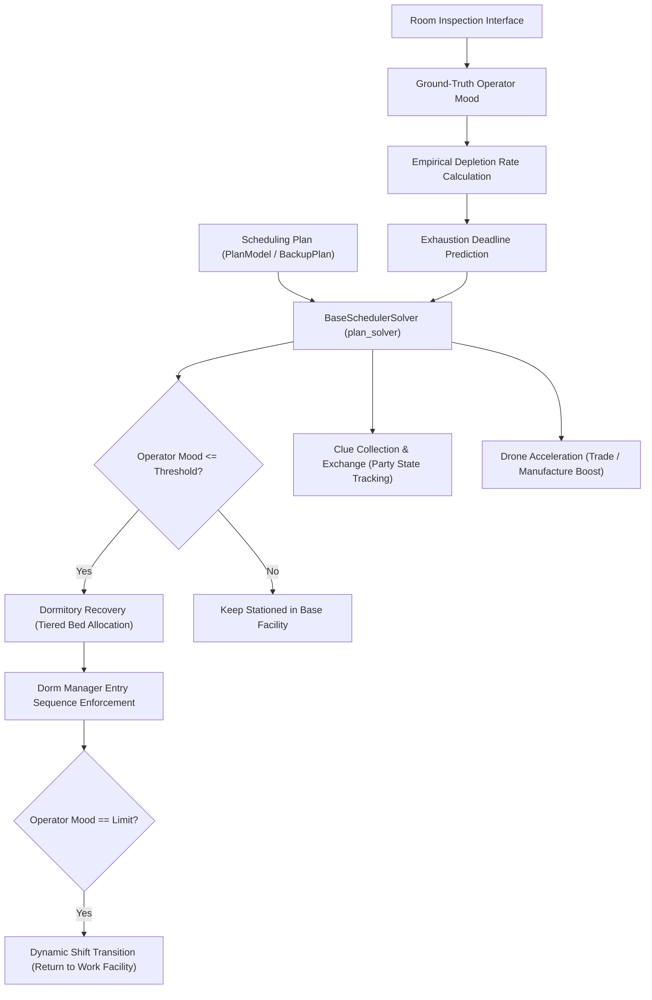

# Base Infrastructure & Scheduling Subsystem Specification

Authoritative specification of the Base Infrastructure & Scheduling Subsystem, governing operator assignments, mood mechanics, dormitory allocation, shift transitions, and facility automation.

---

## 1. Domain Model & Workflow

---

## 2. Core Concepts & Functional Contracts

### 2.1 Scheduling Plan (`Scheduling Plan`)
- Configures assigned primary operators, operator groups, replacements, products, and resting rules across all base facilities.
- Manages the baseline master plan (`plan1`) and condition-triggered backup plans (`backup_plans`).
- Condition triggers monitor facility state, clue party status (`party_time`), and operator exhaustion.
- `op_data.rescue_needed()` is an optional boolean backup-plan condition. At least two and at least half of eligible main-plan primaries below their individual rescue lines enter rescue; completion by a strict majority exits it. Unknown readings remain in the denominator without voting low or complete. Completion is retained across ordinary returns within one rescue episode.
- Rescue lines use each main-plan lower limit plus its mood range multiplied by the main-plan resting threshold and global rescue threshold. Main primaries and main-plan priority replacements receive the highest resting tier while exclusions retain precedence. Explicit working assignments from an active rescue backup default to zero-mood work and require no replacements; inherited slots retain their main-plan rules. Backup plans retain normal ordering, editing, and removal.
- Rescue uses existing vacant Free beds and never batches a clearing of occupied beds. Existing residents release their beds at their individual upper limits through ordinary release tasks; idle-release exclusions remain effective. Without a rescue backup condition, ordinary rotations still rescue exhausted primaries and preserve recovery to their configured upper limits. Primary recovery reserves beds before ordinary idle filling, which uses only remaining unreserved vacancies.
- Runtime snapshots retain the rescue episode and completed main identities only when main-plan individual limits match on restart.
- The maintenance condition edits as one row with an advance-hour value, defaulting to 0.5 hours. Existing `op_data.major_maintenance_remaining_hours() <= hours` conditions retain their saved thresholds, including nested combinations. The scheduler queues one threshold check. The condition is false at and after announced downtime start, including while the announcement remains cached; unknown maintenance and flash updates also do not activate it. Major downtime saves state and stops the automation thread. After the client update and task restart, the first normal backup check exits the maintenance backup; no exit shift runs during downtime.
- Entry reuses the existing pre-maintenance order window and Drone Acceleration. Its queued orders execute earlier, retaining retry delays and completing roster restoration before the backup switch. New order creation pauses during this batch. Other queued orders are not pulled into the batch.
- An active backup containing this condition permits Proviso, Tequila, Pepe, and Closure in its explicit primary slots, with ordinary replacements still required. Any retained trade order primary pauses every trading post's order tasks and order-time refresh tasks. Later explicit overrides replace this permission; `Current` inherits it. Exit or removal of all such primaries resumes order creation. A maintenance backup without trade order primaries keeps normal order runs.
- Decision records: [Maintenance backup ordering](../../.agents/notes/implemented/feature/2026-09-30-maintenance-backup-ordering.md) and [Maintenance cutoff and condition evaluation](../../.agents/notes/implemented/bug-fix/2026-09-30-maintenance-cutoff-condition-evaluation.md).

### 2.2 Operator Mood & Depletion Rate
- Tracks operator mood within the numerical range of 0 to 24.
- Captures ground-truth mood values during room inspection.
- Reuses recognized selection-card faces for candidate screening and ordering: green is 24, red is 0, and yellow uses approximate white-bar length strictly between these endpoints. Estimates remain separate from measured mood and expire after one hour or room readback; a new idle-search round clears them. Unreadable cards remain unknown, and mandatory personal limits require room readings. The [selection-card decision](../../.agents/notes/implemented/simplification/2026-10-01-selection-card-mood.md) defines verification.
- Computes empirical depletion rate dynamically between consecutive inspections (`(m1 - m2) / delta_t`) rather than relying on hardcoded rates.
- Evaluates predicted exhaustion deadlines to dispatch timely dynamic shift transitions before morale depletion occurs.

### 2.3 Base Facilities
- Encapsulates distinct working facilities (Control Center, Manufacturing Station, Trading Post, Power Plant, HR Office, Reception Room, Training Room, Workshop) and resting facilities (Dormitories 1 through 4).
- Serves as the primary operational unit for operator assignment, production monitoring, and capacity validation.

### 2.4 Dormitory Recovery
- Uses one policy for every configuration. Bed priority is high, normal, low, priority replacement, standby, ordinary replacement, then other idle operators; work shift order uses mood above each operator's lower limit. Equal bed priorities compare missing mood points to the recovery target, not percentages.
- Existing ordinary beds remain stable. Higher-priority admissions can reassign single-target recovery. Only marked managers in slots 1–2 provide single-target recovery; moving the target or a provider invalidates the recorded assignment.
- Establishes recovery with the target already at its final slot. Earlier non-manager slots retain full residents or use the highest-mood eligible idle operators; actual readback verifies the target before the final roster is restored without moving it.
- Fills empty beds even when idle release is disabled. Blacklisted and zero-mood workers are excluded. Due trade order and training tasks take precedence; nearby deadlines use a simple fill or defer filling when time is insufficient.
- Idle release merges queued tasks per dormitory within its configured window, orders rooms by number, and preserves occupant identities and its exclusion list. Other tasks and mandatory limits separate batches; workshop configuration does not split releases. Personal and Ling/Xi limits force release regardless of idle-release exclusions; global recovery limits alone do not leave beds empty. Bed movement invalidates the stored recovery time.
- Initial mood sampling updates mood without treating temporary placements as backup-plan occupancy. Backup convergence starts only after sampling finishes, using original occupants and new mood readings.
- Retired configuration keys are ignored on import and omitted from saved configuration and UI. Legacy global dorm order migrates to per-plan room order.
- Queue merging: [Dormitory release queue merge](../../.agents/notes/implemented/simplification/2026-09-29-dorm-release-queue-merge.md).
- Decision record: [Unified dormitory recovery](../../.agents/notes/implemented/simplification/2026-09-29-unified-dorm-recovery.md).

- Idle recovery uses shared candidate states and reservations; unknown readings are confirmed in the game before completed residents are retained. Primary recovery precedes ordinary vacancy filling; ordinary fillers remain able to yield beds. The [shared candidate decision](../../.agents/notes/implemented/simplification/2026-10-01-idle-dorm-candidate-pipeline.md) defines this contract.
- Crafting uses independent tasks after dormitory arrangements, checks recipe scope and stock before movement, and replans dormitory recovery after actual staff restoration. Queue admission and dispatch share specific rejection reasons for mood, recovery protection, task reservations, disabled settings, recipe scope, missing inventory readings, material reserves, and output caps. Each bed retains its own recovery deadline; event-triggered idle replacement does not wait for the automatic crafting admission window.
- Grouped shifts use complete replacement matching and exhausted-group support coordinates only remaining matching shortages. The [group and dormitory planning decision](../../.agents/notes/implemented/bug-fix/2026-10-01-dormitory-and-group-shift-planning.md) defines verification.

### 2.5 Dynamic Shift Transition
- Replaces static timetable rotations with condition-driven transitions between work facilities and dormitories.
- Handles off-shift rotation for exhausted operators, on-shift deployment for replacements, post-rest stationing, trade order runs (Proviso, Tequila, Closure), and Fiammetta energy charges.

- Ordinary shifts converge backup conditions, subsequent eligible off-shift groups, cached corrections, and final empty-bed filling in an isolated projection. Failed convergence preserves actual occupancy and the original task.
- Temporary Fiammetta dorm visits retain the measured work depletion rate; mood and sample timestamps still refresh.
- Decision record: [Complete shift convergence](../../.agents/notes/implemented/simplification/2026-09-29-complete-shift-convergence.md).

- Unconfigured training-room slots do not generate static correction targets. Automatic mastery reads both physical slots independently of the Scheduling Plan.
- Decision record: [Correction from an unconfigured training room](../../.agents/notes/implemented/bug-fix/2026-09-29-unconfigured-training-correction.md).

### 2.6 Clue Collection & Exchange
- Directs operators stationed in the Reception Room to gather clues 1 through 7, receive clues from friends, and gift surplus clues.
- Initiates 24-hour Clue Parties upon completing full clue sets and tracks active party state (`party_time`) to activate corresponding backup plans.

### 2.7 Drone Acceleration
- Consumes Power Plant drones (each drone deducting 3 minutes) to accelerate manufacturing lines or trading post orders.
- Deconflicts concurrent trade order runs with scheduled acceleration windows.
- Calculates current-unit drone counts before manufacturing product switches, subject to the configured progress-loss tolerance.
- After Drone Acceleration, carries the accelerated current unit's remaining time to the product change confirmation. A countdown for the next unit does not defer the switch.
- The [manufacturing switch boundary decision](../../.agents/notes/implemented/bug-fix/2026-09-29-manufacturing-switch-boundary.md) records the failure case and verification.

### 2.8 Operator Selection Verification
- Confirms a selected card by its blue border before committing a facility assignment.
- Normal card border geometry uses the name region's left edge and the standard Capture Frame layout; selection-induced widening of the name region does not move the detection boundary. The blue mask includes dim borders under the card shadow. The [selection border geometry decision](../../.agents/notes/implemented/bug-fix/2026-09-30-selection-border-geometry.md) defines the captured-frame regression.
- When a scrolling notice obscures the upper border, the remaining two vertical borders and the leading portion of the lower border confirm selection. Ambiguous borders retain the existing bounded recognition retry.
- The [operator selection decision](../../.agents/notes/implemented/bug-fix/2026-09-29-notice-occluded-operator-selection.md) records the failure case and verification.

---

## 3. Subsystem Invariants

- **[INV-REC-03] Scene Recovery Limit**: Repeated scene transition exceptions permit one game restart per navigation call, then raise a recognition failure; cancellation and device failures propagate immediately.
- Scheduling dispatch, arrangement, MAA and local operation boundaries propagate classified device failures without consuming the pending task, invoking recognition retries or restarting the game. A missed trade order retains the existing detection and replanning behavior.
- Scene navigation retries a failing transition six times before device recovery and game restart. A second exhausted retry sequence raises `RecognizeError` to the caller. Device recovery remains responsible for the existing Instance Binding; scene navigation issues no simulator lifecycle commands.
- The [session review repairs](../../.agents/notes/implemented/bug-fix/2026-09-29-session-review-repairs.md) define the offline regression cases.

- **[INV-SCHED-01] Empirical Depletion Rate**: Operator exhaustion forecasts must be derived dynamically from sequential inspection deltas rather than uncalibrated static assumptions.
- **[INV-SCHED-02] Stable Recovery Position**: The target retains its final slot during recovery setup and roster restoration; earlier non-manager slots use confirmed full residents or the highest-mood eligible idle padding, with actual readback required before recording recovery.
- **[INV-SCHED-03] Bed Ownership and Release**: Beds have one occupant; release validates occupant identity and respects idle-release exclusions and full-occupancy fallback, while personal mood limits remain mandatory. Merged releases retain each occupant's original bed identity; cancellation removes only that occupant's action.
- **[INV-SCHED-04] Shift Transition Compensation**: Condition-triggered shifts (order runs, backup plans) must preserve state rollback on failure, avoiding orphaned room assignments.
- **[INV-SCHED-06] Manufacturing Switch Boundary**: After Drone Acceleration, a manufacturing product switch tracks completion of the accelerated current unit; the next unit's countdown never postpones that switch.
- **[INV-SCHED-07] Unified Dormitory Policy**: All scheduling uses the same dormitory policy; retired mode keys neither select legacy behavior nor prevent old configuration imports.
- **[INV-SCHED-08] Unscheduled Training Slots**: Unconfigured training-room slots never produce static correction targets; automatic mastery still reads both facility slots.
- **[INV-SCHED-09] Rescue Recovery Lifecycle**: Rescue evaluates main-plan individual mood limits, preserves main-primary and priority-replacement recovery until their upper limits, and exits after majority completion without clearing occupied beds or admitting excluded workers.
- **[INV-SCHED-10] Completed Exhaust Continuation**: An exhausted-shift task whose full working group already rests preserves normal planning and run-order recalculation without reserving another bed or invoking skip.
- **[INV-SCHED-11] Maintenance Backup Ordering**: A maintenance backup checks its configured deadline, completes the existing pre-maintenance drone-accelerated order batch before switching, and suppresses all trade order generation only while its effective primary slots contain trade order agents; its maintenance condition is false from downtime start, and backup exit waits for a normal check after task restart.
- **[INV-SCHED-12] Idle Lifecycle Ownership**: Automatic idle shutdown uses Device Control and the selected Device Profile, with selected identity revalidated before shutdown within the same deadline. A confirmed shutdown records one verified wake; failed or unsupported control leaves the shutdown marker clear and never invokes legacy-path, foreign-instance or host-wide commands. Owned-AVD restrictions and Android isolation remain effective.
- **[INV-SCHED-13] Dormitory Candidate Consistency**: Idle recovery planning and selection share eligibility, reservations, and known/unknown mood classification; unknown readings never establish full recovery, and completed crafting replans recovery after actual staff restoration.
- **[INV-SCHED-14] Complete Group Replacement Matching**: A grouped shift considers all eligible replacement assignments and accepts a complete matching whenever one exists; insufficient replacements or beds preserve the group's original arrangement.
- **[INV-SCHED-15] Selection Estimate Isolation**: Selection-card mood estimates support candidate screening, ordering, and primary shift selection only; they never overwrite measured mood, timestamps, depletion rates, recovery deadlines, or mandatory personal limits.
- The [shared idle recovery decision](../../.agents/notes/implemented/bug-fix/2026-10-01-shared-idle-recovery.md) specifies shutdown authority, runtime launch recovery and classified device failure propagation.

- **[INV-REC-02] Occluded Operator Selection**: A card with an obscured upper selection border is confirmed only when both vertical borders and the leading portion of its lower border are visible; adjacent card borders cannot confirm selection.
- **[INV-REC-04] Selection Border Geometry**: Normal operator card borders remain anchored to card geometry when a selected border widens the recognized name region; dim blue borders preserve selection, and genuinely clipped or ambiguous borders retain bounded recognition recovery.
- **[INV-SCHED-05] Complete Shift Projection**: Ordinary shifts submit only after backup conditions, eligible rotations, cached corrections, and final bed filling stabilize on an isolated projection; failure preserves the original task and actual occupancy.

Rescue condition and completed-task coverage: [Rescue backup condition](../../.agents/notes/implemented/feature/2026-09-30-rescue-backup-condition.md).

---

## 4. Subsystem Implementation Boundaries

- Startup observes actual room occupancy before backup evaluation and reads missing mood on an ordinary facility selection page without confirming arrangements. Enabled Idle Dormitory Recovery refreshes the same snapshot before real candidate planning, sharing one physical scan per scheduler run; completed crafting invalidates the snapshot and opens a fresh scan after restoration. Shift projection performs no observation. Ascending-mood observation stops at the first green face and treats unscanned names as transient 24 estimates; earlier unreadable names remain unknown. The bounded card scan and legacy pending-cache recovery follow the [startup card mood contract](../../.agents/notes/implemented/simplification/2026-10-01-startup-card-mood.md).
- Configuration parser: [`PlanModel`](../../arknights_mower/utils/config/plan.py), [`PlanConfig`](../../arknights_mower/utils/plan.py).
- Scheduler solver: [`BaseSchedulerSolver`](../../arknights_mower/solvers/base_schedule.py).
- Operator data model: [`Operator`](../../arknights_mower/utils/operators.py), [`Operators`](../../arknights_mower/utils/operators.py).
- Dormitory recovery engine: [`dorm_recovery.py`](../../arknights_mower/utils/dorm_recovery.py), [`resting_priority.py`](../../arknights_mower/utils/resting_priority.py).
- Facility acceleration: [`drone_plan`](../../arknights_mower/utils/manufacture_product.py).
