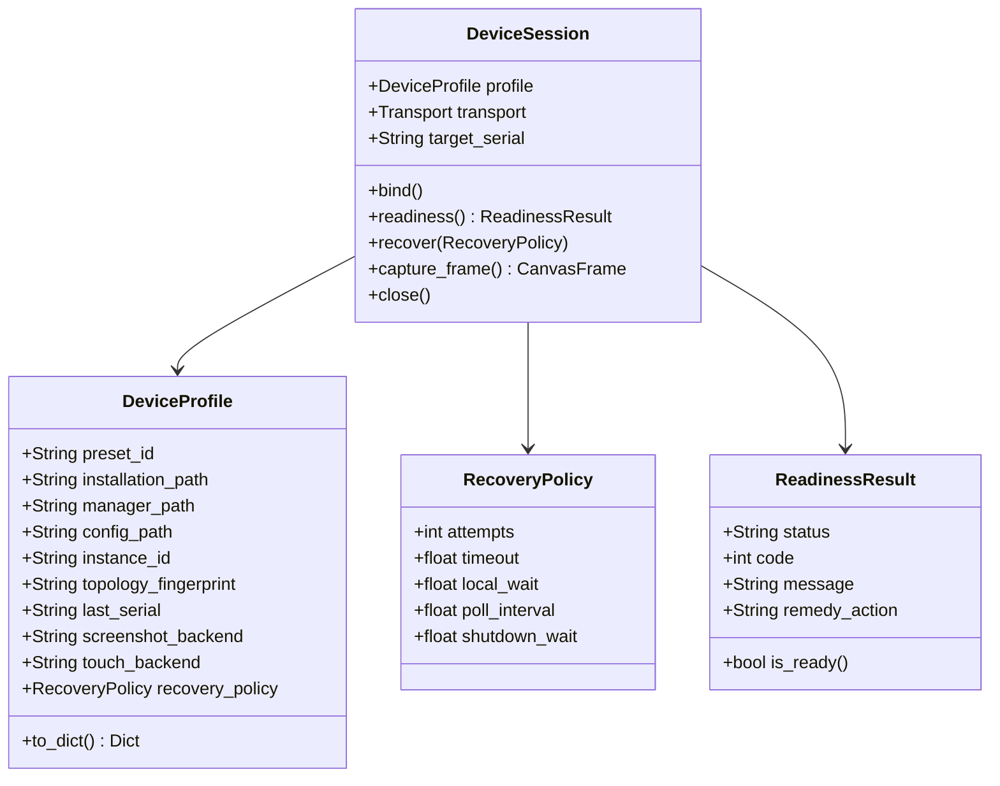

# Device Control Subsystem Specification

Authoritative specification of the Device Control Subsystem, defining discovery, transport protocols, session lifecycles, and fault recovery.

---

## 1. Domain Model & Interface Contracts

### 1.1 Persisted Configuration (`DeviceProfile`)
- Runtime package and endpoint observations belong to the session's profile copy. Startup, recovery and unrelated settings saves preserve the persisted user's selections, including when helper initialization fails.
- MuMu idle shutdown disconnects the owned client's verified endpoint. A closed session or released client skips transport cleanup without substituting the saved endpoint or starting recovery.
- Enforces `[INV-01]`: Persists explicit user selections (`preset_id`, paths, instance identifiers, capture/touch backends, and recovery policy parameters). Transient discovery scans and active socket handles exist in memory only.
- Enforces `[INV-02]`: Resetting or changing any path, preset, or instance identity clears `last_serial` immediately, preventing stale endpoint reuse.
- Enforces `[INV-04]`: IPC capture and touch backends operate as an indivisible pair.

### 1.2 Session Lifecycle (`DeviceSession`)
- Enforces `[INV-03]`: The session binds to a verified instance identity. If the target is absent, offline, or unresponsive, recovery attempts target that instance only, without silent fallback to other online devices on the host.
- Enforces `[INV-05]`: ADB operations route through [`guard_adb`](../../arknights_mower/utils/device/adb_client/server.py), verifying socket server availability without issuing implicit `kill-server` commands.
- The session reports one user-visible line per connection state change — the selected device, the instance launch, the ADB connect and the successful connection — and keeps attempt counters, budgets and observation snapshots in the debug log.

### 1.3 Bound Instance Start (`DeviceControl.start_bound`)
- An explicit start request launches only the bound instance through its preset's own multi-instance manager and verifies the connection inside the session's single monotonic budget. It selects no other instance on the host.
- `MANAGED_INSTANCE_PRESETS` names the presets whose manager can launch the bound instance (`windows.mumu12`, `windows.ldplayer9`, `windows.ldplayer14`, `windows.nox`). Every other preset reports `start_unsupported` and keeps the manual launch.
- The request itself is the explicit launch consent: the manager can only launch the profile's own instance, and the endpoint it reports is verified before the profile is saved. The AVD, ReDroid and Genymotion routes keep their additional `confirmed_instance` token because their controllers start a target named in the request.
- The request persists nothing: the endpoint and package it verifies reach the device profile through the ordinary save path.
- The web UI exposes it as the `启动并测试连接` dropdown option next to the read-only `测试连接` action.

---

## 2. Vendor Discovery & Compatibility Presets

The subsystem integrates platform-specific emulators through deterministic discovery mechanisms:

| Platform / Vendor | Discovery Mechanism | Identity Verification |
| :--- | :--- | :--- |
| **Windows MuMu 12** | Registry query + `MuMuManager.exe info -v all` | Index binding, canvas frame check |
| **Windows LDPlayer 9 / 14** | Registry query + `ldconsole.exe list2` | Process PID cross-referenced with TCP listening port |
| **Windows Nox** | `NoxConsole.exe list` + `.vbox` VM configuration | VM machine UUID, `topology_fingerprint` |
| **Windows BlueStacks 5** | Registry query + `bluestacks.conf` | `bst.instance.<key>.status.adb_port` |
| **macOS MuMu Pro** | Bundled `mumutool info all` lists instances; manual ADB serial remains available | Selected index and VM path fingerprint, current ADB port, standard preflight gate |
| **macOS / Linux AVD** | `ANDROID_SDK_ROOT` + `emulator -list-avds` | AVD name, owned process lifecycle tracking |
| **Linux Genymotion** | `gmtool version` + `gmtool --format json admin list` | Instance UUID, ADB serial binding |
| **Linux ReDroid** | Local Docker socket (`/var/run/docker.sock`) | Immutable container ID, host port mapping |
| **Linux Waydroid** | `waydroid status` session inspection | Session IP endpoint, port 5555 verification |

---

## 3. Subsystem Invariants

- **[INV-DEV-12] Android Configuration Ownership**: Android-managed settings remain authoritative through configuration load, import, partial update and save/reload. `Conf` removes the incoming desktop Device Profile before validation and derives its own profile from the installed Android adapter's validated native fields; Android partial updates use that same boundary instead of desktop binding validation.
- The Android adapter owns connection and MAA paths, capture and touch selections, simulator lifecycle settings, native appearance, screenshot history and service endpoint settings. Desktop profiles cannot restore instance identities, manager paths, vendor capture backends, recovery settings or hotkeys. `package_type` remains editable; profile-only imports preserve a supported `game_package` when `package_type` is absent. General task settings remain unchanged.
- Android backup import serializes the validated native settings and canonical Device Profile, preserving unknown backup fields without retaining desktop values in protected settings. Main and backup Base Plans, weekly plans and general task settings remain editable and support export/import round trips. Subsequent exports retain that same boundary; desktop backup serialization remains unchanged.
- Boundary rationale and verification are recorded in [Android Configuration Isolation](../../.agents/notes/implemented/bug-fix/2026-09-30-android-config-isolation.md).

- **[INV-DEV-11] MuMu Pro Verified Selection**: MuMu Pro discovery reads bounded `mumutool info all` output and exposes each distinct instance for explicit selection. The selected Device Profile saves the instance index and a Topology Fingerprint of its VM path. Connection and recovery query that index again; a changed path, malformed output, or duplicate ADB port fails before any fallback. The current port is used only for the confirmed instance. Manager start and stop commands remain unavailable, so a stopped instance requires manual launch.
- The [MuMu Pro instance selection decision](../../.agents/notes/implemented/feature/2026-09-30-mumu-pro-instance-selection.md) records output validation and multi-instance coverage.

- **[INV-DEV-10] MuMu Pro Manual Binding**: Without a selected instance fingerprint, `macos.mumu_pro` checks only the user's saved ADB serial with the standard preflight gate. Missing, offline, or mismatched targets never select another online device. A different instance that later reuses that serial cannot be distinguished in manual mode. Saved installation and manager paths do not gate manual ADB validation.
- The [MuMu Pro connection repair](../../.agents/notes/implemented/bug-fix/2026-09-30-mumu-pro-manual-binding.md) records the regression and focused coverage.

- **[INV-DEV-09] Classified Failure Isolation**: Classified device failures, including Temporary Preparation errors, request owned resource cleanup and expose their structured verdict without requesting application shutdown.
- Input surface mismatch or unreadable display state keeps the settings interface available. Failed compensation retains its recovery record. Unclassified internal faults still request coordinated application shutdown.
- The [preparation failure decision](../../.agents/notes/implemented/bug-fix/2026-09-30-preparation-failure-isolation.md) records the classification boundary and regression coverage.

- **[INV-DEV-08] Uncertain Input Delivery**: ADB input whose transmission or acknowledgement is uncertain fails without automatic command replay; the input boundary reports a structured delivery-unknown failure.
- **[INV-DIAG-03] Accepted Archive Drain**: Shutdown preserves accepted screenshot and archive work until the common flush deadline; work discarded after that deadline is counted and starts no further file writes.
- **[INV-DIAG-04] Encoded Recent Cache**: With ordinary history disabled, the recent error context retains encoded frames under its count and byte limits; capture submission performs no encoding and pending raw frames remain bounded.
- **[INV-DIAG-05] Shared Frame Encoding**: Each admitted RGB snapshot has at most one encoding attempt; preview, history and error context share its encoded bytes, release the source snapshot after completion, and preserve bounded admission and independent progress of newer previews.
- The [shared screenshot encoding contract](../../.agents/notes/implemented/simplification/2026-09-29-shared-screenshot-encoding.md) specifies ownership and offline verification.
- The [preservation review repairs](../../.agents/notes/implemented/bug-fix/2026-09-29-preservation-review-repairs.md) define the regression contracts and their [shared boundaries](../../.agents/notes/implemented/simplification/2026-09-29-preservation-repair-boundaries.md).

- **[INV-DEV-07] Capture Recovery Separation**: Normal frames use a fresh per-operation deadline; a degraded ADB backend verifies its bound target without invoking the replaced capture helper.
- The first screenshot recovery, rebuild and degradation share the current Recovery Budget. Subsequent degraded frames validate target identity, boot completion and the actual ADB frame within a new operation deadline. Instance commands never exceed the lesser of their remaining local deadline, the enclosing Recovery Budget and the command limit.
- Immediate backend edits compare against the saved Device Profile to preserve IPC pairing while identity drafts remain unpersisted.
- The [session review repairs](../../.agents/notes/implemented/bug-fix/2026-09-29-session-review-repairs.md) and [ownership simplification](../../.agents/notes/implemented/simplification/2026-09-29-review-recovery-ownership.md) record the regression coverage.

- **[INV-DEV-05] Capture Preset Compatibility**: Configuration updates reject incompatible vendor capture presets; capture entry points also verify the host, and UI preset changes clear incompatible capture and coupled touch selections in the draft.
- **[INV-DEV-06] LD Capture Binding**: LD screenshot enhancement verifies the selected ADB endpoint against the selected instance and accepts frames only while its process identity and 1920×1080 dimensions remain unchanged.
- The [LD capture decision](../../.agents/notes/implemented/feature/2026-09-29-ld-capture.md) defines the vendor boundary and its [shared process lifecycle](../../.agents/notes/implemented/simplification/2026-09-29-native-capture-owner.md).

- **[INV-DEV-04] Launch Protection**: A session preserves the bound instance's configured startup interval before a subsequent automatic restart; waiting remains inside its Recovery Budget and respects cancellation.
- `DeviceControl` supplies the existing `simulator.wait_time` to `DeviceSession.bind`. The session records launch issuance on its monotonic clock and retains it across recovery of the same Instance Binding. A different binding clears that observation. Readiness during the interval avoids a restart; an exhausted budget produces failure without an early stop.
- The advanced device form edits `simulator.wait_time` independently of `recovery_timeout` (the entire Recovery Budget) and `recovery_local_wait` (the local observation window after a reconnect). Saving the interval preserves unconfirmed identity drafts.
- **[INV-DIAG-01] Archive Deletion Cohesion**: Error archive deletion holds the store's archive lock and cancels its queued writes and active windows before late frames can recreate it.
- **[INV-DIAG-02] Archive Error Isolation**: Invalid metadata in one error archive produces a diagnostic without terminating the archive worker.
- `ScreenshotStore` owns both expiry and capacity retirement. `ScreenshotCleanup` advances bounded batches of ordinary frame files and leaves error archives to the store.
- The [behavior preservation decision](../../.agents/notes/implemented/bug-fix/2026-09-29-upstream-behavior-preservation.md) records the restored contracts and offline verification.

- **[INV-DEV-03] Startup Budget Isolation**: Each new device startup establishes its Recovery Budget before preparation; preparation, readiness, validation and helper initialization share that deadline without inheriting a previous run's deadline.
- Preparation exhaustion prevents readiness probes and releases acquired resources. Readiness uses the deadline established before preparation, including on the first startup.
- Before Temporary Preparation reads or modifies display geometry, the session resolves ADB within that deadline. The resolved path remains in the session copy and is reused by readiness; it does not overwrite the persisted Device Profile.
- The [startup budget decision](../../.agents/notes/implemented/bug-fix/2026-09-29-startup-recovery-budget.md) records the implementation and offline verification.

- **[INV-DEV-02] Lifecycle Command Isolation**: Simulator lifecycle commands pass literal argument lists without a shell and act only on an explicitly identified instance; unavailable instance control fails without a host-wide action.
- Windows MuMu offers only the `windows.mumu12` preset, labeled **MuMu 12**. Retired MuMu 6 configurations load as `manual.other` with the endpoint and game confirmation cleared; no MuMu 6 discovery or lifecycle adapter is registered.
- The [preset support decision](../../.agents/notes/implemented/simplification/2026-09-29-emulator-preset-support.md) records MuMu 6 removal and LDPlayer 14 capture coverage.
- The [command isolation decision](../../.agents/notes/implemented/bug-fix/2026-09-29-review-command-isolation.md) records the review repairs and their offline verification.

- **[INV-DEV-01] Native Back Dispatch**: When the selected touch backend is MuMu IPC, Android BACK uses the owned MuMu IPC worker; an uncertain result stops the session without input replay or ADB fallback.
- `Device.send_keyevent(4)` selects the transport from the configured touch backend and dispatches `MuMuInputSession.back()`, which maps Android BACK to native MuMu key `1`. Temporary helper removal during recovery does not alter this selection. Key down and key up share the existing bounded worker and the session input failure boundary.
- Other Android keycodes use ADB. `TouchFailure.backend` records the selected touch backend, while `TouchFailure.transport` identifies the transport that failed. ADB failure diagnostics name ADB and direct the user to check the ADB connection.

---

## 4. Capture Frame Contract & Storage

- **Canvas Frame Standard**: All screenshot capture backends (ADB raw, ADB gzip, DroidCast HTTP, MuMu IPC, and LD screenshot enhancement) yield an uncompressed `(1080, 1920, 3)` `uint8` RGB matrix.
- **Vendor Compatibility**: MuMu screenshot enhancement requires Windows MuMu 12 and paired MuMu touch. LD screenshot enhancement (`ld_native`) requires Windows x64, LDPlayer 9 or 14, its installed `ldopengl64.dll`, and a `list2` result with confirmed 1920×1080 dimensions. LD touch remains scrcpy or MaaTouch. Unsupported configurations fail without another backend being selected.
- **LD Capture Lifetime**: Preflight owns a temporary capture session; runtime reuses its native worker until rebuild or close. Manager queries verify process identity and dimensions around each frame within the same deadline. LD capture checks the selected endpoint through the existing LDPlayer resolver before opening the DLL. The worker converts bottom-up BGR to RGB and never invokes emulator lifecycle commands.
- **Bounded In-Memory Slot**: Web UI live preview uses an atomic single-frame slot with background JPEG encoding, avoiding frame queuing latency.
- **Ring Buffer Eviction**: Historical frames enqueue into a bounded worker ring buffer, encoding to disk (`screenshot/YYYYMMDD-HH/`) with fixed capacity ceilings and rolling hourly cleanup.

---

## 5. Readiness Classification & Bounded Recovery

### 5.1 Readiness Classification
The session classifies device health into deterministic verdicts via [`ReadinessResult`](../../arknights_mower/utils/device/session.py):
- `absent`: Simulator process not running or executable missing.
- `offline`: Process active but ADB daemon unresponsive.
- `booting`: ADB connected but `sys.boot_completed != 1`.
- `ready`: Device fully booted and canvas frame matches `(1080, 1920, 3)`.

### 5.2 Bounded Recovery Execution
When a device becomes unresponsive or disconnected:
1. `DeviceSession` evaluates the configurable [`RecoveryPolicy`](../../arknights_mower/utils/device/session.py).
2. Attempts reconnection up to `recovery_attempts` within the monotonic budget `recovery_timeout`.
3. Observes readiness for up to `recovery_local_wait` after a local reconnect, stopping the wait as soon as the target is ready.
4. If the budget exhausts without reaching `ready`, the session terminates with a structured failure without retrying infinitely.

---

## 6. Architectural References

This subsystem implements architectural decisions detailed in the following records:
- [Device Settings Save Scope and Start-and-Test Action](../../.agents/notes/implemented/feature/2026-09-28-device-settings-save-scope-and-start-and-test.md)
- [MuMu Native Back Dispatch and Input Transport Attribution](../../.agents/notes/implemented/bug-fix/2026-09-28-mumu-native-back-dispatch.md)
- [Device Configuration Compatibility & Session Architecture](../../.agents/notes/implemented/architecture/2026-09-26-device-configuration-and-session-architecture.md)
- [Device Screenshot Frame Contract](../../.agents/notes/implemented/architecture/2026-09-26-device-screenshot-frame-contract.md)
- [Bounded Screenshot Storage & Preview](../../.agents/notes/implemented/architecture/2026-09-27-bounded-screenshot-storage-and-preview.md)
- [Unified Owned Resource Shutdown](../../.agents/notes/implemented/architecture/2026-09-27-unified-owned-resource-shutdown.md)
- [macOS MuMu Pro Compatibility](../../.agents/notes/implemented/feature/2026-09-26-mumu-pro-macos-compatibility.md)
- [DroidCast Capture Lifecycle](../../.agents/notes/implemented/feature/2026-09-27-droidcast-capture-lifecycle.md)
- [Linux Genymotion Compatibility](../../.agents/notes/implemented/feature/2026-09-27-linux-genymotion-gmtool-compatibility.md)
- [Linux ReDroid Discovery](../../.agents/notes/implemented/feature/2026-09-27-linux-redroid-docker-discovery.md)
- [Linux Waydroid Discovery](../../.agents/notes/implemented/feature/2026-09-27-linux-waydroid-session-discovery.md)
