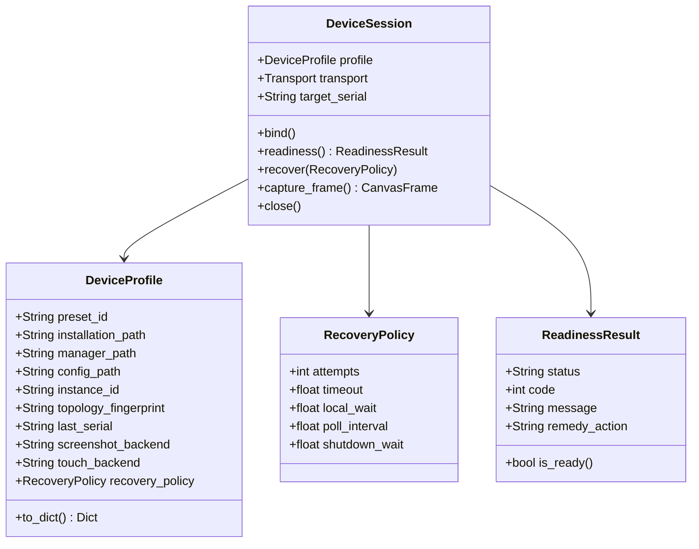

# Device Control Subsystem Specification

Authoritative specification of the Device Control Subsystem, defining discovery, transport protocols, session lifecycles, and fault recovery.

---

## 1. Domain Model & Interface Contracts

### 1.1 Persisted Configuration (`DeviceProfile`)
- Enforces `[INV-01]`: Persists explicit user selections (`preset_id`, paths, instance identifiers, capture/touch backends, and recovery policy parameters). Transient discovery scans and active socket handles exist in memory only.
- Enforces `[INV-02]`: Resetting or changing any path, preset, or instance identity clears `last_serial` immediately, preventing stale endpoint reuse.
- Enforces `[INV-04]`: IPC capture and touch backends operate as an indivisible pair.

### 1.2 Session Lifecycle (`DeviceSession`)
- Enforces `[INV-03]`: The session binds to a verified instance identity. If the target is absent, offline, or unresponsive, recovery attempts target that instance only, without silent fallback to other online devices on the host.
- Enforces `[INV-05]`: ADB operations route through [`guard_adb`](../../arknights_mower/utils/device/adb_client/server.py), verifying socket server availability without issuing implicit `kill-server` commands.
- The session reports one user-visible line per connection state change — the selected device, the instance launch, the ADB connect and the successful connection — and keeps attempt counters, budgets and observation snapshots in the debug log.

### 1.3 Bound Instance Start (`DeviceControl.start_bound`)
- An explicit start request launches only the bound instance through its preset's own multi-instance manager and verifies the connection inside the session's single monotonic budget. It selects no other instance on the host.
- `MANAGED_INSTANCE_PRESETS` names the presets whose manager can launch the bound instance (`windows.mumu12`, `windows.ldplayer9`, `windows.nox`). Every other preset reports `start_unsupported` and keeps the manual launch.
- The request itself is the explicit launch consent: the manager can only launch the profile's own instance, and the endpoint it reports is verified before the profile is saved. The AVD, ReDroid and Genymotion routes keep their additional `confirmed_instance` token because their controllers start a target named in the request.
- The request persists nothing: the endpoint and package it verifies reach the device profile through the ordinary save path.
- The web UI exposes it as the `启动并测试连接` dropdown option next to the read-only `测试连接` action.

---

## 2. Vendor Discovery & Compatibility Presets

The subsystem integrates platform-specific emulators through deterministic discovery mechanisms:

| Platform / Vendor | Discovery Mechanism | Identity Verification |
| :--- | :--- | :--- |
| **Windows MuMu 12** | Registry query + `MuMuManager.exe info -v all` | Index binding, canvas frame check |
| **Windows LDPlayer 9** | Registry query + `ldconsole.exe list2` | Process PID cross-referenced with TCP listening port |
| **Windows Nox** | `NoxConsole.exe list` + `.vbox` VM configuration | VM machine UUID, `topology_fingerprint` |
| **Windows BlueStacks 5** | Registry query + `bluestacks.conf` | `bst.instance.<key>.status.adb_port` |
| **macOS MuMu Pro** | Guided manual configuration (`manual.other`) | User-specified port, preflight gate |
| **macOS / Linux AVD** | `ANDROID_SDK_ROOT` + `emulator -list-avds` | AVD name, owned process lifecycle tracking |
| **Linux Genymotion** | `gmtool version` + `gmtool --format json admin list` | Instance UUID, ADB serial binding |
| **Linux ReDroid** | Local Docker socket (`/var/run/docker.sock`) | Immutable container ID, host port mapping |
| **Linux Waydroid** | `waydroid status` session inspection | Session IP endpoint, port 5555 verification |

---

## 3. Subsystem Invariants

- **[INV-DEV-01] Native Back Dispatch**: When the selected touch backend is MuMu IPC, Android BACK uses the owned MuMu IPC worker; an uncertain result stops the session without input replay or ADB fallback.
- `Device.send_keyevent(4)` selects the transport from the configured touch backend and dispatches `MuMuInputSession.back()`, which maps Android BACK to native MuMu key `1`. Temporary helper removal during recovery does not alter this selection. Key down and key up share the existing bounded worker and the session input failure boundary.
- Other Android keycodes use ADB. `TouchFailure.backend` records the selected touch backend, while `TouchFailure.transport` identifies the transport that failed. ADB failure diagnostics name ADB and direct the user to check the ADB connection.

---

## 4. Capture Frame Contract & Storage

- **Canvas Frame Standard**: All screenshot capture backends (ADB raw, ADB gzip, DroidCast HTTP, and MuMu IPC) yield an uncompressed `(1080, 1920, 3)` `uint8` RGB matrix.
- **Bounded In-Memory Slot**: Web UI live preview uses an atomic single-frame slot with background JPEG encoding, avoiding frame queuing latency.
- **Ring Buffer Eviction**: Historical frames enqueue into a bounded worker ring buffer, encoding to disk (`screenshot/YYYYMMDD-HH/`) with fixed capacity ceilings and rolling hourly cleanup.

---

## 5. Readiness Classification & Bounded Recovery

### 5.1 Readiness Classification
The session classifies device health into deterministic verdicts via [`ReadinessResult`](../../arknights_mower/utils/device/session.py):
- `absent`: Simulator process not running or executable missing.
- `offline`: Process active but ADB daemon unresponsive.
- `booting`: ADB connected but `sys.boot_completed != 1`.
- `ready`: Device fully booted and canvas frame matches `(1080, 1920, 3)`.

### 5.2 Bounded Recovery Execution
When a device becomes unresponsive or disconnected:
1. `DeviceSession` evaluates the configurable [`RecoveryPolicy`](../../arknights_mower/utils/device/session.py).
2. Attempts reconnection up to `recovery_attempts` within the monotonic budget `recovery_timeout`.
3. Pauses for `recovery_local_wait` post-boot to allow Android runtime services to stabilize.
4. If the budget exhausts without reaching `ready`, the session terminates with a structured failure without retrying infinitely.

---

## 6. Architectural References

This subsystem implements architectural decisions detailed in the following records:
- [Device Settings Save Scope and Start-and-Test Action](../../.agents/notes/implemented/feature/2026-09-28-device-settings-save-scope-and-start-and-test.md)
- [MuMu Native Back Dispatch and Input Transport Attribution](../../.agents/notes/implemented/bug-fix/2026-09-28-mumu-native-back-dispatch.md)
- [Device Configuration Compatibility & Session Architecture](../../.agents/notes/implemented/architecture/2026-09-26-device-configuration-and-session-architecture.md)
- [Device Screenshot Frame Contract](../../.agents/notes/implemented/architecture/2026-09-26-device-screenshot-frame-contract.md)
- [Bounded Screenshot Storage & Preview](../../.agents/notes/implemented/architecture/2026-09-27-bounded-screenshot-storage-and-preview.md)
- [Unified Owned Resource Shutdown](../../.agents/notes/implemented/architecture/2026-09-27-unified-owned-resource-shutdown.md)
- [macOS MuMu Pro Compatibility](../../.agents/notes/implemented/feature/2026-09-26-mumu-pro-macos-compatibility.md)
- [DroidCast Capture Lifecycle](../../.agents/notes/implemented/feature/2026-09-27-droidcast-capture-lifecycle.md)
- [Linux Genymotion Compatibility](../../.agents/notes/implemented/feature/2026-09-27-linux-genymotion-gmtool-compatibility.md)
- [Linux ReDroid Discovery](../../.agents/notes/implemented/feature/2026-09-27-linux-redroid-docker-discovery.md)
- [Linux Waydroid Discovery](../../.agents/notes/implemented/feature/2026-09-27-linux-waydroid-session-discovery.md)
