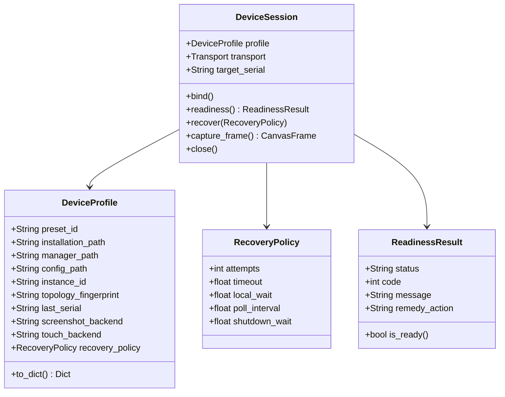

# Device Control Subsystem Specification

Authoritative specification of the Device Control Subsystem, defining discovery, transport protocols, session lifecycles, and fault recovery.

---

## 1. Domain Model & Interface Contracts

### 1.1 Persisted Configuration (`DeviceProfile`)
- Runtime package and endpoint observations belong to the session's profile copy. Startup, recovery and unrelated settings saves preserve the persisted user's selections, including when helper initialization fails.
- MuMu idle shutdown disconnects the owned client's verified endpoint. A closed session or released client skips transport cleanup without substituting the saved endpoint or starting recovery.
- Enforces `[INV-01]`: Persists explicit user selections (`preset_id`, paths, instance identifiers, capture/touch backends, and recovery policy parameters). Transient discovery scans and active socket handles exist in memory only.
- Enforces `[INV-02]`: Resetting or changing any path, preset, or instance identity clears `last_serial` immediately, preventing stale endpoint reuse.
- Enforces `[INV-04]`: IPC capture and touch backends operate as an indivisible pair.

### 1.2 Session Lifecycle (`DeviceSession`)
- Enforces `[INV-03]`: The session binds to a verified instance identity. If the target is absent, offline, or unresponsive, recovery attempts target that instance only, without silent fallback to other online devices on the host.
- Enforces `[INV-05]`: ADB operations route through [`guard_adb`](../../arknights_mower/utils/device/adb_client/server.py), verifying socket server availability without issuing implicit `kill-server` commands.
- Read-only Nox inspection never registers ADB transports. Runtime recovery of an unresolved Nox endpoint verifies its saved VM identity, reconnects only current enabled loopback ADB forwards, and confirms manager/direct boot identity before helper reconstruction. A selected `emulator-*` alias receiving an exact already-registered response performs targeted `-s serial reconnect` inside the registration deadline. The [bound endpoint registration decision](../../.agents/notes/implemented/bug-fix/2026-10-01-adb-endpoint-registration.md) records these recovery boundaries and regressions.
- The session reports one user-visible line per connection state change — the selected device, the instance launch, the ADB connect and the successful connection — and keeps attempt counters, budgets and observation snapshots in the debug log.

### 1.3 Bound Instance Start (`DeviceControl.start_bound`)
- An explicit start request launches only the bound instance through its preset's own multi-instance manager and verifies the connection inside the session's single monotonic budget. It selects no other instance on the host.
- `MANAGED_INSTANCE_PRESETS` names the presets whose manager can launch the bound instance (`windows.mumu12`, `windows.ldplayer9`, `windows.ldplayer14`, `windows.nox`, `macos.mumu_pro`, `linux.waydroid`). Every other preset reports `start_unsupported` and keeps the manual launch.
- The request itself is the explicit launch consent: the manager can only launch the profile's own instance, and the endpoint it reports is verified before the profile is saved. The AVD, ReDroid and Genymotion routes keep their additional `confirmed_instance` token because their controllers start a target named in the request.
- The request persists nothing: the endpoint and package it verifies reach the device profile through the ordinary save path.
- The web UI uses `启动并检测` for a bound supported instance: it checks the target first and starts only after `instance_stopped` or `start_confirmation_required`, then verifies the connection. Multiple discovery candidates require selection; a unique candidate uses its explicit discovery binding. Other errors preserve their repair guidance.
- The dropdown also exposes `测试连接（只读）` and `启动并测试连接`. Confirmed-start controllers receive the selected instance in the immediate request; scheduled runs do not reuse that consent.
- MuMu Pro detection requests may pass the explicit boolean `start_manager` to `/device/discover` or `/device/preflight`. This action opens the selected installation's manager application once when official `mumutool port` reports `invalidPort`, and waits within six seconds for a valid inventory after the service port appears. A freshly opened manager may report an empty inventory before loading its instances. It sends no VM launch command before discovery and selection. Requests without that flag remain read-only; unsupported presets, invalid output, active runs and shutdown reject the action.
- Selected MuMu Pro session startup also prepares that manager within the session Recovery Budget. Manual serial profiles do not acquire automatic lifecycle control. Closing a selected VM keeps the manager application running; available `mumutool` calls never restart the manager. A starting VM without an ADB port, or a reported running VM whose port is not yet listening, stays booting inside the Recovery Budget. A manager-reported instance error retains the inventory and produces a selected-instance repair verdict without issuing lifecycle commands.

---

## 2. Vendor Discovery & Compatibility Presets

The subsystem integrates platform-specific emulators through deterministic discovery mechanisms:

| Platform / Vendor | Discovery Mechanism | Identity Verification |
| :--- | :--- | :--- |
| **Windows MuMu 12** | Registry query + `MuMuManager.exe info -v all` | Index binding, canvas frame check |
| **Windows LDPlayer 9 / 14** | Registry query + `ldconsole.exe list2` | Process PID cross-referenced with TCP listening port |
| **Windows Nox** | `NoxConsole.exe list` + `.vbox` VM configuration | VM machine UUID, `topology_fingerprint` |
| **Windows BlueStacks 5** | Registry query + `bluestacks.conf` | `bst.instance.<key>.status.adb_port` |
| **macOS MuMu Pro** | Bundled `mumutool info all` lists instances; manual ADB serial remains available | Selected index and VM path fingerprint, current ADB port, standard preflight gate |
| **macOS / Linux AVD** | `ANDROID_SDK_ROOT` + `emulator -list-avds` | AVD name, owned process lifecycle tracking |
| **Linux Genymotion** | `gmtool version` + `gmtool --format json admin list` | Instance UUID, ADB serial binding |
| **Linux ReDroid** | Local Docker socket (`/var/run/docker.sock`) | Immutable container ID, host port mapping |
| **Linux Waydroid** | `waydroid status` session inspection | Session IP endpoint, port 5555 verification |

---

## 3. Subsystem Invariants

- **[INV-DEV-20] Command Output Ownership**: MuMu startup observations and default guarded ADB commands capture output through `manager_io.run_command` without pipe EOF waits. Each captured channel owns a temporary writer and an independently opened reader; collection never changes inherited writer positions or overwrites existing bytes. Windows readers share delete access with the writer, and both handles close through the command's cleanup stack. Captured stdout/stderr retain separate channels unless the caller requests merging; binary and text results and optional return-code checks retain subprocess semantics, with `universal_newlines` selecting text alongside `text`, `stdin=PIPE` receiving immediate EOF and `input` remaining rejected. The partial output a timeout carries follows that same binary/text selection; a fragment that cannot be decoded stays raw, because the timeout remains the failure the command reports. General captured output has a combined 32 MiB limit; `run_manager_command` retains merged binary output and its 1 MiB limit. The manager runner owns that merging and the return-code check, accepts the shared command call shape and rejects every other option instead of dropping it. An over-budget capture reports `CommandOutputLimit`, which is both a `ValueError` and a `subprocess.SubprocessError`, so the verdict stays a device failure rather than an application fault, and the manager budget keeps its repair step in that verdict. Polling and output checks use the command's monotonic deadline; an exhausted deadline rejects further execution. Timeout kills only the owned command and attempts reaping for at most one additional second. Closing the temporary streams never waits for a descendant or stops shared services; a captured file is removed once its last handle closes, so a descendant still holding an inherited handle keeps that file alive until it exits, within its channel's output limit. Process creation remains subject to the operating system's interruptibility.
- The invariant governs the bounded runners that capture, input and preflight use. The `MuMu12IPC` compatibility class in `arknights_mower/utils/device/mumu12ipc/core.py` is not on those routes: those workers construct it through `object.__new__` for its renderer binding, and its manager queries and connection helpers keep their own execution policy.
- The [output reader repair](../../.agents/notes/implemented/bug-fix/2026-10-03-command-output-review-repairs.md) records concurrent inherited-write coverage and offline execution seams.
- Device Control reports preflight start, helper initialization start and completed initialization at INFO. Connection readiness precedes these stages and does not imply initialized helpers. Preflight and MuMu input version DEBUG records identify commands or instances and effective timeouts. The [command deadline decision](../../.agents/notes/implemented/bug-fix/2026-10-03-mumu-startup-command-deadline.md) records the confirmed offline defect and limits of incident attribution; the [diagnostic recipe](../cookbook/device-startup-stall.md) defines log collection.

- **[INV-DEV-19] Shared ADB Recovery**: Direct sockets, guarded CLI commands, capture and input helpers, vendor delegation and MAA use the same shared local ADB server. No route starts an owned foreground server, reserves a private port, negotiates takeover or requires SDK 36. Compatible older and vendor binaries remain usable; client/server protocol mismatch retains a repair verdict without restarting a healthy server.
- Ordinary commands and read-only settings checks retain [INV-05]: socket-level negotiation precedes CLI operations and implicit `kill-server` remains prohibited. Only the explicit host-recovery boundary permits a coordinated shared-server restart after at least two unanswered host handshakes sustained for at least thirty seconds. Target absence, offline status, boot delay and version mismatch alone never authorize restart; cancellation and caller budget exhaustion do not count as failed host observations.
- `SharedADBHandshakeTimeout` supplies restart evidence. It covers a listener that answered nothing within the budget: the host never completed the TCP connect, the connected listener never replied, or a partially delivered reply stalled mid-delivery. An unanswered connect shows only that the service did not answer inside the budget; it is not proof that no live process owns the port, so it still needs the full sustained-failure window. A listener that answered with a malformed response, or closed the connection before the response completed, is a different observation: it proves a live process owns the port, so it preserves that process and supplies no restart evidence. A confirmed absent server permits guarded startup within the same budget without sending `kill-server` or waiting for destructive-restart cooldown; startup is distinct from restarting an existing service.
- The attempt is recorded before the protocol stop request and the persisted cooldown applies. On Windows, a `SharedADBStopTimeout` permits termination only through a retained process handle after verifying the shared port owner and exact selected ADB executable. Port ownership and unanswered status are rechecked before termination. Healthy re-probes skip termination; changed ownership, executable mismatch, insufficient permissions, unsupported platforms and failed stop retain bounded recovery and no startup before confirmed port release.
- Restart coordination uses a host-shared cross-process lock and a persisted wall-clock cooldown, defaulting to thirty seconds and bounded between zero and sixty seconds. The host-failure window and current Recovery Budget use monotonic time. Lock waiting, probes, stop/start commands and post-start verification consume that budget and action limit. The coordinator re-probes under the lock before acting; a healthy server skips restart. Shared destructive-restart cooldown prevents concurrent processes and subsequent recovery cycles from repeatedly restarting the host service. Exhausted budgets, cancellation, coordination failures and unsuccessful post-start verification preserve a classified failure without another recovery loop. Explicit restart can interrupt other host ADB clients; ordinary failure handling never treats it as device-only cleanup.
- `DeviceControl` receives the coordinator through `adb_recovery`, constructed as `SharedADBRecovery` from `adb_client/shared.py`. Its `recover` call receives `timeout`, `cancelled` and `action` from the existing session budget and shutdown policy. The coordinator exposes `.generation` for restart observation across processes and has no `close` lifecycle.
- A verified healthy compatible server does not require the recovery lock or a writable coordination record. An unavailable or malformed record emits one warning and invalidates local helpers once; it never blocks healthy startup or authorizes a destructive restart. Explicit stop validates the `host:kill` acknowledgement before waiting for the listener to disappear.
- After a verified restart, each application session retains its original Instance Binding, revalidates that target and fully reconstructs capture and input helpers before dispatch, including when another process initiated the restart. A shared-server generation change remains pending until helper binding succeeds; failed frame verification never permits stale-helper reuse. Scheduler state, pending tasks, persisted Device Profile and uncertain-input pauses remain unchanged; uncertain input is not replayed.
- Whole-run completion, process shutdown and normal idle cleanup release only application-owned helpers, sockets and forwards, never the shared server. Active operations retain deferred cleanup and idempotent release. The [release and task retention decision](../../.agents/notes/implemented/bug-fix/2026-10-01-recovery-release-and-task-retention.md) retains its helper-cleanup and scheduler-preservation scope.
- The [shared ADB recovery decision](../../.agents/notes/implemented/simplification/2026-10-01-shared-adb-recovery.md) records the verified replacement contract and focused regression coverage.
- The [unanswered connect decision](../../.agents/notes/implemented/bug-fix/2026-10-06-unanswered-connect-restart-evidence.md) records connect-phase evidence and the preserved malformed-response verdict. The [verified listener stop decision](../../.agents/notes/implemented/bug-fix/2026-10-07-verified-adb-listener-stop.md) defines the Windows fallback after protocol stop timeout.

- The [shared idle recovery decision](../../.agents/notes/implemented/bug-fix/2026-10-01-shared-idle-recovery.md) defines cross-platform launch recovery, pre-input helper recovery and idle lifecycle ownership.
- Automatic idle shutdown uses the selected Device Profile and its lifecycle adapter. Index-based Windows MuMu and LDPlayer shutdown revalidates manager identity within the same command deadline; changed or ambiguous identity prevents shutdown without requiring ADB readiness. Binding failures leave this boundary as a classified verdict rather than entering scheduling recognition recovery. Unsupported presets remain manual, and AVD shutdown remains restricted to owned instances.

- **[INV-DEV-16] Absent Target Cleanup**: An exact selected-device-not-found response during permitted DroidCast cleanup does not create a permanent startup failure when guarded server-level forward inspection confirms no owned mapping remains. Host process and HTTP resources still close. Unknown transport errors, surviving owned mappings and host cleanup failures retain the cleanup-failure guard; foreign resources, Device Profile and shared ADB state remain unchanged.
- The [absent-target cleanup decision](../../.agents/notes/implemented/bug-fix/2026-09-30-droidcast-absent-target-cleanup.md) specifies cleanup ownership and subsequent startup regression coverage.

- **[INV-DEV-15] Settings Cancellation Isolation**: Device settings discovery, connection testing, manager preparation and startup use context-local cancellation independent of `config.stop_mower`. They leave that task signal unchanged and remain cancellable by process shutdown or device closure. Each parallel discovery provider receives an independent copy of the caller's context. Scope exit restores the caller's policy; parallel task threads retain task cancellation. The shared HTTP boundary returns `device_operation_cancelled` for cancellation instead of an unhandled server error. Settings helper waits share the same scope and Recovery Budget.
- The [settings cancellation decision](../../.agents/notes/implemented/bug-fix/2026-09-30-device-settings-cancellation.md) specifies the shared cancellation boundary and its regression coverage.
- The [discovery worker cancellation decision](../../.agents/notes/implemented/bug-fix/2026-09-30-discovery-worker-cancellation.md) specifies independent provider contexts and real thread-pool regression coverage.
- Manager preparation checks the scoped cancellation policy before commands, during polling and before publishing success; in-flight commands retain their existing timeouts. The [manager preparation cancellation decision](../../.agents/notes/implemented/bug-fix/2026-09-30-mumu-pro-manager-cancellation.md) specifies these boundaries and their regression coverage.

- **[INV-UI-03] Selected Instance Persistence**: Choosing a detected instance saves its explicit identity before connection testing or startup. Failed readiness preserves the choice; a rejected identity save prevents startup and restores the previous saved Device Profile. Connection success alone saves the verified endpoint and game package. Manual identity edits remain drafts until validated, and candidate lists remain ephemeral.
- The [device selection persistence decision](../../.agents/notes/implemented/bug-fix/2026-09-30-device-selection-persistence.md) specifies selection and retry coverage.

- **[INV-DEV-14] Startup Reconnect Budget**: Rejected ADB reconnects during initial startup or runtime launch readiness retain bounded retries and observation within the existing deadline for every supported preset. `DeviceSession._wait_ready` retries only unconfirmed connections, counts each reconnect in the existing action budget, and uses `_wait_local` before another attempt. Exhausted actions permit only read-only readiness polling until the same deadline; binding changes, shared ADB errors and cancellation remain terminal.
- The [MuMu Pro idle reconnect decision](../../.agents/notes/implemented/bug-fix/2026-09-30-mumu-pro-idle-reconnect.md) records the shared readiness boundary and its regression tests.

- **[INV-DEV-12] Android Configuration Ownership**: Android-managed settings remain authoritative through configuration load, import, partial update and save/reload. `Conf` removes the incoming desktop Device Profile before validation and derives its own profile from the installed Android adapter's validated native fields; Android partial updates use that same boundary instead of desktop binding validation.
- The Android adapter owns connection and MAA paths, capture and touch selections, simulator lifecycle settings, native appearance, screenshot history and service endpoint settings. Desktop profiles cannot restore instance identities, manager paths, vendor capture backends, recovery settings or hotkeys. `package_type` remains editable; profile-only imports preserve a supported `game_package` when `package_type` is absent. General task settings remain unchanged.
- Android backup import serializes the validated native settings and canonical Device Profile, preserving unknown backup fields without retaining desktop values in protected settings. Main and backup Base Plans, weekly plans and general task settings remain editable and support export/import round trips. Subsequent exports retain that same boundary; desktop backup serialization remains unchanged.
- Boundary rationale and verification are recorded in [Android Configuration Isolation](../../.agents/notes/implemented/bug-fix/2026-09-30-android-config-isolation.md).

- **[INV-DEV-13] Detection Startup Target**: Detection starts only a selected target whose read-only check reports a stopped instance and whose preset provides startup control; ambiguous targets and other failures never trigger startup.
- The [detection startup decision](../../.agents/notes/implemented/feature/2026-09-29-instance-detection-start.md) records immediate launch authorization and UI coverage.

- **[INV-DEV-11] MuMu Pro Verified Selection**: MuMu Pro discovery reads bounded `mumutool info all` output and exposes each distinct instance for explicit selection. The selected Device Profile saves the instance index and a Topology Fingerprint of its VM path. Connection and recovery query that index again; a changed path, malformed output, or duplicate ADB port fails before any fallback. The current port is used only for the confirmed instance. Start and stop verify the index and saved fingerprint before one literal single-index `open` or `close` command. Validation and command execution share a deadline; uncertain commands are not replayed. Manual serial profiles cannot start or stop instances.
- The [MuMu Pro instance selection decision](../../.agents/notes/implemented/feature/2026-09-30-mumu-pro-instance-selection.md) records output validation and multi-instance coverage.

- **[INV-DEV-10] MuMu Pro Manual Binding**: Without a selected instance fingerprint, `macos.mumu_pro` checks only the user's saved ADB serial with the standard preflight gate. Missing, offline, or mismatched targets never select another online device. A different instance that later reuses that serial cannot be distinguished in manual mode. Saved installation and manager paths do not gate manual ADB validation.
- The [MuMu Pro connection repair](../../.agents/notes/implemented/bug-fix/2026-09-30-mumu-pro-manual-binding.md) records the regression and focused coverage.

- **[INV-DEV-09] Classified Failure Isolation**: Classified device failures, including Temporary Preparation errors, request owned resource cleanup and expose their structured verdict without requesting application shutdown.
- **[INV-DEV-18] Recovery Cycle Continuation**: Failed finite Recovery Budgets retain the selected Instance Binding and repeat only after cancellable cooldown. Verified readiness supersedes an unconfirmed reconnect response. Shared ADB and identity failures pause target operations without selecting another endpoint. Idle wakeup device failures return to Device Control recovery without MAA task error reporting, preserving pending tasks and uncertain-input pauses.
- **[INV-DEV-17] Pre-Input Helper Recovery**: A control helper unavailable before input recovers only after same-target validation within the Recovery Budget. Probe uncertainty does not authorize input. Input-only recovery rebuilds the selected control helper while preserving healthy ADB and capture resources; MuMu IPC retains paired recovery. Actual cleanup failure blocks replacement. Uncertain delivery interrupts the operation without replay; ordinary graph navigation re-observes the scene within its existing call, while unverified side effects pause device dispatch.
- The [recoverable failure contract](../../.agents/notes/implemented/simplification/2026-10-01-recoverable-device-failures.md) records recovery ownership and verification.
- The [idle wakeup recovery decision](../../.agents/notes/implemented/simplification/2026-10-07-idle-recovery-boundary.md) defines the MAA handoff boundary.
- Input surface mismatch or unreadable display state keeps the settings interface available. Failed compensation retains its recovery record. Unclassified internal faults still request coordinated application shutdown.
- The [preparation failure decision](../../.agents/notes/implemented/bug-fix/2026-09-30-preparation-failure-isolation.md) records the classification boundary and regression coverage.

- **[INV-DEV-08] Uncertain Input Delivery**: ADB input whose transmission or acknowledgement is uncertain fails without automatic command replay; the input boundary reports a structured delivery-unknown failure.
- **[INV-DIAG-03] Accepted Archive Drain**: Shutdown preserves accepted screenshot and archive work until the common flush deadline; work discarded after that deadline is counted and starts no further file writes.
- **[INV-DIAG-07] Archive Observation Cohesion**: Regression assertions spanning an error manifest and invalidated log files acquire the store's archive lock after observing the relevant archive transition.
- The [archive observation decision](../../.agents/notes/implemented/testing/2026-10-03-archive-observation-cohesion.md) records the offline regression boundary.
- **[INV-DIAG-04] Encoded Recent Cache**: With ordinary history disabled, the recent error context retains encoded frames under its count and byte limits; capture submission performs no encoding and pending raw frames remain bounded.
- **[INV-DIAG-05] Shared Frame Encoding**: Each admitted RGB snapshot has at most one encoding attempt; preview, history and error context share its encoded bytes, release the source snapshot after completion, and preserve bounded admission and independent progress of newer previews.
- **[INV-DIAG-06] Error Notification Evidence**: Every ERROR notification emits a log record before mail configuration checks or delivery; screenshots are archived only when the caller explicitly identifies a visual failure, independently of email enablement.
- `send_message` logs ERROR notification detail before email configuration checks. Its keyword-only `archive_screenshots` argument defaults to false; visual failure callers explicitly pass true to use the existing log handler and archive store. Training arrangement rejection and confirmation timeout request screenshots. Ordinary configuration and transport error notifications retain diagnostic logs without requesting screenshots. Custom subjects retain the error body in diagnostic detail. INFO and WARNING notifications retain their existing delivery policy without automatically creating error archives. Existing overlapping-window merging combines adjacent error records. The [notification archive decision](../../.agents/notes/archived/bug-fix/2026-10-02-mastery-panel-identity-and-archives.md) records the regression coverage.
- The [shared screenshot encoding contract](../../.agents/notes/implemented/simplification/2026-09-29-shared-screenshot-encoding.md) specifies ownership and offline verification.
- The [preservation review repairs](../../.agents/notes/implemented/bug-fix/2026-09-29-preservation-review-repairs.md) define the regression contracts and their [shared boundaries](../../.agents/notes/implemented/simplification/2026-09-29-preservation-repair-boundaries.md).

- **[INV-DEV-07] Capture Recovery Separation**: Normal frames use a fresh per-operation deadline; a degraded ADB backend verifies its bound target without invoking the replaced capture helper.
- The first screenshot recovery, rebuild and degradation share the current Recovery Budget. Subsequent degraded frames validate target identity, boot completion and the actual ADB frame within a new operation deadline. Instance commands never exceed the lesser of their remaining local deadline, the enclosing Recovery Budget and the command limit.
- Immediate backend edits compare against the saved Device Profile to preserve IPC pairing while identity drafts remain unpersisted.
- The [session review repairs](../../.agents/notes/implemented/bug-fix/2026-09-29-session-review-repairs.md) and [ownership simplification](../../.agents/notes/implemented/simplification/2026-09-29-review-recovery-ownership.md) record the regression coverage.

- **[INV-DEV-05] Capture Preset Compatibility**: Configuration updates reject incompatible vendor capture presets; capture entry points also verify the host, and UI preset changes clear incompatible capture and coupled touch selections in the draft.
- **[INV-DEV-06] LD Capture Binding**: LD screenshot enhancement verifies the selected ADB endpoint against the selected instance and accepts frames only while its process identity and 1920×1080 dimensions remain unchanged.
- The [LD capture decision](../../.agents/notes/implemented/feature/2026-09-29-ld-capture.md) defines the vendor boundary and its [shared process lifecycle](../../.agents/notes/implemented/simplification/2026-09-29-native-capture-owner.md).

- **[INV-DEV-04] Launch Protection**: A session preserves the bound instance's configured startup interval before a subsequent automatic restart; waiting remains inside its Recovery Budget and respects cancellation.
- `DeviceControl` supplies the existing `simulator.wait_time` to `DeviceSession.bind`. The session records launch issuance on its monotonic clock and retains it across recovery of the same Instance Binding. A different binding clears that observation. Readiness during the interval avoids a restart; an exhausted budget produces failure without an early stop.
- The advanced device form edits `simulator.wait_time` independently of `recovery_timeout` (the entire Recovery Budget) and `recovery_local_wait` (the local observation window after a reconnect). Saving the interval preserves unconfirmed identity drafts.
- **[INV-DIAG-01] Archive Deletion Cohesion**: Error archive deletion holds the store's archive lock and cancels its queued writes and active windows before late frames can recreate it.
- **[INV-DIAG-02] Archive Error Isolation**: Invalid metadata in one error archive produces a diagnostic without terminating the archive worker.
- `ScreenshotStore` owns both expiry and capacity retirement. `ScreenshotCleanup` advances bounded batches of ordinary frame files and leaves error archives to the store.
- The [behavior preservation decision](../../.agents/notes/implemented/bug-fix/2026-09-29-upstream-behavior-preservation.md) records the restored contracts and offline verification.

- **[INV-DEV-03] Startup Budget Isolation**: Each new device startup establishes its Recovery Budget before preparation; preparation, readiness, validation and helper initialization share that deadline without inheriting a previous run's deadline.
- Preparation exhaustion prevents readiness probes and releases acquired resources. Readiness uses the deadline established before preparation, including on the first startup.
- Before Temporary Preparation reads or modifies display geometry, the session resolves ADB within that deadline. The resolved path remains in the session copy and is reused by readiness; it does not overwrite the persisted Device Profile.
- The [startup budget decision](../../.agents/notes/implemented/bug-fix/2026-09-29-startup-recovery-budget.md) records the implementation and offline verification.

- **[INV-DEV-02] Lifecycle Command Isolation**: Simulator lifecycle commands pass literal argument lists without a shell and act only on an explicitly identified instance; unavailable instance control fails without a host-wide action.
- Windows MuMu offers only the `windows.mumu12` preset, labeled **MuMu 12**. Retired MuMu 6 configurations load as `manual.other` with the endpoint and game confirmation cleared; no MuMu 6 discovery or lifecycle adapter is registered.
- The [preset support decision](../../.agents/notes/implemented/simplification/2026-09-29-emulator-preset-support.md) records MuMu 6 removal and LDPlayer 14 capture coverage.
- The [command isolation decision](../../.agents/notes/implemented/bug-fix/2026-09-29-review-command-isolation.md) records the review repairs and their offline verification.

- **[INV-DEV-01] Native Back Dispatch**: When the selected touch backend is MuMu IPC, Android BACK uses the owned MuMu IPC worker; an uncertain result interrupts the operation without input replay or ADB fallback.
- `Device.send_keyevent(4)` selects the transport from the configured touch backend and dispatches `MuMuInputSession.back()`, which maps Android BACK to native MuMu key `1`. Temporary helper removal during recovery does not alter this selection. Key down and key up share the existing bounded worker and the session input failure boundary.
- Other Android keycodes use ADB. `TouchFailure.backend` records the selected touch backend, while `TouchFailure.transport` identifies the transport that failed. ADB failure diagnostics name ADB and direct the user to check the ADB connection.

---

## 4. Capture Frame Contract & Storage

- ADB gzip capture shares one deadline across guarding, SDK query, frame read and decoding. Each remaining timeout is clamped to the initial effective capture budget and any parent I/O budget. The [capture timeout decision](../../.agents/notes/implemented/bug-fix/2026-10-02-capture-timeout-clamp.md) records the cross-platform boundary test.
- **Canvas Frame Standard**: All screenshot capture backends (ADB raw, ADB gzip, DroidCast HTTP, MuMu IPC, and LD screenshot enhancement) yield an uncompressed `(1080, 1920, 3)` `uint8` RGB matrix.
- **Vendor Compatibility**: MuMu screenshot enhancement requires Windows MuMu 12 and paired MuMu touch. LD screenshot enhancement (`ld_native`) requires Windows x64, LDPlayer 9 or 14, its installed `ldopengl64.dll`, and a `list2` result with confirmed 1920×1080 dimensions. LD touch remains scrcpy or MaaTouch. Unsupported configurations fail without another backend being selected.
- **LD Capture Lifetime**: Preflight owns a temporary capture session; runtime reuses its native worker until rebuild or close. Manager queries verify process identity and dimensions around each frame within the same deadline. LD capture checks the selected endpoint through the existing LDPlayer resolver before opening the DLL. The worker converts bottom-up BGR to RGB and never invokes emulator lifecycle commands.
- **Bounded In-Memory Slot**: Web UI live preview uses an atomic single-frame slot with background JPEG encoding, avoiding frame queuing latency.
- **Ring Buffer Eviction**: Historical frames enqueue into a bounded worker ring buffer, encoding to disk (`screenshot/YYYYMMDD-HH/`) with fixed capacity ceilings and rolling hourly cleanup.

---

## 5. Readiness Classification & Bounded Recovery

### 5.1 Readiness Classification
The session classifies device health into deterministic verdicts via [`ReadinessResult`](../../arknights_mower/utils/device/session.py):
- `absent`: Simulator process not running or executable missing.
- `offline`: Process active but ADB daemon unresponsive.
- `booting`: ADB connected but `sys.boot_completed != 1`.
- `ready`: Device fully booted and canvas frame matches `(1080, 1920, 3)`.

### 5.2 Bounded Recovery Execution
When a device becomes unresponsive or disconnected:
1. `DeviceSession` evaluates the configurable [`RecoveryPolicy`](../../arknights_mower/utils/device/session.py).
2. Attempts reconnection up to `recovery_attempts` within the monotonic budget `recovery_timeout`.
3. Observes readiness for up to `recovery_local_wait` after a local reconnect, stopping the wait as soon as the target is ready.
4. If the budget exhausts without reaching `ready`, the current recovery cycle returns a structured failure. Task supervision retains the scheduler and pending tasks and waits through a cancellable 30-second cooldown before another finite cycle; no failed cycle selects another instance or expands its own deadline.
5. Ordinary navigation re-observes the Capture Frame before selecting a new edge. An uncertain side effect retains a device dispatch pause and diagnostic frames until explicit cancellation and state verification; it never enters ordinary task replay.

---

## 6. Architectural References

This subsystem implements architectural decisions detailed in the following records:
- [Device Settings Save Scope and Start-and-Test Action](../../.agents/notes/implemented/feature/2026-09-28-device-settings-save-scope-and-start-and-test.md)
- [MuMu Native Back Dispatch and Input Transport Attribution](../../.agents/notes/implemented/bug-fix/2026-09-28-mumu-native-back-dispatch.md)
- [Device Configuration Compatibility & Session Architecture](../../.agents/notes/implemented/architecture/2026-09-26-device-configuration-and-session-architecture.md)
- [Device Screenshot Frame Contract](../../.agents/notes/implemented/architecture/2026-09-26-device-screenshot-frame-contract.md)
- [Bounded Screenshot Storage & Preview](../../.agents/notes/implemented/architecture/2026-09-27-bounded-screenshot-storage-and-preview.md)
- [Unified Owned Resource Shutdown](../../.agents/notes/implemented/architecture/2026-09-27-unified-owned-resource-shutdown.md)
- [macOS MuMu Pro Compatibility](../../.agents/notes/implemented/feature/2026-09-26-mumu-pro-macos-compatibility.md)
- [DroidCast Capture Lifecycle](../../.agents/notes/implemented/feature/2026-09-27-droidcast-capture-lifecycle.md)
- [Linux Genymotion Compatibility](../../.agents/notes/implemented/feature/2026-09-27-linux-genymotion-gmtool-compatibility.md)
- [Linux ReDroid Discovery](../../.agents/notes/implemented/feature/2026-09-27-linux-redroid-docker-discovery.md)
- [Linux Waydroid Discovery](../../.agents/notes/implemented/feature/2026-09-27-linux-waydroid-session-discovery.md)
