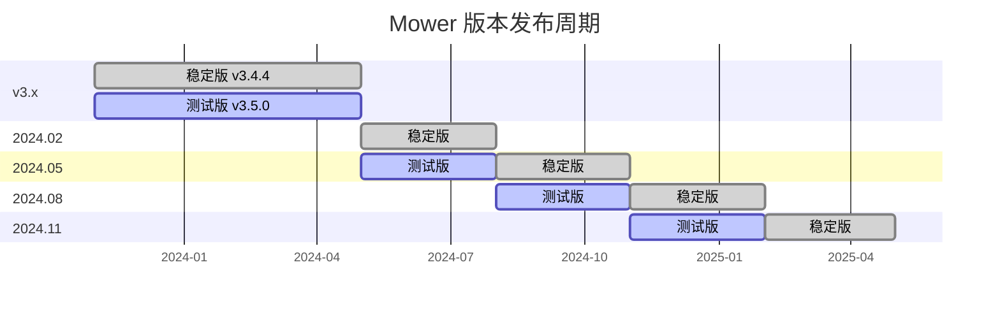

# 安装与更新

**注意**：Mower 使用 Python 3.12，故不支持 Windows 7 及更早的 Windows 版本。

<h2 id="release-cycle">版本发布周期</h2>

自 2024 年 5 月起，mower 采取新的版本发布周期与命名规范：每年以春节、周年、夏活、半周年四个活动为节点，共发布四个版本，版本号以“年份+月份”命名。每个版本的支持周期为 6 个月，前 3 个月作为测试分支，开发新功能；后 3 个月作为稳定分支，只进行必要的维护与错误修复。

当前，稳定分支为 2024.02，测试版为 2024.05。

## 下载

Mower 仅为 Windows 提供可执行文件。Linux 与 macOS 用户需要[从源码运行](#run-from-source)。

<h3 id="updater">更新器</h3>

更新器在q群（521857729）群文件可下载，由雨浮维护。

更新器下载文件，既可全新安装，也可用于升级、降级。全量升级前应先下载群里压缩包，再进行覆盖

### 直接下载

- GitHub：稳定版可从 [Releases](https://github.com/ArkMowers/arknights-mower/releases) 下载；测试版可从 [Actions](https://github.com/ArkMowers/arknights-mower/actions) 下载。
- 下载：从 q群文件直接下载 Zip 压缩包（full为全量包，update为增量包）。

下载后解压运行即可。

如果 mower 无法正常运行（如窗口白屏、无法从带有二维码的图片导入排班表等），可尝试安装以下依赖：

- Microsoft Visual C++ 2013 Redistributable：<https://aka.ms/highdpimfc2013x64enu>
- Microsoft Visual C++ 2015-2022 Redistributable：<https://aka.ms/vs/17/release/vc_redist.x64.exe>
- Microsoft Edge WebView2：<https://go.microsoft.com/fwlink/p/?LinkId=2124703>

